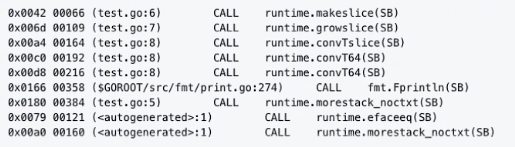
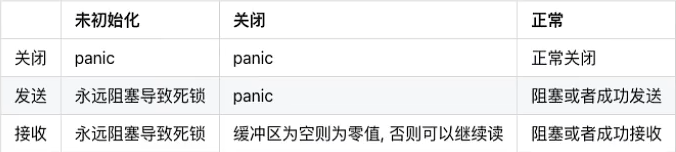
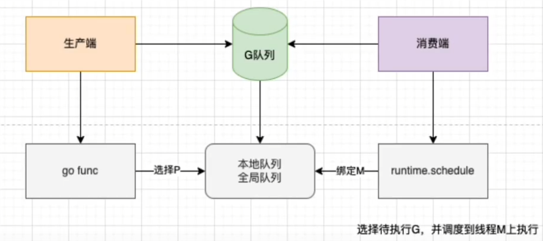

# golangfacecontent
## 基础部分

### goLang 的优势

- 部署简单，不依赖其他的库
- 静态类型语言(看运行的时候是编译后运行还是解释器运行)，强类型方便阅读和重构
- 语言层面天生支持高并发，充分利用多核 -> GMP
- 工程化优秀，GoFmt可以统一代码格式
- 强大的标准库， runtime 系统调度机制，高效的GC垃圾回收 -> Go的垃圾回收机制
- 因为是开发k8s的语言，go社区与k8s社区良性互动和发展

## 数据类型
https://github.com/ameamezhou/go-data-structure

这里做了部分常用数据类型详细的记录

这个仓库要重点看，比如slice和map的扩容，函数内的调用都设计它们的底层结构，说得越清楚越好

简单来说
1. bool
2. 数字类型 uint int float32 float64 byte rune
   - byte 等同于int8，常用来处理ascii字符
   - rune 等同于int32,常用来处理unicode或utf-8字符
3. 字符串类型
4. 复合类型
    - 数组
    - 切片
    - map
    - 管道
    - 结构体 struct
5. 指针 pointer
6. 接口 interface
7. 函数
8. 方法类型 method (注意和函数进行区分)

其实和关键字一样 属于基础提问，但是可以针对你回答的问题进行深入探究

### 方法和函数的区别
在go语言里面，函数和方法不太一样，有明确的概念区分。在其他语言中，比如java，一般来说函数就是方法，但是在go语言中，函数是指不属于任何结构体、类型的方法，也就是说
函数是没有接收者的，但是方法有接收者

```go

func (t *T) add (a, b int) int {
	return a + b
}

// 其中T是自定义类或者说结构体，不能是基础数据类型 int 等

func add (a, b int) int {
    return a + b
}

```

### 方法接收者和指针接收者的区别
这两者都属于能把函数内的修改带回到本身的一个使用方法，所以要区分好他们之间有什么区别

如果方法的接收者是指针类型，无论调用者是对象还是对象指针，修改的都是对象本身，会影响调用者

如果方法接收者是值类型，无论调用者是对象还是对象指针，修改的都是对象的副本，不影响调用者

我们通常使用指针类型作为方法的接收者的理由：
- 使用指针类型能够修改调用者的值
- 使用指针类型可以避免在每次调用方法的时候复制该值，在值的类型为大型结构体时，这个做法会更高效

### Go函数返回局部变量的指针是否是安全的
一般来说，局部变量会在函数返回后被销毁，因此被返回的引用就成了“无所指”的引用，程序会进入未知状态。

但这在Go中是安全的，Go编译器将会对每个局部变量进行逃逸分析.如果发现局部变量的作用域超出该函数，则不会将内存分配在栈上，而是分配在堆上，因为他们不在栈区，所以即使释放函数，其内容也不会受影响

(这里关于堆栈的内容，详细的要看golang的垃圾回收机制和操作系统的堆栈分配区的区别)

```go
package main

import (
   "fmt"
   "net/http"
)

func add(x, y int) *int {
   res := x + y
   return &res
}

func main(){
	fmt.Println(add(1, 2))
}
```
这个例子中，add函数的局部变量 res 发生了逃逸，res作为返回值，在main函数中继续使用，因此res指向的内存不能够分配在栈上，随着函数结束而会回收，因此只能分配在堆上

编译的时候可以用 -gcflags=-m 查看变量逃逸的情况

我们看到 res escapes to heap 代表res从栈区分配到了堆区，发生了逃逸

### go函数中参数传递到底是值传递还是引用传递
Go语言中所有的传参都是值传递，都是一个副本一个拷贝

参数如果是非引用类型 int string struct 这些，这样就在函数中无法修改原内容数据；如果是引用类型 (指针、map、slice、chan等这些)，这样就可以修改原内容数据

是否可以修改原内容数据，和传值、传引用没有必然的关系，在c++中，传引用肯定是可以修改原内容数据的，但是在Go中虽然只有传值，但是我们也可以修改原内容数据，因为参数是引用类型。

引用类型和引用传递是两个概念
- 值传递: 将实际参数的值传递给形参，形式参数是实际参数的一份拷贝，实际参数和形式参数的内存地址不同。函数内堆形式参数值的内容进行修改，至于是否影响实际参数的值的内容，取决于参数是否是引用类型
- 引用传递: 将实际参数的地址传递给形式参数，函数内对形式参数内容的修改，将会影响实际参数的值的内容。GO语言中是没有引用传递的，在c++中函数参数的传递方式又引用传递。

**int 类型**
```go
package main

import "fmt"

func main(){
	var i = 1
	fmt.Printf("原内存地址 %p \n", &i)
	modifyInt(i)
	fmt.Printf("改动后值 %v \n", i)
}

func modifyInt(i int){
	fmt.Printf("函数内内存地址 %p \n", &i)
	i = 10
}
```
**指针类型**
```go
package main

import "fmt"

func main(){
   var args = 1
   p := &args
   fmt.Printf("原指针内存地址 %p \n", &p)
   fmt.Printf("原指针变量内存地址 %p \n", p)
   modifyPointer(p)
   fmt.Printf("改动后值 %v \n", *p)
}

func modifyPointer(i *int){
   fmt.Printf("函数内内存地址 %p \n", &i)
   *i = 10
}
```
**Slice 类型**

形式参数和实际参数内存地址一样，不代表是引用类型；下面进行详细说明slice还是值传递，传递的是指针


slice 这里的结构体参考golang数据结构那个仓库   后面的map同

**map**

map 形式参数和实际参数内存地址不同，所以其实还是值传递

因为这里我们通过make创建的map变量的本质是一个hmap类型的指针，所以函数内堆形参的修改还是会返回原来的内容数据

**channel**


因为通过make创建的chan本质也是一个hchan类型的指针，所以对形参的修改会修改原内容数据

**struct**
形参和实际参数内存地址不一样  是值传递，只要内部的元素不是指针类型的  函数内对形参的修改就不会修改原来的内容数据

## 关键字
### 声明相关
package: 包声明

import: 引入包

var: 变量声明

const: 常量声明

interface: 接口声明

struct: 结构体声明

map、chan: 类型声明

type: 自定义类型声明

### 函数相关
func: 函数定义

return: 从函数返回

### 流程控制
break case continue for fallthrough else if switch goto default: 流程控制

go: 创建goroutine

range: 遍历读取 slice chan map 的数据

select: IO

这个关键字类型的问题属于发散性的面试问题，比如说我是面试官，我问你golang常见的关键字有哪些，你回答了interface那些，就可能会被针对性的提问这个方向，所以要对自己回答的每个关键字要做到心里有数

### defer关键字的实现原理
defer能让我们推迟执行某些函数调用，推迟到当前函数返回前才会实际执行。

defer与panic和recover结合  形成了Go语言风格的异常与捕获机制

使用场景：
defer语句进场被用于处理承兑的操作，比如文件句柄关闭，关闭连接、释放锁等等

优点：方便开发者使用

缺点: 又性能损耗

实现原理： Go1.14中编译器会将defer函数直接插入到函数尾部，无需链表和栈上参数拷贝，性能大幅提升。把defer函数在当前函数内展开并直接调用，这种方式被称为open coded defer

源代码：
```go
func A(i int) {
	defer A1(i, 2*i)
	if (i > 1) {
		defer A2("hello")
    }
    // code
    return
}

func A1 (a, b int) {
    //	
}

func A2(m string) {
	
}

// 编译后  会变成这样

func A(i int){
	// code
    if (i > 1) {
        A2("hello")
    }
    A1(i, 2*i)
}
```

1. 函数退出钱 按照现金后厨的顺序执行defer函数
2. panic 后的defer函数是不会执行的
3. panic没有被recover的时候，抛出的panic 到当前goroutine最上层函数的时候，最上层程序直接异常终止
4. panic 有被recover的时候，当前goroutine最上层函数正常执行

### recover
Recover是在defer中的，它只能捕获自身协程内的异常，不能跨协程捕获，然后实际上的实现原理应该是再函数栈上调用的时候触发panic就会在推出的时候调用，输出panic内容，不因为一个协程挂了就影响main

然后recover并不是所有的错误都能获取到，它只能获取一些panic，更严重的fatal是不能被获取的。比如map是一个非线程安全的map，不能直接进行并发写，会触发fatal，这个是不能被recover捕获的

### context
在Go语言中，context是一个非常重要的概念，它用于在不同的goroutine之间传递请求域的相关数据，并且可以用来控制goroutine的生命周期和取消操作。

```go
type Context interface {
	Deadline() (deadline time.Time, ok bool)
	Done() <-chan struct{}
	Err() error
	Value(key any) any
}
```
- Deadline() 方法用于获取 Context 的截止时间
- Done() 方法用于返回一个只读的 channel，用于通知当前的 Context 是否已经被取消。
- Err() 方法用于获取 Context 取消的原因
- Value() 方法用于获取 Context 中保存的键值对数据

#### 用法1 数据传输
```go
package main

import (
	"context"
	"fmt"
)

type UserInfo struct {
	Name 	string
	Age 	int
}

func GetUser(ctx context.Context){
	fmt.Println(ctx.Value("info").(UserInfo).Name) // 可以使用断言转化类型的
}

func main(){
	ctx := context.Background()
	ctx = context.WithValue(ctx, "info", UserInfo{Name: "xiaoqizhou", Age: 18})
	GetUser(ctx)
}
```

#### 用法2 取消协程 WithCancel

很常见的一个案例，假设有一个获取ip的协程，但是这是一个非常耗时的操作每用户随时可能会取消

如果用户取消了，那么之前那个获取协程的函数就要停止了

```go
package main

import (
	"context"
	"fmt"
	"sync"
	"time"
)

var Wait = sync.WaitGroup{}

func main()  {
	t := time.Now()
	ctx, cancel := context.WithCancel(context.Background())
	Wait.Add(1)
	go func() {
		// Wait.Done()
		ip, err := GetIp(ctx)
		if err != nil {
			fmt.Println(err)
			return
		}
		fmt.Println(ip, err)
	}()
	go func() {
		time.Sleep(2*time.Second)
		// 取消协程
		cancel()
	}()
	Wait.Wait()
	fmt.Println("执行结束:", time.Since(t))
}

func GetIp(ctx context.Context)(ip string, err error){
	go func() {
		select {
		case <- ctx.Done():
			fmt.Println("协程取消", ctx.Err())
			err = ctx.Err()
			Wait.Done()
			return
		}
	}()
	defer Wait.Done()
	time.Sleep(4*time.Second)

	ip = "192.16.8.0.1"

	return
}
```

#### 截止时间 WithDeadline

除了使用 WithCancel() 方法取消协程之外，Context 还可以被用来设置截止时间，以使在超时的情况下取消请求

还是上面那个案例

```go
package main

import (
	"context"
	"fmt"
	"sync"
	"time"
)

func main(){
	var wg = sync.WaitGroup{}

	ctx1, _ := context.WithDeadline(context.Background(), time.Now().Add(5*time.Second))
	wg.Add(1)
	go GetIp(ctx1, &wg)
	wg.Wait()
}

func GetIp(ctx context.Context, wg *sync.WaitGroup)(ip string, err error){
	go func() {
		select {
		case <- ctx.Done():
			fmt.Println("协程取消", ctx.Err())
			err = ctx.Err()
			wg.Done()
			return
		}
	}()
	defer wg.Done()
	time.Sleep(7*time.Second)

	ip = "192.16.8.0.1"

	return
}
```

#### 超时时间  WithTimeout

用法大差不差  也是可以手动取消的

```go
package main

import (
	"context"
	"fmt"
	"time"
)

func main(){
	ctx, _ := context.WithTimeout(context.Background(), 5*time.Second)

	go GetIp3(ctx)
	// 手动结束进程
	time.Sleep(5*time.Second)
	// 模拟线程阻塞
	time.Sleep(1*time.Second)
}

func GetIp3(ctx context.Context){
	fmt.Println("获取IP")
	select {
		case <- ctx.Done():
			fmt.Println("协程取消", ctx.Err())
	}
}
```

### new 和 make 的区别
纠正一下，make和new是内置函数，不是关键字

变量初始化一般包括两步，变量声明+变量内存分配。

new和make函数主要是用来分配内存的。

var声明值类型的变量的时候，系统会默认为他分配内存空间，并赋该类型的零值

比如bool，数字，字符串，结构体

如果指针类型或者引用类型的变量，系统不会为它分配内存，默认就是nil。此时如果你想直接使用的话，系统会抛出异常，必须进行内存分配之后，才能使用

new和make两个内置函数主要是用来进行内存空间的分配，有了内存空间，变量才能使用，二者主要有以下两点的区别:
1. 使用场景区别
    - make只能用来分配以及初始化类型为 slice map chan 的数据
    - new可以分配任意类型的数据，并且置0
2. 返回值的区别
    - make 函数原型如下，返回的是slice map chan 本身
    - new 函数原型如下，返回一个指向该类型内存地址的指针
```go
func make(t Type, size ...IntegerType) Type
```
```go
func new(Type) *Type
```

### interface 的底层实现原理
golang 钟的接口分为带方法的接口和空接口。带方法的接口在底层用 iface(说白了就是一个结构体  在底层代码里定义) 表示，空接口的底层则是 eface 表示。

```go
//runtime/runtime2.go

//非空接口
type iface struct {
	tab  *itab
	data unsafe.Pointer //data是指向真实数据的指针
}
type itab struct {
	inter  *interfacetype //描述接口自己的类型
	_type  *_type         //接口内部存储的具体数据的真实类型
	link   *itab
	hash   uint32 // copy of _type.hash. Used for type switches.
	bad    bool   // type does not implement interface
	inhash bool   // has this itab been added to hash?
	unused [2]byte
	fun    [1]uintptr // fun是指向方法集的指针。它用于动态调度。
}

// 空接口
type eface struct {
    _type *_type
    data  unsafe.Pointer
}

//runtime/type.go
type _type struct {
	size       uintptr
	ptrdata    uintptr // size of memory prefix holding all pointers
	hash       uint32
	tflag      tflag
	align      uint8
	fieldalign uint8
	kind       uint8
	alg        *typeAlg
	// gcdata stores the GC type data for the garbage collector.
	// If the KindGCProg bit is set in kind, gcdata is a GC program.
	// Otherwise it is a ptrmask bitmap. See mbitmap.go for details.
	gcdata    *byte
	str       nameOff
	ptrToThis typeOff
}
```
1. iface
    - hash 是对 _type.hash 的拷贝，当我们想将 interface 类型转换成具体类型时，可以使用该字段快速判断目标类型和具体类型 runtime._type 是否一致；
    - fun 是一个动态大小的数组，它是一个用于动态派发的虚函数表，存储了一组函数指针。虽然该变量被声明成大小固定的数组，但是在使用时会通过原始指针获取其中的数据；

    

2. eface: eface顾名思义就是empty interface，代表的是不包含方法的interface，例如： type Test interface{}
   - _type：这个是运行时 runtime._type 指针类型，表示数据类型
   - data: 表示的数据指针


## slice head
slice的具体原理已经在golang数据结构那个仓库有总结了，这里再梳理一边

源码在 src/runtime/slice.go 里面定义了slice的数据结构

```go
type slice struct{
	array   unsafe.Pointer
	len     int
	cap     int
}
```
slice 占用24个字节

- array： 指向底层数组的指针 占用8字节
- len： 切片的长度 占用8字节
- cap： 切片的容量，cap总是大于等于len的，占用8个字节

slice 有四种初始化方式
```go
// var 直接声明
var slice1 []int

// 字面量初始化
slice2 := []int{1, 2, 3, 4}

// make
slice3 := make([]int, 3, 5)

// 从切片或者数组截取
slice4 := arr[1:3]
```

通过一个简单的程序看看slice初始化调用的底层函数
```go
package main

import "fmt"

func main(){
	slice := make([]int, 0)
	slice = append(slice, 1)
	fmt.Println(slice, len(slice), cap(slice))
}

```
通过 `go tool compile -S test.go | grep CALL` 得到汇编代码


初始化slice调用的是runtime.makeslice, makeslice 函数的主要工作就是计算slice所需的内存大小，然后调用mallocgc进行内存分配

所需内存大小 = 切片中元素大小*切片的容量
```go
func makeslice(et *_type, len, cap int) unsafe.Pointer {
	mem, overflow := math.MulUintptr(et.size, uintptr(cap))
	if overflow || mem > maxAlloc || len < 0 || len > cap {
		// NOTE: Produce a 'len out of range' error instead of a
		// 'cap out of range' error when someone does make([]T, bignumber).
		// 'cap out of range' is true too, but since the cap is only being
		// supplied implicitly, saying len is clearer.
		// See golang.org/issue/4085.
		mem, overflow := math.MulUintptr(et.size, uintptr(len))
		if overflow || mem > maxAlloc || len < 0 {
			panicmakeslicelen()
		}
		panicmakeslicecap()
	}

	return mallocgc(mem, et, true)
}
```

### array 和 slice的区别
数据结构那个仓库有  再梳理一边

1. 数组长度不同
    - 数组初始化必须指定长度 并且长度就是固定的
    - 切片的唱剫不固定的，可以追加元素，再追加的时候可能使切片的容量增大
2. 函数传参不同
    - 数组是值类型，将一个数组赋值给另一个数组的时候，传递的是一份深拷贝，函数传参操作都会复制整个数组数据，会占用额外的内存，函数内对数组元素值的修改不会修改原数组的内容
    - 切片是引用类型，将一个切片赋值给另一个切片的时候，传递是一份浅拷贝，函数传参操作不会直接拷贝整个切片，只会复制len和cap，底层共用同一个数组，不会占用额外的内存。函数内对数组元素值的修改会修改原数组内容。
3. 计算数组长度方式不同
    - 数组需要变例计算数组长度，时间复杂度为 O(n)
    - 切片底层包含len字段，可以通过len()计算切片长度，时间复杂度为 O(1)

### slice 的深浅拷贝
深拷贝: 拷贝的是数据本身，创造一个新对象，新创建的对象与原对象不共享内存，新创建的对象再内存中开辟一个新的内存地址，新对象值修改的时候不会影响原对象的值

实现深拷贝的方式：
- copy(slice2, slice1)
- 遍历append赋值
```go
package main

import "fmt"

func main(){
	slice1 := []int{1, 2, 3, 4}
	slice2 := make([]int, 5, 5)
	fmt.Printf("slice1: %v, %p \n", slice1, slice1)
	copy(slice2, slice1)
	fmt.Printf("slice2: %v, %p \n", slice2, slice2)
    slice3 := make([]int, 0, 5)
    for _, v := range slice1{
    	slice3 = append(slice3, v)
    }
    fmt.Printf("slice2: %v, %p \n", slice3, slice3)
}
```
浅拷贝：拷贝的是数据地址，只复制指向对象的指针，此时新对象和老对象指向的内存地址是一样的，新对象修改值时老对象也会发生变化

实现浅拷贝的方式:
1. slice2 := slice1

引用类型的变量，默认复制操作就是浅拷贝

```go
package main

import "fmt"

func main(){
   slice1 := []int{1, 2, 3, 4}
   fmt.Printf("slice1: %v, %p \n", slice1, slice1)
   slice2 := slice1
   fmt.Printf("slice2: %v, %p \n", slice2, slice2)
}
```
### slice 的扩容机制
扩容会发生在slice append的时候，当slice的cap不足以容纳新元素的时候就会触发扩容，扩容规则如下:
- 如果新申请的容量比两倍原有的容量大，那么扩容后容量大小为新申请容量
- 如果原有slice长度小于1024，那么每次扩容为原来的两倍
- 如果原有slice长度大于等于1.24，那么每次扩容就为原来的1.25倍
  

```go
var inta = [5]int{1, 2, 3, 4, 5}
ints := inta[0:]
fmt.Println(cap(ints))
// 这个时候 使用 cap(ints)查看  会发现 cap==5, 此时如果要append一个元素会怎么样
ints = append(ints, 6)
fmt.Println(cap(ints))
// 这里我们会发现cap变成了10
// 先不去考虑cap的问题, 我们知道array在内存中是一个连续的一段,并且不能扩大;
// 那么当slice需要表示的len超过了array就会重新给slice创建一个新的array, 再将元数据拷贝过去
// 至此就能理解为什么会出现cap变成10的原因了;
// 因为slice是可以扩大的, 如果没append一次就要重新创建数组再copy回来, 那么对于性能的损耗就会比较大
// 所以 Go 对slice的扩容做了优化
```

### slice为什么不是线程安全的
线程安全的定义:
- 多个线程访问一个对象的时候，可以调用这个对象的行为，并且都能获得正确的结果，那么这个对象就是线程安全的
- 若有多个线程同时执行写操作，一般都要考虑线程同步，否则的话就可能影响线程安全。

Go实现线程安全的常用方式
1. 互斥锁
2. 读写锁
3. 原子操作
4. sync.once
5. sync.atomic
6. channel

slice底层结构并没有用加锁等方式，不支持并发读写，所以并不是线程安全的，使用多个goroutine对slice变量进行操作的时候，每次输出的值大概率都不会一样，与预期的不一致；slice在并发执行的过程中不会报错，但是数据会丢失

```go
/*
切片非并发安全
多次执行看到的结果不同
可以考虑用channel不呢神的特性(阻塞)来实现安全的并发读写
 */

package sliceTest

import (
	"sync"
	"testing"
)

func TestSliceConcurrencySafy(t *testing.T){
	a := make([]int, 0)
	var wg sync.WaitGroup
	for i :=0; i < 10000; i++ {
		wg.Add(1)
		go func(i int) {
			a = append(a, i)
			wg.Done()
        }(i)
    }
    wg.Wait()
	t.Log(len(a))
}
```

[toc]
## Go map
### Go map 的实现原理
Go中的map是一个指针，占用8个字节，指向hmap结构体

源码在 src/runtime/map.go 中定义了hmap的数据结构

hmap半酣若干给结构为bmap的数组，每个bmap底层都采用链表结构，bmap通常称其为bucket，也就是go数据结构中桶的那个说法

具体用到的一些数据结构
```go
// Go map 的底层结构体表示
type hmap struct {
    count     int    // map中键值对的个数，使用len()可以获取 
	flags     uint8  // 这事一个状态标记位，标记是否处于正在写入
	B         uint8  // 哈希桶的数量的log2，比如有8个桶，那么B=3
	noverflow uint16 // 溢出桶的数量
	hash0     uint32 // 哈希种子

	buckets    unsafe.Pointer // 指向哈希桶数组的指针，数量为 2^B 
	oldbuckets unsafe.Pointer // 扩容时指向旧桶的指针，当扩容时不为nil 
	nevacuate  uintptr        // 扩容进度，小鱼此处地址的buckets表示已经迁移完成了

	extra *mapextra  // 可选字段  存储溢出桶，这个字段是为了优化GC扫描而设计的
}

const (
	bucketCntBits = 3
	bucketCnt     = 1 << bucketCntBits     // 桶数量 1 << 3 = 8
)

// Go map 的一个哈希桶，一个桶最多存放8个键值对
type bmap struct {
    // tophash存放了哈希值的最高字节
	tophash [bucketCnt]uint8
	// 用于实现快速定位key的位置，在实现过程中会使用key的哈希值的高八位作为tophash存放在tophash字段中
	// tophash字段不仅存储key哈希值的高八位，还会存储一些状态来表明当前桶的状态
    // 特殊标记相关在下面tophash有明确说明
    // 在这里有几个其它的字段没有显示出来，因为k-v的数量类型是不确定的，编译的时候才会确定
    // keys: 是一个数组，大小为bucketCnt=8，存放Key
    // elems: 是一个数组，大小为bucketCnt=8，存放Value
    // 你可能会想到为什么不用空接口，空接口可以保存任意类型。但是空接口底层也是个结构体，中间隔了一层。因此在这里没有使用空接口。
    // 注意：之所以将所有key存放在一个数组，将value存放在一个数组，而不是键值对的形式，是为了消除例如map[int64]所需的填充整数8（内存对齐）
    keys    [bucketCnt]keyType
	values  [bucketCnt]valueType
    // overflow: 是一个指针，指向溢出桶，当该桶不够用时，就会使用溢出桶
    overflow uintptr
}
```
**图像如下**

这里还没有画出溢出桶，找个图

这里绿色部分就是溢出桶

```go
//可能的tophash值。我们保留了一些特殊标记的可能性。
//每个存储桶（包括其溢出存储桶，如果有的话）将有其全部或全部
//vacuum*状态中的条目（在evacuate（）方法期间除外，该方法只发生
//在映射写入期间并且因此在该时间期间没有其他人能够观察到映射）。
emptyOne       = 1 // this cell is empty
evacuatedX     = 2 // key/elem is valid.  Entry has been evacuated to first half of larger table.
evacuatedY     = 3 // same as above, but evacuated to second half of larger table.
evacuatedEmpty = 4 // cell is empty, bucket is evacuated.
minTopHash     = 5 // minimum tophash for a normal filled cell.

// tophash calculates the tophash value for hash.
func tophash(hash uintptr) uint8 {
    top := uint8(hash >> (goarch.PtrSize*8 - 8))
    if top < minTopHash {
        top += minTopHash
    }
    return top
}

这里我们可以看到，为了防止高八位和这些状态值相等，都自动加上了minTopHash这些值
```

**mapextra结构体**
```go
// mapextra holds fields that are not present on all maps.
type mapextra struct {
    //如果key和elem都不包含指针并且是内联的，那么我们标记bucket
    //类型为不包含指针。这样可以避免扫描此类地图。
    //但是，bmap.overflow是一个指针。为了保持水桶溢出
    //活着时，我们将指向所有溢出存储桶的指针存储在hmap.extra.overflow和hmap.extra.oldoverflow中。
    //只有当key和elem不包含指针时，才会使用overflow和oldoverflow。
    //overflow包含用于hmapbucket的溢出bucket。
    //oldoverflow包含hmap.oldbuckets的溢出bucket。
    //间接寻址允许在hiter中存储指向切片的指针。	overflow    *[]*bmap
	overflow    *[]*bmap
	oldoverflow *[]*bmap

	// nextOverflow保存一个指向空闲溢出存储桶的指针。
	nextOverflow *bmap
}
```
当map的key和value都不是指针类型对象的时候，bmap将完全不包含指针，那么gc的时候就不用扫描bmap，bmap指向一处同的字段overflow是uintptr类型，为了防止这些overflow
桶被gc掉，所以需要mapextra.overflow将它保存起来。如果bmap的overflow是*bmap类型，那么gc扫描的是一个个拉链表，效率明显不如直接扫描一段内存

**总结**

注意这里上面提到的key和value都是各自存放在一起的，并不是key-value/key-value 这种存储形式，当key和value类型不同的时候二者占用的字节大小不一样，这样可能会因为
考虑内存对齐而造成内存空间浪费，所以go采用key和value分开存储的设计，这样更节省内存空间


这一段是map里面必须要弄懂的，后面扩容相关规则参考这篇博客 说得还挺清楚的
https://blog.csdn.net/Peerless__/article/details/125458742

### Go map的遍历为什么是无序的
使用range多次遍历map的时候输出的key和value顺序有可能不同，这事Go语言的设计者们有意为之，旨在告诉开发者们，Go底层实现并不保证map遍历顺序稳定，请打架
不要依赖range遍历结果顺序

主要原因有两点：
- map在遍历的时候并不是从固定的0号bucket开始遍历的，每次遍历都会从一个随机值序号的bucket，在从其中随机的cell开始遍历
- map遍历时，是按序遍历bucket，同时按需遍历bucket中和其他overflow bucket中的cell。但是map在扩容后会发生key的搬迁，这造成原来落在一个bucket中的key，搬迁后，有可能落到其他bucket中了，从这个角度看遍历map的结果就不可能是按照原来的顺序了

map本身是无序的，且遍历的时候顺序还会被随机化，如果想顺序遍历map，需要对map key 先排序，再按照key的顺序遍历map。

### 为什么map不是线程安全的
map默认是并发不安全的，同时对map进行并发读写，程序会出现panic

Go官方在经过长时间讨论后认为map更适配典型使用场景，不需要从多个goroutine中进行安全访问，而不是为了小部分情况(并发访问)，导致大部分程序付出枷锁的代价(性能)，决定了不支持

如果两个协程同时读写，会出现致命错误：fatal error: concurrent map writes

**注意！** 这个fatal是不能被recover进行异常捕获的

如果想要实现map的线程安全
- 方法1：使用读写锁 --- map + sync.RWMutex

```go
package main

import (
	"fmt"
	"sync"
	"time"
)

func main() {
	var lock sync.RWMutex
	s := make(map[int]int)
	for i := 0; i < 100; i++ {
		go func(i int) {
			lock.Lock()
			s[i] = i
			lock.Unlock()
		}(i)
	}

	for i := 0; i < 100; i++ {
		go func(i int) {
			lock.RLock()
			fmt.Printf("map 元素 %v    %v \n", i, s[i])
			lock.RUnlock()
		}(i)
	}
	time.Sleep(1 * time.Second)
}
```

- 方法2 使用 Go提供的 sync.map
```go
package main

import (
	"fmt"
	"sync"
	"time"
)

func main() {
	var m sync.Map
	for i := 0; i < 100; i++ {
		go func(i int) {
			m.Store(i, i)
		}(i)
	}

	for i := 0; i < 100; i++ {
		go func(i int) {
			v, ok := m.Load(i)
			fmt.Printf("load: %v, %v", v, ok)
		}(i)
	}
	time.Sleep(1 * time.Second)
}
```

### Go map 如何查找
Go语言中读取map有两种语法：带comma和不带comma，当要查询的key不在map里面，带comma的用法会返回一个bool型的变量提示key是否在map中，而不殆comma的语句则会返回一个value类型的零值。
如果value是int就会返回0，如果value是string类型就会返回空字符串。

```go
// 不带 comma
value := a["name"]
fmt.Printf("value %s", value)

// 带 comma
value, ok := a["name"]
```

map的查找可以通过生成会变吗可以知道，根据key的不同类型/返回参数，编译器会将查找函数用具体的函数替换，优化效率


**查找流程**


1. 写保护检测

函数首先会检查map的标志位flags，如果flags的写标志位此时被置为1了，说明有其他的协程正在进行写操作，进而导致程序panic，这也说明了map不是线程安全的


2. 计算hash值
```go
hash := t.hasher(key, uintptr(h.hash0))
```
key 经过哈希函数计算之后，得到的哈希值如下（主流64位机下共六十四个bit位） 不同类型的key会有不同搞得hash函数：

10010111|000011110110110010001111001010100010010110010101010|01010

3. 找到hash值对应的bucket

bucket定位：哈希值的低B个bit位，用来定位key锁存放的bucket

如果当前正在扩容中，并且定位到的旧的bucket数据还未完成迁移，就会使用就的bucket(扩容前的bucket)

```go
// 计算hash值
hash := t.hasher(key, uintptr(h.hash0))
// 桶的个数n-1，即 1 << B-1, B=5时，则有0-31号桶
m := bucketMask(h.B)
// 计算hash值对应的bucket
// t.bucketsize 为一个bmap的大小，通过对哈希值和桶个数取模得到桶的编号，通过对桶编号和buckets其实地址进行运算，获取哈希值对应的bucket
b := (*bmap)(add(h.buckets, (hash&m)*uintptr(t.bucketsize)))
// 是否在扩容
if c := h.oldbuckets; c != nil {
	// 桶的个数已经发生增长，则就bucket的桶个数为当前桶个数的一半
    if !h.sameSizeGrow() {
        // There used to be half as many buckets; mask down one more power of two.
        m >>= 1
    }
    // 计算哈希值对应的旧的bucket
    oldb := (*bmap)(add(c, (hash&m)*uintptr(t.bucketsize)))
    // 如果就的bucket数据还没有完成迁移，则使用旧的bucket查找
    if !evacuated(oldb) {
        b = oldb
    }
}
top := tophash(hash)
```

4. 遍历bucket查找

tophash值定位：哈希值的高八个bit位，用来快速判断key是否已经存在当前bucket中，如果不在的画则需要取bucket的overflow中查找

用步骤2中的hash值得到高八个bit位，也就是10010111，转化为10进制也就是151
```go
top := tophash(hash)

// tophash calculates the tophash value for hash.
func tophash(hash uintptr) uint8 {
    top := uint8(hash >> (goarch.PtrSize*8 - 8))
    if top < minTopHash {
        top += minTopHash
    }
    return top
}
```
上面函数中的hash是六十四位的，但是sys.PtrSize 的值是8，所以 `top := uint8(hash >> (goarch.PtrSize*8 - 8))` 等同于 `top = uint8(hash >> 56)`
最后top取出来的值就是hash的高八位值

在bucket以及bucket的overflow中寻找tophash值（HOB hash）为151*的曹魏，即key所在的位置，如果找到空槽或者2号槽位，这样整个查找过程就结束了，其中空槽为代表没找到
```go
bucketloop:
	for ; b != nil; b = b.overflow(t) {
		for i := uintptr(0); i < bucketCnt; i++ {
			if b.tophash[i] != top {
				// 未使用的槽位，插入
				if b.tophash[i] == emptyRest {
					break bucketloop
				}
				continue
			}
			// 找到tophash值对应的key
			k := add(unsafe.Pointer(b), dataOffset+i*uintptr(t.keysize))
			if t.indirectkey() {
				k = *((*unsafe.Pointer)(k))
			}
			if t.key.equal(key, k) {
				e := add(unsafe.Pointer(b), dataOffset+bucketCnt*uintptr(t.keysize)+i*uintptr(t.elemsize))
				if t.indirectelem() {
					e = *((*unsafe.Pointer)(e))
				}
				return e
			}
		}
	}
```
（这里顶格写的是标签，然后break + 标签 是跳出整个标签，相关的关键字用法还有goto 是跳转到标签段执行，这里可以取搜索下相关的资料）

5. 返回keyh对应的指针

如果上面的步骤找到了key对应的槽位下标i，我们再来看如何获取到key和value的

```go
dataOffset = unsafe.Offsetof(struct {
    b bmap
    v int64
}{}.v)

bucketCntBits = 3
bucketCnt     = 1 << bucketCntBits

// key 定位公式
k := add(unsafe.Pointer(b), dataOffset+i*uintptr(t.keysize))

// value elem 定位公式
e := add(unsafe.Pointer(b), dataOffset+bucketCnt*uintptr(t.keysize)+i*uintptr(t.elemsize))
```
bucket里面keys的起始地址就是unsafe.Pointer(b)+dataOffset

第i个下标key的地址就要在此基础上跨过i个key的大小；

而我们还知道 value 的地址是在所有的key之后，因此第i个下标的value地址还要加上所有key的偏移

### Go map 解决冲突的方式
比较常见的解决hash冲突的方法有链地址发和开放寻址法

**链地址法：** 当哈希冲突发生的时候，创建新的单元，并将新单元添加到冲突单元所在链表的尾部

**开放寻址法：** 当哈希冲突发生的时候，从发生冲突的那个单元起，按照一定的次序，从哈希表中寻找一个空闲的单元，然后把发生冲突的元素存入到该单元。开放寻址发需要的表长度要大于等于所需要存放的元素数量

开放寻址法有多种方式：线性探测法，平方探测法，随机探测法和双重哈希法。这里以线性探测法来说明

**线性探测法**

设 Hash(key) 表示关键字 key 的哈希值，表示哈希表的槽位数（哈希表大小）

线性探测法可以表示为：

如果 `Hash(x) % M` 已经有数据，则尝试 `(Hash(x) + 1) % M`;

如果 `Hash(x + 1) % M` 已经有数据，则尝试 `(Hash(x) + 2) % M`;

以此类推

**两种方法比较**

对于链地址法，基于数组+链表进行存储，链表结点可以在需要的时候再创建，不必像开放地址法那样先申请号足够的内存，因此链地址法对于内存的利用率会比开放地址法的利用率高。
链地址法对装载因子的容忍度会更高，并且适合存储大对象、大数据量的哈希表。而且相较于开放寻址法则，它更加灵活，支持更多的优化策略，比如可以采用红黑树来代替链表。但是链地址法需要额外的空间来存储指针

对于开放地址法，它只有数组一种数据结构完成存储，继承了数组的优点，比如对cpu缓存友好，易于序列号操作，但是它对于内存的利用率不如链地址法，并且发生冲突的时候代价更高。当数据量明确，装载因子小的时候更适合用开放寻址法

**总结**

在发生哈希冲突的时候，python中的dict采用的开放寻址发，java的hashmap采用的是链地址法，具体就是插入key到map中，当key定位的桶充满八个元素后(这里的单元就是桶，不是元素)，将会创建出一个溢出桶，并且将溢出桶插入当前桶所在链表尾部

```go
	if inserti == nil {
		// The current bucket and all the overflow buckets connected to it are full, allocate a new one.
		newb := h.newoverflow(t, b)
		// 创建要给新的溢出桶
		inserti = &newb.tophash[0]
		insertk = add(unsafe.Pointer(newb), dataOffset)
		elem = add(insertk, bucketCnt*uintptr(t.keysize))
	}
```

### Go 的负载因子为什么是6.5
在Go的数据结构那一章里面提到了Go map的负载因子

负载因子就是用于衡量当前哈希表中空间占用率的核心指标，也就是每个bucket桶存储的平均元素个数。

负载因子 = 哈希表存储的元素个数/桶个数

另外负载因子与扩容、迁移等重新散列(rehash)行为有直接关系：
- 在程序运行到时候会不断地进行插入、删除等，会导致bucket不均，内存利用率低，需要迁移
- 在程序运行的时候会出现负载因子过大，需要做扩容，解决bucket过大的问题。

负载因子是哈希表中的一个重要指标，在各种版本的哈希表视线中都有类似的东西，主要目的是为了平衡buckets的存储空间大小和查找元素时的性能高低。

在接触各种哈希表的时候都可以关注一下，做不同的对比，看看各家的考量。

```go
func overLoadFactor(count int, B uint8) bool {
    return count > bucketCnt && uintptr(count) > loadFactorNum*(bucketShift(B)/loadFactorDen)
}
const loadFactorNum = 13
// 扩容规则的意思是：如果map中键值对的数量 count> 8，也就是说，至少要能装满一个bmap；
// 且 count > 13*桶的数量/2，也就是说 count/bucketCount >6.5；两个条件都满足才会允许扩容；
```

**为什么是6.5？**

为什么Go语言中的哈希表的负载因子是6.5，为什么不是8也不是1，这里面有可靠的数据支撑吗？

**测试报告**

实际上这是Go官方经过认真测试得出的数字，在官方报告中一共包含4个关键指标

loadFactor、%overflow、bytes/entry、hitprobe、missprobe

- loadFactor: 负载因子，也有叫装载因子
- %overflow: 溢出率，有溢出bucket的百分比
- bytes/entry: 平均每对key value的开销字节数
- hitprobe: 查找一个存在的key时，需要查找的平均个数
- missprobe: 查找一个不存在的key的时候，需要查找的平均个数

**选择数值**

Go官方发现：装在因子越大，填入的元素越多，空间利用率就越高，但是发生哈希冲突的可能性就变大。反之，转载因子越小，填入的元素越少，冲突发生的几率就越小，但是空间浪费就会变得更多，而且会提高扩容操作的次数

根据测试结果，Go官方选取了一个相对适中的值，把Go中的map的负载因子编码为6.5，这就是6.5的理由

这意味着在Go语言中，当map存储的元素个数大于或者等于 6.5 * 桶个数的时候，就会触发扩容行为

### map 如何扩容
**扩容规则**

1. 条件1：超过负载。 map元素个数 > 6.5 * 桶个数
```go
func overLoadFactor(count int, B uint8) bool {
    return count > bucketCnt && uintptr(count) > loadFactorNum*(bucketShift(B)/loadFactorDen)
}
const loadFactorNum = 13
// 扩容规则的意思是：如果map中键值对的数量 count> 8，也就是说，至少要能装满一个bmap；
// 且 count > 13*桶的数量/2，也就是说 count/bucketCount >6.5；两个条件都满足才会允许扩容；
```
2. 条件2： 溢出桶太多。

当桶总数 < 2^15 时， 如果溢出桶总数 >= 桶总数，则会认为溢出桶过多。

当桶总数 >= 2^15 时， 直接与 2^15 比较，当溢出桶总数 >= 2^15，则会认为溢出桶太多
```go
// tooManyOverflowBuckets reports whether noverflow buckets is too many for a map with 1<<B buckets.
// Note that most of these overflow buckets must be in sparse use;
// if use was dense, then we'd have already triggered regular map growth.
func tooManyOverflowBuckets(noverflow uint16, B uint8) bool {
	// If the threshold is too low, we do extraneous work.
	// If the threshold is too high, maps that grow and shrink can hold on to lots of unused memory.
	// "too many" means (approximately) as many overflow buckets as regular buckets.
	// See incrnoverflow for more details.
	if B > 15 {
		B = 15
	}
	// The compiler doesn't see here that B < 16; mask B to generate shorter shift code.
	return noverflow >= uint16(1)<<(B&15)
}
```
对于条件2，其实算是对条件1的补充。因为在负载因子较小的情况下，有可能map的查找效率也低，而第一点识别不出来这种情况。

表面现象就是负载因子比较小，即map里元素总数少，但是桶的数量多(真是分配的桶数量多，包括大量的溢出桶)。比如不断的增删，这样会造成overflow的bucket数量增多
，但是负载因子又不高，达不到第一点的临界值，就不能触发扩容机制来环节这种情况，这样会造成桶的使用率不高，值存储的比较系数，查找插入效率会变得比较低，因此有了第二扩容条件

**扩容机制:**

- 双倍扩容：针对条件1，新建一个buckets数组，新的buckets大小是原来的两倍，然后旧的buckets数据搬迁到新的buckets。这种方法称为双倍扩容
- 等量扩容：针对条件2，并不扩大容量，buckets数量维持不变，重新做一遍类似双倍扩容的搬迁动作，把松散的键值对重新排列一次，是的同一个bucket中的key排列得更加紧密，更节约空间，提高bucket的利用率。

**扩容函数:**

在golang数据结构中提到的hashGrow并没有实现真正的”搬迁“，它只是分配好了新的buckets，并将老的buckets挂到了oldbuckets字段上。真正搬迁buckets动作在growWork()函数中，
而调用 growWork() 函数的动作是在 mapassign 和 mapdelete 函数中，也就是插入或者修改、删除key的时候都会尝试进行搬迁buckets的工作，先检查oldbuckets是否搬迁完，具体来说就是检查oldbuckets是否为nil

```go
func hashGrow(t *maptype, h *hmap) {
    // bigger为需要扩充的数量
    bigger := uint8(1)
    // 判断是否满足扩容条件
    if !overLoadFactor(h.count+1, h.B) {
        // 不满足bigger为0
        bigger = 0
        h.flags |= sameSizeGrow
    }
    // oldbuckets和 按照修改后的数组创建 newbuckets
    // 记录老的 buckets
    oldbuckets := h.buckets
    // 申请新的buckets
    newbuckets, nextOverflow := makeBucketArray(t, h.B+bigger, nil)
    // 注意 &^ 运算符，这块代码的逻辑是转移标志位
    flags := h.flags &^ (iterator | oldIterator)
    if h.flags&iterator != 0 {
        flags |= oldIterator
    }
    // 修改h的buckets数量，也就是翻倍，例如原来B=2，数量为 1<<2 == 4，1<<(2+1) == 8；
    // 修改flag，把oldbuckets、newbuckets修改，将rehash进度置为0，将溢出桶的数量置为0
    h.B += bigger
    h.flags = flags
    h.oldbuckets = oldbuckets
    h.buckets = newbuckets
    // 搬迁进度
    h.nevacuate = 0
    h.noverflow = 0
    // 修改 extra字段中的 oldoverflow 和 overflow 
    if h.extra != nil && h.extra.overflow != nil {
        // Promote current overflow buckets to the old generation.
        if h.extra.oldoverflow != nil {
            throw("oldoverflow is not nil")
        }
        h.extra.oldoverflow = h.extra.overflow
        h.extra.overflow = nil
    }
    if nextOverflow != nil {
        if h.extra == nil {
            h.extra = new(mapextra)
        }
        h.extra.nextOverflow = nextOverflow
    }
}
```

由于map扩容需要将原有的key/value 重新搬迁到新的内存地址，如果map存储了数以亿记的key-value，一次性搬迁将会造成比较大的时延，因此 Go map的扩容采取了
一种被称为 **渐进式** 的方式，原有的key并不会一次性搬迁完毕，每次搬迁只会搬迁两个bucket

```go
func growWork(t *maptype, h *hmap, bucket uintptr) {
	// make sure we evacuate the oldbucket corresponding
	// to the bucket we're about to use
	evacuate(t, h, bucket&h.oldbucketmask())

	// evacuate one more oldbucket to make progress on growing
	if h.growing() {
		evacuate(t, h, h.nevacuate)
	}
}
```

### map 和 sync.Map 性能比较

**sync.Map**
```go
type Map struct {
	mu Mutex
	read atomic.Value // readOnly
	dirty map[any]*entry
	misses int
}
```
对比原始map：和原始map+RWLock的实现并发的方式相比，减少了加锁对性能的影响，它做了一些优化：可以无锁访问read map，而且会优先操作 read map，倘若只操作read map 就可以满足要求，
那就不用去操作 write map(dirty)，所以在某些特定场景它发生锁竞争的频率会远远小于 map + RWLock 的实现方式

优点：适合多读写少的场景

缺点：写多的场景，会导致read map 缓存失效，需要加锁，冲突变多，性能急剧下降

## channel
### channel 的底层实现原理

**概念:**  
Go中的channel是一个队列，遵循先进先出的原则，分则协程之间的通信（Go语言体长不要通过共享内存来通信，而要通过通信来实现内存共享，CSP communicating sequential process 并发模型就是通过goroutine 和 channel 来实现的）

**使用场景:**
- 停止信号监听
- 定时任务
- 生产方和消费方解耦
- 控制并发数

**底层数据结构:**  
通过var声明或者make函数创建的channel变量是一个存储在 **函数栈** 上的 **指针**，占用8个字节，指向堆上的hchan结构体

源码中 src/runtime/chan.go 定义了 hchan 的数据结构:


```go
type hchan struct {
	/*
	channel 分为无缓冲和有缓冲两种
	对于有缓冲的channel存储数据，使用了 ring buffer 环形缓冲区 来写入数据，本质是循环数组
	为啥是循环数组？普通数组不行吗？ 普通数组容量固定更适合指定的空间，弹出元素的时候普通数组需要廍向前移动。
	当下标超过数组容量后会回到第一个位置所以需要两个字段记录当前读写的下表位置
	*/
	qcount   uint           // total data in the queue 循环数组的元素数量
	dataqsiz uint           // size of the circular queue 循环数组的胀肚
	buf      unsafe.Pointer // 指向底层的循环数组指针  也就是ring buffer
	elemsize uint16         // 元素大小
	
	closed   uint32 // channel 是否关闭的标志
	elemtype *_type // element type 元素类型
	
	// 这里就可以看成循环指针
	sendx    uint   // send index 下一次写下标的位置
	recvx    uint   // receive index 下一次读下标的位置
	
	// 尝试向channel读或者向channel写入数据而被阻塞的goroutine
	recvq    waitq  // list of recv waiters 读等待队列
	sendq    waitq  // list of send waiters 写等待队列

	// lock protects all fields in hchan, as well as several
	// 保护所有hchan的部分  甚至包括 sudog 被组织的几个字段
	// fields in sudogs blocked on this channel.
	//
	// Do not change another G's status while holding this lock
	// (in particular, do not ready a G), as this can deadlock
	// with stack shrinking.
	/*
	在持有这个锁的时候不要随便修改G的状态
	*/
	lock mutex // 互斥锁  保证读写channel的时候不发生并发竞争
}
```

等待队列：

`waitq`包含一个头节点一个尾结点，是个双向链表

每个结点都是一个sudog结构体变量，记录哪个协程在等待，等待的是哪个channel，等待发送、接收的数据在哪

```go
type waitq struct {
	first *sudog
	last  *sudog
}


type sudog struct {
// The following fields are protected by the hchan.lock of the
// channel this sudog is blocking on. shrinkstack depends on
// this for sudogs involved in channel ops.
g *g

next *sudog
prev *sudog
elem unsafe.Pointer // data element (may point to stack)
c        *hchan // channel
...
}
```

操作：
- **创建**

使用`make(chan T, cap)` 来创建channel，make语法在编译的时候会转化为 `makechan64` 和 `makechan`

```go
func makechan64(t *chantype, size int64) *hchan {
	if int64(int(size)) != size {
		panic(plainError("makechan: size out of range"))
	}

	return makechan(t, int(size))
}

func makechan(t *chantype, size int) *hchan { ... }
```

创建channel有两种，一种是带缓冲的channel，一种是不带缓冲的channel

```go
// buffer
ch := make(chan int, 2)
// no buffer
ch := make(chan int)
```

创建的时候会做一些检查:
1. 元素大小不超过64k
2. 元素对齐大小不能超过 maxAlign 也就是8字节
3. 计算出来的内存是否超过限制

创建时的策略:
1. 如果是无缓冲的 channel，会直接给 hchan 分配内存
2. 如果是有缓冲的 channel，并且元素不包含指针，那么会为 hchan 和底层数组分配一段连续的地址
3. 如果是有缓冲的 channel，并且元素包含指针，那么会为 hchan 和底层数组分别分配地址
```go
// makechan
var c *hchan
switch {
case mem == 0:
    // Queue or element size is zero.
    c = (*hchan)(mallocgc(hchanSize, nil, true))
    // Race detector uses this location for synchronization.
    c.buf = c.raceaddr()
case elem.ptrdata == 0:
    // Elements do not contain pointers.
    // Allocate hchan and buf in one call.
    c = (*hchan)(mallocgc(hchanSize+mem, nil, true))
    c.buf = add(unsafe.Pointer(c), hchanSize)
default:
    // Elements contain pointers.
    c = new(hchan)
    c.buf = mallocgc(mem, elem, true)
}
```
---
- **发送**

发送操作，编译时会转换为 `runtime.chansend` 函数

```go
func chansend(c *hchan, ep unsafe.Pointer, block bool, callerpc uintptr) bool
```

**阻塞式**

调用chansend函数 并且block = true

```go
ch <- 10
```

**非阻塞式**

调用 chansend 函数，并且block=false

```go
select {
    case ch <- 10:
    	...
    default
    	
}
```

向 channel中发送数据时大概分为两大块：检查和数据发送，数据发送流程如下：
- 如果channel的读等待队列存在接收者goroutine
   - 将数据直接发送给第一个等待的 goroutine，唤醒接收的goroutine
- 如果channel的读等待队列不存在接收者goroutine
   - 如果循环数组 buf 未满，那么将会把数据发送到循环数组buf队尾
   - 如果循环数组 buf 已满，这个时候就会走阻塞发送的流程，将当前goroutine加入写等待队列，并挂起等待唤醒

---

- **接收**

发送操作，编译时转换为 `runtime.chanrecv` 函数

```go
func chanrecv(c *hchan, ep unsafe.Pointer, block bool) (selected, received bool)
```
**阻塞式**

调用 chanrecv 函数，并且 block = true
```go
<- ch

v := <-ch

v, ok := <-ch

// 当channel 关闭到时候，for循环会自动退出，无需主动监测channel是否关闭，可以防止读取已经关闭的channel，造成督导数据为通道所存储数据类型的零值
for i := range ch {
	fmt.Println(i)
}
```    

**非阻塞式**

调用 chanrecv 函数，并且 block = false
```go
select {
    case <- ch:
    	...
    default
    	
}
```

向 channel 中接收数据时大概分为两大块，检查和数据发送，而数据接收流程如下：
- 如果是channel的写等待队列存在发送者goroutine
   - 如果是无缓冲channel，直接从第一个发送者 goroutine 那里把数据拷贝给接收变量，唤醒发送的 goroutine
   - 如果是有缓冲channel(已满)，将循环数组buf的队首元素拷贝给接收变量，将第一个发送者goroutine的数据拷贝到buf循环数组队尾，唤醒发送的 goroutine
- 如果 channel 的写等待队列不存在发送者 goroutine
   - 如果循环数组buf非空，将循环数组 buf 的队首元素拷贝给接收变量
   - 如果循环数组buf非空，这个时候就会走阻塞接收的流程，将当前 goroutine 加入读等待队列，病挂起等待唤醒

---

- **关闭**

关闭操作，调用 close 函数，编译时转换为 `runtime.closechan` 函数
```go
close(ch)

func closechan(c *hchan) 
```

```go
package main

import (
  "fmt"
  "time"
  "unsafe"
)

func main(){
  // ch 是长度为4的带缓冲的 channel
  // 初始 hchan结构体中的buf为空，sendx和recvx均为0
  ch := make(chan string, 4)
  fmt.Println(ch, unsafe.Sizeof(ch))
  go sendTask(ch)
  go receiveTask(ch)
  time.Sleep(1 * time.Second)
}

// G1 是发送者
// 当 G1 向ch里面发送数据的时候，首先会对buf加锁，然后将 task 存储的数据 copy 到 buf 中，然后 sendx++ ， 然后释放对 buf 的锁
func sendTask(ch chan string){
  taskList := []string{"I", "like", "jia jia", "and", "my", "id" , "is", "zhou ", "jia jia"}
  for _, task := range taskList {
    ch <- task
  }
}

// G2 是接收者
// 当 G2 消费 ch 的时候，会首先对 buf 加锁，然后将 buf 中的数据 copy 到 task 变量对应的内存里，然后 recvx++, 并释放锁
func receiveTask(ch chan string){
  for {
    task := <- ch
    fmt.Println("received: ", task)
  }
}
```

---

- **总结**
   - 用来保存goroutine之间传递数据的循环数组: buf
   - 用来记录循环数组当前发送或者接收数据的下标值： sendx 和 recvx
   - 用来保存向该chan发送和从该chan接收数据被阻塞的goroutine队列：sendq和recvq
   - 保证channel写入和读取数据时线程安全的锁: lock

### channel 的特点

channel 的类型：无缓冲、有缓冲

channel 有3种模式：写操作模式(单向通道)、读操作模式(单项通道)、读写操作模式(双向通道)

```go
// 写操作模式
make(chan <-int)
// 读操作模式
make(<- chan int)
// 读写操作模式
make(chan int)
```

channel 有三种状态：未初始化、正常、关闭


**注意点**
1. 一个channel不能多次关闭，会导致panic
2. 如果多个 goroutine 都监听头一个 channel，那么channel上的数据都可能随机被某一个goroutine取走进行消费
3. 如果多个 goroutine 都监听同一个 channel，如果这个channel被关闭，则所有 goroutine 都能接收到退出信号

### Go channel 有无缓冲的区别

无缓冲：就类似于这个东西我递给你，你不接我就一直举着手，知道你拿走了，我才会收走

有缓冲：只要你桌子上有空余的地方，我就直接放到你空余的地方就好了，除非你的桌子堆满了，我就要等到你空出一个位置之后我放下才会走

|     | 无 缓 冲 | 有 缓 冲 |
|:---:|:---:|:---:|
|创建方式|make(chan T)|make(chan T, size)|
|发送阻塞|数据接收前发送阻塞|缓冲满的时候发送阻塞|
|接收阻塞|数据发送前接收阻塞|缓冲空的时候接收阻塞|

```go
package main

import (
	"fmt"
	"time"
)
// 非缓冲 channel
func loop(ch chan int){
	for {
		select {
		case i := <- ch:
			fmt.Println()
        }
    }
}

func main(){
	ch := make(chan int)
	ch <- 1
	go loop(ch)
	time.Sleep(1 * time.Second)
}
```
这里回报错 `fatal error` 这是因为 ch<-1 发送了，但是没有接收者，所以出现了阻塞

不过这里我们可以把 ch <- 1 放到 go loop 下面，也能够正常执行


如果希望能正常发送和接受，那我们要做一个缓冲 channel

这样程序也能正常运行，这里不做demo了  就把上面的改成缓冲channel 然后多塞几个进去就好了

### channel 为什么是线程安全的

不同协程通过 channel 进行通信，本身的使用场景就是多线程，为了保证数据的一致性，必须实现线程安全

channel的底层实现中，hchan结构体中就采用了 mutex 锁来保证读数据读写安全，在对循环数组buf中数据进行入队和出队操作的时候，必须先获取互斥锁才能操作channel

### channel 如何控制 goroutine 并发执行顺序

多个 goroutine 并发执行的时候，每一个 goroutine 强盗处理器的时间点不一致，goroutine 的执行本身并不能保证顺序，即代码中险些的 goroutine 并不能保证限制性

思路：用channel进行通知，用channel去传递信息，从而控制并发执行顺序

```go
var wg sync.WaitGroup

func main(){
	ch1 := make(chan struct{}, 1)
	ch2 := make(chan struct{}, 1)
	ch3 := make(chan struct{}, 1)
	ch1 <- struct{}{}
	wg.Add(3)
	start := time.Now().Unix()
	go outPut("goroutine1", ch1, ch2)
	go outPut("goroutine2", ch2, ch3)
	go outPut("goroutine3", ch3, ch1)
	wg.Wait()
	end := time.Now().Unix()
	fmt.Printf("duration: %d \n", end - start)
}

func outPut(s string, inch, outch chan struct{}){
	time.Sleep(1 * time.Second)
	select {
	case <- inch:
		fmt.Printf("%s \n", s)
		outch <- struct{}{}
	}
	wg.Done()
}
```

### channel共享内存的优劣

无论是通过共享内存来通信还是通过通信来共或内存，最终我们应用程序都是读取的内存当中的数据，只是前者是直接读取内存的数据，而后者是通过发送消息的方式来
进行同步。而通过发送消息来同步的这种方式常见的就是 Go 采用的 CSP(Ccommunication SequentialProcess)模型以及 Eang 采用的 Actor 模型，这两种方式都是通过
通信来共享内存。


大部分的语言采用的都是第一种方式直接去操作内存，然后通过互斥锁，CAS等操作来保证并发安全。Go引入了Channel和 Goroutine 实现 CSP模型将生产者和消费者进行了解耦，Channel其实和消息队列很相似。而Actor 模型和 CSP模型都是通过发送消息来共享内存，但是它们之间最大的区别就是 Actor 模型当中并没有一个独立的Channel组件，而是 Actor与 Actor 之间直接进行消息的发送与接收，每个 Actor 都有一个本地的"信箱"消息都会先发送到这个"信箱当中"。

- **优点**
   - 使用channel可以帮助我们解耦生产者喝消费者，可以降低并发当中的耦合

- **缺点**
   - 容易出现死锁

### channel 死锁情况
- **死锁**
   - 单个协程永久阻塞
   - 两个或者两个以上的协程的执行过程中，由于竞争资源或由于彼此通信而造成的一种阻塞的现象

---

- **channel死锁场景**
   - 非缓存 channel 只写不读
   - 非缓存 channel 读在写后面
   - 缓存 channel 写入超过缓冲区的数量
   - 空读
   - 多个协程互相等待

1. 非缓存channel只读不写
```go
func deadlock1(){
	ch := make(chan int)
	ch <- 3 // 这里会一直阻塞
}
```

2. 非缓存channel读在写后
```go
func deadlock2(){
    ch := make(chan int)
    ch <- 3 // 这里会一直阻塞
    num := <-ch
    fmt.Println(num)
}

func deadlock2(){
    ch := make(chan int)
    ch <- 100
    go func(){
  	    num := <-ch
  	    fmt.Println(num)
    }
    time.Sleep(time.Second)
}
```
3. 缓存 channel 写入超过缓冲区数量
```go
func deadlock3(){
	ch := make(chan int, 3)
	ch <- 1
    ch <- 2
    ch <- 3
    ch <- 4 // 这里会一直阻塞
}
```
4. 空读
```go
func deadlock4(){
    ch := make(chan int)
    num := <-ch
    fmt.Println(num)
}
```
5. 多个协程相互等待
```go
func deadlock5(){
    ch1 := make(chan int)
    ch2 := make(chan int)
    go func(){
    	for {
    	    select {
    	    case num := <- ch1:
    	    	fmt.Println(num)
    	    	ch2 <- 100
            }       	
        }   
    }()
    go func(){
        for {
            select {
                case num := <- ch2:
                fmt.Println(num)
                ch1 <- 100
            }       	
        }   
    }()
}
```

### 空 chan 和 关闭的 chan 进行读写会怎么样
1. 空chan
   - 读会读到该chan类型的零值
   - 写会直接写到chan中
2. 关闭的chan
   - 读已经关闭的chan能一直读到东西，但是读到的内容根据通道内关闭前是否有元素而不同，如果有元素就继续读剩下的元素，没有元素就会读零值
   - 写已经关闭的chan会panic

## Mutex
### Mutex 的实现原理
Go sync包提供了两种锁类型：互斥锁 sync.Mutex 和读写互斥锁 sync.RWMutex，都属于悲观锁。

**概念:**

Mutex是互斥锁，当一个goroutine获得了锁后，其他 goroutine 不能获取锁 (只能存在一个写者或者读者，不能同时读写)

**使用场景:**

多个线程同时访问临界区，为保证数据的安全，所著一些共享资源，以防止并发访问这些共享数据时可能导致的数据不一致的问题。

获取锁的线程可以正常访问临界区，未获取到锁的线程等待锁释放后可以尝试获取锁


**底层实现结构:**

互斥锁对应的是底层结构是 sync.Mutex 结构体，位于 src/sync/mutex.go 中

```go
type Mutex struct {
	state int32
	sema  uint32
}
```
state 表示锁的状态，有锁定、被唤醒、饥饿模式等。并且是用state的二进制位来标识的，不同模式下会有不同的处理方式


Sema表示信号量，mutex阻塞队列的定位就是通过这个变量来实现的，从而实现goroutine的阻塞和唤醒


(引入sudog结构体)
```go
type sudog struct {
    // The following fields are protected by the hchan.lock of the
    // channel this sudog is blocking on. shrinkstack depends on
    // this for sudogs involved in channel ops.
    g *g
    
    next *sudog
    prev *sudog
    elem unsafe.Pointer // data element (may point to stack) 指向sema变量
    waitlink *sudog // g.waiting list or semaRoot
    waittail *sudog // semaRoot
    ...
}
```

**操作**

锁的实现一般会依赖于原子操作、信号量，通过atomic包中一些原子操作来实现锁的锁定，通过信号量来实现线程阻塞与唤醒

**加锁**

通过原子操作 cas 加锁，如果加锁不成功就会根据不同场景选择自旋重试加锁或者阻塞等待被唤醒后加锁


```go
func (m *Mutex) Lock() {
    // Fast path: grab unlocked mutex.
    if atomic.CompareAndSwapInt32(&m.state, 0, mutexLocked) {
        if race.Enabled {
            race.Acquire(unsafe.Pointer(m))
        }
        return
    }
    // Slow path (outlined so that the fast path can be inlined)
    m.lockSlow() // 尝试自选或者阻塞获取锁
}
```

**解锁**

通过原子操作add解锁，如果任有 goroutine 在等待，唤醒等待的goroutine


```go
func (m *Mutex) Unlock() {
	if race.Enabled {
		_ = m.state
		race.Release(unsafe.Pointer(m))
	}

	// Fast path: drop lock bit.
	new := atomic.AddInt32(&m.state, -mutexLocked)
	if new != 0 {
		// Outlined slow path to allow inlining the fast path.
		// To hide unlockSlow during tracing we skip one extra frame when tracing GoUnblock.
		m.unlockSlow(new) // 唤醒等待的goroutine
	}
}
```

**注意点:**
- 在 Lock() 之前使用 Unlock() 会导致 panic 异常
- 使用 Lock() 加锁后，再次 Lock() 会导致死锁（不支持重入），需要 Unlock() 解锁后才能再加锁
- 锁定状态与 goroutine 没有关联，一个goroutine 可以 Lock，另一个 goroutine 可以 Unlock

### Go互斥锁正常模式和饥饿模式的区别
Go有两种抢锁的模式，一种是正常模式，另一种是饥饿模式

**正常模式(非公平锁)**

在刚开始的时候，是处于正常模式(Barging)，也就是，当一个G1持有一个锁的时候，G2会自旋的去尝试获取这个锁

当自旋四次还没有能获取到锁的时候，这个G2就会被浇入到获取锁的等待队列里，并阻塞等待唤醒

    正常模式下，所有等待锁的goroutine按照 FIFO 顺序等待，唤醒的 goroutine 不会直接拥有锁，而是回合请求锁的 goroutine 竞争，新请求锁的 gotoutine 具有优势: 它正在CPU上执行，而且可能有好几个，所以刚刚唤醒的 goroutine 有很大可能在竞争中失败，长时间获取不到锁会进入饥饿模式

**饥饿模式(公平锁)**

当一个 goroutine 等待锁时间超过 1 毫秒的时候，它可能会遇到接问题。 在版本 1.9 中，这个场景下 Go Mutex 切换到饥饿模式 handoff 解决接问题

```go
starving = runtime_nanotime()-waitStartTime > 1e6
```

    饥饿模式下，直接把锁交给等待队列中排在第一位的 goroutine(队头)，同时饥饿模式下，新进来的goroutine不会参与抢锁，也不会进入自旋状态，会直接进入等待队列的队尾，这样很好地解决了老的 goroutine 一直抢不到锁的问题

那么也不可能说永远保持一个饥饿状态，总归有要有吃饱的时候，也就是说有那么一个 Mutex 要回到正常模式，那么回归正常模式必须具备的条件有以下几种：

    1. G的执行时间小于 1ms
    2. 等待队列已经全部清空了

当满足上述两个条件的任意一个的时候，Mutex会切换回正常模式，而Go的抢锁过程，就是在这个正常模式和饥饿模式中来回切换进行的。
```go
delta := int32(mutexLocked - 1<<mutexWaiterShift)
if !starving || old>>mutexWaiterShift == 1 {
    // Exit starvation mode.
    // Critical to do it here and consider wait time.
    // Starvation mode is so inefficient, that two goroutines
    // can go lock-step infinitely once they switch mutex
    // to starvation mode.
    delta -= mutexStarving
}
atomic.AddInt32(&m.state, delta)
```

总结:

对于两种模式，正常模式下的性能都是最好的，goroutine 可以连续多次获取锁，饥饿模式就是为了解决锁公平的问题，但是性能会下降

### 互斥锁允许自旋的条件

线程没有获取到锁的时候常见有两种处理方式：
- 一种是没有获取到锁的线程就一直循环等待判断该资源是否已经释放锁，这种锁也叫自旋锁，它不用将线程阻塞起来，适用于并发低且程序执行时间短的场景，缺点是cpu占用高
- 另一种处理方式就是把自己阻塞起来，会释放CPU给其他线程，内核会将线程置为 _睡眠_ 状态, 等到锁被释放后，内核会在合适的实际唤醒该线程，适用于高并发场景，缺点是有线程上下文切换的开销

Go语言中的Mutex实现了自旋与阻塞两种场景，当满足不了自旋条件的时候就会进入阻塞

允许自旋的条件:
1. 锁已经被占用，且锁不处于饥饿状态
2. 积累的自旋次数小鱼最大自旋次数 (active_spin=4)
3. CPU核数大于1
4. 有空闲的P
5. 当前 goroutine 所挂在的P下，本地待运行队列为空

```go
if old&(mutexLocked|mutexStarving) == mutexLocked && runtime_canSpin(iter) {
// Active spinning makes sense.
// Try to set mutexWoken flag to inform Unlock
// to not wake other blocked goroutines.
    if !awoke && old&mutexWoken == 0 && old>>mutexWaiterShift != 0 &&
        atomic.CompareAndSwapInt32(&m.state, old, old|mutexWoken) {
        awoke = true
    }
    runtime_doSpin()
    iter++
    old = m.state
    continue
}

func sync_runtime_canSpin(i int) bool {
	if i >= active_spin || ncpu <= 1 || gomaxprocs <= int32(sched.npidle+sched.nmspinning) + 1 {
		return false
    }   
    if p := getg().m.p.ptr(); !runqempty(p){
        return false	
    }
    return false
}
```

**自旋:**
```go
func sync_runtime_doSpin(){
	procyield(active_spin_cnt)
}
```
如果可以进入自旋状态后就调用上面这个方法来进入自旋，doSpin 方法会调用 procyield(30) 执行 30 次 PAUSE 指令，什么都不做，但是会消耗CPU时间

### Go 读写锁的实现原理
读写互斥锁 RWMutex, 是对 Mutex 的一个扩展，当一个 goroutine 获得了读锁之后，其他 goroutine 可以获取读锁，但是不能获取写锁；当一个goroutine获得了写锁后，其他goroutine既不能获取读锁也不能获取写锁（只能存在一个写者或者多个读者，可以同时读）

**使用场景:**

读多余写的情况(既保证线程安全，又保证性能不太差)

**底层实现结构:**

互斥锁对应的底层结构在 src/sync/rwmutex.go 中

```go
type RWMutex struct {
	w           Mutex  // held if there are pending writers
	writerSem   uint32 // semaphore for writers to wait for completing readers
	readerSem   uint32 // semaphore for readers to wait for completing writers
	readerCount int32  // number of pending readers
	readerWait  int32  // number of departing readers
}
```

**操作**

####读锁的加锁与释放

```go
func (rw *RWMutex) RLock()

func (rw *RWMutex) RUnlock()
```
**加读锁**
```go
func (rw *RWMutex) RLock() {
	if race.Enabled {
		_ = rw.w.state
		race.Disable()
	}
	// 为什么readerCount会小于0 因为 writer的lock会对readerCount做减法(原子操作)
	if atomic.AddInt32(&rw.readerCount, 1) < 0 {
		// A writer is pending, wait for it.
		runtime_SemacquireMutex(&rw.readerSem, false, 0)
	}
	if race.Enabled {
		race.Enable()
		race.Acquire(unsafe.Pointer(&rw.readerSem))
	}
}
```
`atomic.AddInt32(&rw.readerCount, 1)` 调用这个原子方法,对当前在读的数量加1，如果返回负数那就说明当前有其他写缩，就调用 `runtime_SemacquireMutex`
休眠当前goroutine等待被唤醒

**释放读锁**

解锁的时候对正在读的操作减1，如果返回值小鱼0那么说明当前有在写的操作，这个时候调用 rUnlockSlow 进入慢速通道

```go
func (rw *RWMutex) RUnlock(){
	if r:= atomic.AddInt32(&rw.readerCount, -1); r < 0 {
		rw.rUnlockSlow(r)
    }   
}
```
被阻塞的准备读的goroutine的数量减一，readerWait 为0，就表示当前没有正在准备读的 goroutine 这时候调用 runtime_Semrelease 唤醒写操作

```go
func (rw *RWMutex) rUnlockSlow(r int32) {
	if r+1 == 0 || r+1 == -rwmutexMaxReaders {
		race.Enable()
		throw("sync: RUnlock of unlocked RWMutex")
	}
	// A writer is pending.
	if atomic.AddInt32(&rw.readerWait, -1) == 0 {
		// The last reader unblocks the writer.
		runtime_Semrelease(&rw.writerSem, false, 1)
	}
}
```

#### 写锁的加锁与释放
```go
func (rw *RWMutex) Lock()

func (rw *RWMutex) Unlock()
```

**加写锁**
```go
func (rw *RWMutex) Lock() {
    if race.Enabled {
        _ = rw.w.state
        race.Disable()
    }
    // First, resolve competition with other writers.
    rw.w.Lock()
    // Announce to readers there is a pending writer.
    r := atomic.AddInt32(&rw.readerCount, -rwmutexMaxReaders) + rwmutexMaxReaders
    // Wait for active readers.
    if r != 0 && atomic.AddInt32(&rw.readerWait, r) != 0 {
        runtime_SemacquireMutex(&rw.writerSem, false, 0)
    }
    if race.Enabled {
        race.Enable()
        race.Acquire(unsafe.Pointer(&rw.readerSem))
        race.Acquire(unsafe.Pointer(&rw.writerSem))
    }
}
```

首先调用互斥锁的lock，获取到互斥锁之后，如果计算之后当前仍然又其他的goroutine持有读锁，那么就调用`runtime_SemacquireMutex` 休眠当前的goroutine
等待所有读锁操作完成

这里的read count 原子性加上一个很大的负数是防止后面的协程能拿到读锁，阻塞读

**释放写锁**

```go
func (rw *RWMutex) Unlock() {
	if race.Enabled {
		_ = rw.w.state
		race.Release(unsafe.Pointer(&rw.readerSem))
		race.Disable()
	}

	// Announce to readers there is no active writer.
	r := atomic.AddInt32(&rw.readerCount, rwmutexMaxReaders)
	if r >= rwmutexMaxReaders {
		race.Enable()
		throw("sync: Unlock of unlocked RWMutex")
	}
	// Unblock blocked readers, if any.
	for i := 0; i < int(r); i++ {
		runtime_Semrelease(&rw.readerSem, false, 0)
	}
	// Allow other writers to proceed.
	rw.w.Unlock()
	if race.Enabled {
		race.Enable()
	}
}
```

解锁的操作会西安调用 `atomic.AddInt32(&rw.readerCount, rwmutexMaxReaders)` 将回复之前写入的负数，然后根据当前有多少个读操作在等待，循环唤醒

**注意点**

- 读锁或写锁Lock()之前使用 Unlock() 会导致 panic
- 使用 Lock() 加锁后再次 Lock() 会导致死锁（不支持重入），需要 Unlock() 之后才能再加锁
- 锁定状态与 goroutine 没有关联，一个 goroutine 可以 Rlock(Lock), 另一个 goroutine 可以 RUnlock(Unlock)

**互斥锁和读写锁的区别：**

- 读写锁区分读者和写者，而且互斥锁不区分
- 互斥锁同一时间只允许一个线程访问该对象，无论读写；读写锁同一时间只允许一个写者，但是允许多个读者同时读对象

### Go 可重入锁如何实现

可重入锁又称为递归锁，是指在同一个线程在外层方法获取锁的时候，在进入该线程的内层方法时会自动获取锁，不会因为之前已经获取过还没释放再次加锁导致死锁

#### 为什么Go语言种没有可重入锁？
Mutex不是可重入的锁，mutex实现种没有记录哪个 goroutine 拥有这把锁，理论上任何 goroutine 都可以随意地 unlock 这把锁，所以没办法计算重入条件，并且 Mutex 重复Lock 会导致死锁

如何实现可重入锁？

两个重点

- 记住持有锁的线程
- 统计重入的次数

```go
package main

import (
	"fmt"
	"runtime"
	"strconv"
	"strings"
	"sync"
	"sync/atomic"
)

type ReentrantLock struct {
	sync.Mutex
	recursion	int32 // goroutine 可重入的次数
	owner 		int64 // 当前持有锁的 goroutine id
}

func GetGoroutineID() int64 {

	var buf [64]byte
	// 获取栈信息
	n := runtime.Stack(buf[:], false)
	// 抽取id
	idField := strings.Fields(strings.TrimPrefix(string(buf[:n]), "goroutine"))[0]
	// 转为64位整数
	gid, _ := strconv.Atoi(idField)
	return int64(gid)
}

func NewReentrantLock() sync.Locker {
	res := &ReentrantLock{
		Mutex: sync.Mutex{},
		recursion: 0,
		owner: 0,
	}
	return res
}

// ReentrantMutex 包装一个 Mutex 实现可重入
type ReentrantMutex struct {
	sync.Mutex
	recursion	int32 // goroutine 可重入的次数
	owner 		int64 // 当前持有锁的 goroutine id
}
func (m *ReentrantMutex) Lock(){
	gid := GetGoroutineID()
	if atomic.LoadInt64(&m.owner) == gid {
		m.recursion++
		return
	}
	m.Mutex.Lock()
	// 获得锁的 goroutine 第一次调用 记录下它的goroutine id 调用次数加1
	atomic.StoreInt64(&m.owner, gid)
	m.recursion = 1
}

func (m *ReentrantMutex) ULock(){
	gid := GetGoroutineID()
	// 非持有锁的goroutine尝试释放锁，错误使用
	if atomic.LoadInt64(&m.owner) != gid {
		panic(fmt.Sprintf("worng the owner(%d): %d", m.owner, gid))
	}
	// 调用次数减1
	m.recursion--
	if m.recursion != 0 {
		return
	}
	// 最后一次调用，需要释放锁
	atomic.StoreInt64(&m.owner, -1)
	m.Mutex.Unlock()
}
```

### Go 的原子操作有哪些

Go atomic 包是最轻量级的锁(也称无锁结构)，可以在不形成临界区和创建互斥量的情况下完成并发安全值的替换操作，不过这个包值支持 int32/int64/uint32/uint64/uintptr
这集中数据类型的一些基础操作(增减、交换、载入、存储)

概念：原子操作仅会由一个独立的CPU指令和代表完成，原子操作是无锁的，常常直接通过CPU指令直接实现。事实上，其他同步技术的实现依赖于原子操作

使用场景：

当我们想要对某个变量并发安全的修改，除了使用官方提供的 mutex，还可以使用 sync/atomic 包的原子操作，它能够保证对变量的读取或修改期间不被其他的协程所影响。

atomic包提供的原子操作能够确保任一时刻只有一个goroutine对变量进行操作，善用atomic能够避免程序中出现大量锁操作。

**常见操作：**
- 增减 Add
- 载入 Load
- 比较并交换 CompareAndSwap
- 交换 Swap
- 存储 Store

atomic 操作的对象是一个地址，你需要把可寻址的变量的地址作为参数传递给方法，而不是把变量的值传递给方法

下面分别介绍这些操作

**增减**
```go
func AddInt32(addr *int32, delta int32)(new int32)
func AddInt64(addr *int64, delta int64)(new int64)
func AddUInt32(addr *uint32, delta uint32)(new uint32)
func AddUInt32(addr *uint64, delta uint64)(new uint64)
func AddUintptr(addr *uintptr, delta uintptr) (new uintptr)
```

需要注意的是，第一个参数必须是指针类型的值，通过指针变量可以获取被操作数在内存中的地址，从而施加特殊的CPU指令，确保同一时间只有一个goroutine能够操作

```go
fund add(addr *int64, delta int64){
	atomic.AddInt64(addr, delta)
	fmt.Println("add opts: ", *addr)
}
```

**载入**
```go
func LoadInt32(addr *int32) (val int32)
func LoadInt64(addr *int64) (val int64)
func LoadUint32(addr *uint32) (val uint32)
func LoadUint64(addr *uint64) (val uint64)
func LoadUintptr(addr *uintptr) (val uintptr)
func LoadPointer(addr *unsafe.Pointer) (val unsafe.Pointer)
```
载入操作能保证原子的读变量的值，当读取的时候，任何其他CPU操作都无法对该变量进行读写，其实是吓死你机制受到底层硬件的支持

**比较并交换**

此类操作的前缀为 CompareAndSwap 简称为 CAS，可以实现乐观锁
```go
func CompareAndSwapInt32(addr *int32, old, new int32) (swapped bool)
func CompareAndSwapInt64(addr *int64, old, new int64) (swapped bool)
func CompareAndSwapUint32(addr *uint32, old, new uint32) (swapped bool)
func CompareAndSwapUint64(addr *uint64, old, new uint64) (swapped bool)
func CompareAndSwapUintptr(addr *uintptr, old, new uintptr) (swapped bool)
func CompareAndSwapPointer(addr *unsafe.Pointer, old, new unsafe.Pointer) (swapped bool)
```
该操作在进行交换前首先确保变量的值未被更改，即依然保持参数old所记录的值，满足此前提条件下才进行交换。CAS的做法类似操作数据库时常见的乐观锁机制

需要注意的是，当由大量的 goroutine 对变量进行读写操作的时候，可能导致 CAS 操作无法成功，这时可以利用 for 循环多次尝试

**交换**
```go
func SwapInt32(addr *int32, new int32) (old int32)
func SwapInt64(addr *int64, new int64) (old int64)
func SwapUint32(addr *uint32, new uint32) (old uint32)
func SwapUint64(addr *uint64, new uint64) (old uint64)
func SwapUintptr(addr *uintptr, new uintptr) (old uintptr)
func SwapPointer(addr *unsafe.Pointer, new unsafe.Pointer) (old unsafe.Pointer)
```
相对于CAS，明显此类操作更直接暴力，不管变量的旧值是否被改变，直接赋予新值然后返回替换的值

**存储**
```go
func StoreInt32(addr *int32, val int32)
func StoreInt64(addr *int64, val int64)
func StoreUint32(addr *uint32, val uint32)
func StoreUint64(addr *uint64, val uint64)
func StoreUintptr(addr *uintptr, val uintptr)
func StorePointer(addr *unsafe.Pointer, val unsafe.Pointer)

func (v *Value)Store(x interface{}){}
```
此类操作确保了写变量的原子性，避免其他操作督导了修改变量过程中的脏数据

### Go的原子操作和锁

1. 原子操作由底层硬件支持，而锁是基于原子操作+信号量完成。若实现相同功能，前者通常会更有效率
2. 原子操作是单个指令的互斥操作；互斥锁/读写锁是一种数据结构，可以完成临界区(多个指令)的互斥操作，扩大原子操作的反胃
3. 原子操作是无锁操作，属于乐观锁；说起锁的时候一般都是悲观锁
4. 原子操作存在于各个指令/语言层级，比如"机器指令层级的原子操作"，“汇编指令层级的原子操作”，“Go语言层级的原子操作”
5. 锁也存在于各个指令/语言层级，比如 "机器指令层级的锁"，“汇编指令层级的锁”，“Go语言层级的锁”等

## 协程 Goroutine
### 底层原理

Goroutine 可以理解为一种 Go 语言的协程(轻量级线程)，是 Go 支持高并发的基础，属于用户态的线程，由 Go runtime 管理而不是操作系统

**底层数据结构**
```go
type g struct {
	stack       stack   // offset known to runtime/cgo
	sched     gobuf     // goroutine 切换的时候用于保存 g 的上下文
	goid         int64  // goroutine 唯一id
	gopc           uintptr         // pc of go statement that created this goroutine
	startpc        uintptr         // pc of goroutine function
    ...
}

type gobuf struct {
    sp   uintptr        // 栈指针的位置
    pc   uintptr        // 运行到的程序的位置
    g    guintptr       // 指向 goroutine
    ctxt unsafe.Pointer
    ret  uintptr        // 保存系统调用的返回值
    lr   uintptr
    bp   uintptr // for framepointer-enabled architectures
}

type stack struct {
    lo uintptr  // 栈的下界内存地址
    hi uintptr  // 栈的上界内存地址
}
```
最终有一个 runtime.g 对象放入调度队列

**状态流转**

|**状态**|**含义**|
|:---:|:---:|
|空闲中_Gidle|G刚刚新建，任未初始化|
|待运行_Grunnable|就绪状态，G在运行队列中，等待M取出并运行|
|运行中_Grunning|M正在运行这个G，这个时候M会拥有一个P|
|系统调用中_Gsyscall|M正在运行这个G发起的系统调用，这个时候M并不拥有P|
|等待中_Gwaiting|G在等待某些条件完成，这时候G不在运行也不在运行队列中(可能在channel的等待队列中)|
|已终止_Gdead|G未被使用，可能已执行完毕|
|栈复制中_Gcopystack|G正在获取一个新的栈空间，并把原来的内容复制过去(用于防止GC扫描)|


#### 创建
通过 `go` 关键字调用底层函数 `runtime.newproc()` 创建一个 `goroutine`

当调用该函数之后， goroutine 会被设置成 runnable 状态

创建好的这个goroutine 会申请一个自己的栈空间，同时在 G 的 sched 中维护栈地址与程序计数器这些信息。

！！！每个 G 在被创建之后，都会被优先放到本地队列，如果本地队列已经满了，就会被放到全局队列中！！！‘

#### 运行
goroutine 本身只是一个数据结构，真正让 goroutine 运行起来的是调度器，Go实现了一个用户态的调度器模型(GMP)
这个调度器充分利用现代计算机的多核心特性，同时让多个 goroutine 运行，同时 goroutine 设计的很轻量级，调度和上下文切换的代价都比较小



#### 调度时机
- 新启一个协程和协程执行完毕
- 会阻塞的系统调用，比如文件IO、网络 IO
- channel、mutex 等阻塞操作
- time.sleep
- gc
- 主动调用 runtime.Gosched()
- 运行过久或者系统调用过久等

1. 每个 M 开始执行 P 的本地队列中的 G 时，goroutine 会被设置成 `running` 状态
2. 如果某个 M 把本地队列中的 G 都执行完成之后，然后就会去全局队列中拿 G，这里需要注意，每次去全局队列拿 G 的时候都需要上锁，避免同样的任务被多次拿
3. 如果全局队列都被拿完了，而且当前 M 也没有更多的G可以执行的时候，它就回去其他P的本地队列中拿任务，这个机制被称之为 work stealing 机制，每次会拿走一半的任务，向下取整，比如另一个p中有3个任务，那么拿走一半就是拿走一个
4. 当全局队列为空，M也没办法从其他的 P 中拿任务的时候，就会让自身进入自选状态，等待有新的 G 进来。最多只有 GOMAXPROCS 个 M 在自旋状态，过多的 M 自旋会浪费 CPU 资源

#### 阻塞
channel 的读写操作、等待锁、等待网络数据、系统调用等都有可能发生阻塞，会调用底层函数 `runtime.gopark()` 会让出 cpu 时间片，让调度器安排其他等待的任务进行，并在下次某个时候从该位置恢复执行

当调用该函数之后，goroutine 会被设置成 waiting 状态

#### 唤醒
处于 waiting 状态的 goroutine， 在调用 `runtime.goready()` 函数后会被唤醒，唤醒的goroutine 会被放到 M 对应的上下文P对应的 runqueue 中等待被调度

当调用该函数后 goroutine 会处于 runnable 的状态

#### 退出
当 goroutine 执行完成后，会调用底层函数 `runtime.Goexit()`

当调用该函数之后，goroutine会被设置为 dead 状态

### goroutine 和线程的区别

| |goroutine|线程|
|:---:|:---:|:---:|
|内存占用|创建一个goroutine的栈内存消耗为2KB，实际运行过程中如果栈空间不足会自动进行扩容|创建一个线程的栈内存消耗为 1MB|
|创建和销毁|goroutine因为是由Go runtime 负责管理的，创建和销毁的消耗非常小，是用户级|线程创建和销毁都有巨大的内存消耗，因为要和操作系统打交道，是内核级的，通常解决办法就是线程池|
|切换|goroutine切换秩序保存三个寄存器: PC、SP、BP(程序计数器、堆栈指针寄存器，内容为栈顶的偏移地址、基地址寄存器，常用于访问内存时存放内存单元的偏移地址)goroutine切换约 200ns，相当于2400-3600条指令|当线程切换到时候需要保存各种寄存器，方便恢复现场。线程切换会消耗 1000-1500ns 相当于 12000-18000 条指令|

### goroutine 泄露场景
**泄露原因**
- Goroutine 内进行 channel/mutex 等读写操作一直被阻塞
- Goroutine 内的业务逻辑进入死循环，资源一直无法释放
- Goroutine 内的业务逻辑进入长时间等待，有不断新增的 goroutine 入场

**泄露场景**

如果输出的 goroutines 数量是不断在增加的，就说明存在泄露

- **nil channel**

channel 如果忘记初始化，无论你是读还是写都会阻塞

```go
package main

import (
	"fmt"
	"runtime"
	"time"
)

func main(){
	fmt.Println("before goroutine: ", runtime.NumGoroutine())
	block1()
	time.Sleep(time.Second * 1)
	fmt.Println("after goroutine: ", runtime.NumGoroutine())
}

func block1(){
	var ch chan int
	for i := 0; i < 10; i++ {
		go func() {
			<- ch
		}()
	}
}
```
- **发送不接收**

channel发送数量超过channel接收数量，也会造成阻塞

```go
func block2(){
	ch := make(chan int)
	for i := 0; i < 10; i++ {
        go func() {
            ch <- 1
        }()
    }
}
```
- **接收不发送**

channel接收数量超过channel发送数量，也会造成阻塞

```go
func block2(){
	ch := make(chan int)
	for i := 0; i < 10; i++ {
        go func() {
            <-ch
        }()
    }
}
```
- http request body 未关闭

`resp.Body.Close()` 未被调用的时候，goroutine 不会退出

```go
func requestWithNoClose(){
	_, err := http.Get("www.baidu.com")
	if err != nil {
		fmt.Println("err: ", err.Error())
	}
}

func requestWithClose(){
	resp, err := http.Get("www.baidu.com")
	if err != nil {
		fmt.Println("err: ", err.Error())
		return
	}
	defer resp.Body.Close()
}

var wg sync.WaitGroup

func block4(){
	for i := 0; i < 10; i++ {
		wg.Add(1)
		go func() {
			defer wg.Done()
			requestWithClose()
		}()
	}
}

func main(){
	block4()
	wg.Wait()
}
```
一般发起request 请求 需要关闭 body

- **互斥锁忘记解锁**

第一个协程获取 `sync.Mutex` 加锁了，但是他可能在处理业务逻辑，又或是忘记了 Unlock 了。

因此导致后面的协程想加锁，却因锁未释放被阻塞了
```go
func block5(){
	var mutex sync.Mutex
	for i := 0; i < 10; i++ {
	    go func(){
	    	mutex.Lock()
        }()   	
    }   
}
```

- **sync.waitGroup 使用不当**

由于 `wg.Add` 的数量与 `wg.Done` 的数量不匹配，因此在调用 wg.Wait 方法后一直阻塞等待

```go
func block6(){
	var wg sync.WaitGroup
	for i := 0; i < 10; i++ {
		go func(){
		    wg.Add(2)
		    wg.Done()
		    wg.Wait()
		}()
    }
}
```

#### 如何排查
单个函数：调用 runtime.NumGoroutine 方法来打印执行代码前后 Goroutine 的运行数量，进行前后比较，就能知道有没有泄露了

生产测试环境：使用 pprof 实时检测Goroutine 的数量

### Go 如何查看正在执行的 goroutine 的数量

在程序中引入 pprof package

```go
package main

import "net/http"

func main(){
	for i := 0; i < 100; i++ {
		go func() {
			select {}
		}()
	}
	go func() {
		http.ListenAndServe("localhost:6060", nil)
	}()

	select {}
}
```
**分析goroutine文件**

执行命令
```shell
go tool pprof -http=:1248 http://127.0.0.1:6060/debug/pprof/goroutine
```

会自动打开一个网页

可惜我看不到图  so sad

Could not execute dot; may need to install graphviz.


### 如何控制并发 goroutine 的数量

#### 为什么要控制goroutine并发的数量
在开发过程中，如果对goroutine不加以控制而进行滥用的话，可能会导致服务整体崩溃。比如耗尽系统资源导致程序崩溃，或者CPU使用率过高导致系统忙不过来

#### 用什么方法控制 goroutine 并发的数量
- 有缓冲 channel

利用缓冲满时发生阻塞的特性
```go
package main

import (
	"fmt"
	"runtime"
	"sync"
)

var wg = sync.WaitGroup{}

func main(){
	// 模拟用户请求
	requestCount := 10
	fmt.Println("goroutine_num", runtime.NumGoroutine())
	// 管道长度即最大并发数
	ch := make(chan bool, 3)
	for i := 0; i < requestCount; i++ {
		wg.Add(1)
		ch <- true
		go Read(ch,i)
	}
	wg.Wait()
}

func Read(ch chan bool, i int){
	fmt.Printf("goroutine_num: %d, go func: %d", runtime.NumGoroutine(), i)
	<- ch
	wg.Done()
}
```
输出结果 默认不超过3(4-1)个 goroutine 并发执行

- 无缓冲channel

任务发送和执行分离，指定消费者并发协程数
```go
package main

import (
	"fmt"
	"runtime"
	"sync"
)

var wg = sync.WaitGroup{}

func main(){
	// 模拟用户请求
	requestCount := 10
	fmt.Println("goroutine_num", runtime.NumGoroutine())
	// 管道长度即最大并发数
	ch := make(chan bool)
	for i := 0; i < 3; i++ {
		go Read(ch,i)
	}
	for i := 0; i < requestCount; i++ {
		wg.Add(1)
		ch <- true
	}
	wg.Wait()
}

func Read(ch chan bool, i int){
	for _ = range ch {
		fmt.Printf("goroutine_num: %d, go func: %d", runtime.NumGoroutine(), i)
		wg.Done()
	}
}
```

## 调度模型
### Go 线程实现模型
Go实现的是两级线程模型(M:N)，准确的说是GMP模型，是对两级线程模型的改进实现，使它能够更加灵活地进行线程之间的调度。

**背景**

| | 含义|缺点|
|:---:|:---:|:---:|
|单进程时代|每个程序就是一个进程，直到一个程序运行完才能运行下一个进程|无法并发，只能串行\\进程阻塞所带来的CPU时间浪费|
|多进程/线程时代|一个线程阻塞，CPU可以立即切换到其他线程中执行|进程/线程占用内存高\\进程/线程上下文切换成本高|
|协程时代|协程(用户态线程)绑定线程(内核态线程)CPU调度线程执行|实现起来比较复杂，协程和线程的绑定依赖调度器实现(调度器算法)|

线程->CPU由操作系统调度， 协程->线程 由Go调度器来调度，协程与线程的映射关系有三种线程模型

#### 三种线程模型
主要分为：
1. 内核级线程模型
2. 用户级线程模型
3. 两级线程模型

它们的区别在于用户线程与内核线程之间的对应关系

---

- 内核级线程模型  1:1

1个用户线程对应1个内核线程，这种最容易实现，协程的调度都由CPU完成了

优点：
1. 实现起来最简单
2. 能够利用多核
3. 如果进程中要给线程被阻塞不会影响其他线程，是能够切换同一个进程内其他线程继续执行

缺点
1. 上下文切换成本高

---

- 用户级线程模型(n:1)

1个进程中所有线程对应1个内核线程

优点
1. 上下文切换成本低，再用户态即可完成协程切换

缺点
1. 无法利用多核
2. 一旦协程阻塞造成线程阻塞，本线程的其他协程无法执行

---

- 两级线程模型 (M:N)

M个协程对应N个内核线程

优点
1. 利用多核
2. 上下文切换成本低
3. 如果一个线程被阻塞不会阻塞其他线程，是能够切换同一进程内的其他线程继续执行

缺点
1. 实现起来最复杂

### GMP 和 GM

调度器的好坏评价标准: 是否能在适当的实际将合适的协程分配到合适的位置，保证公平和效率

Go采用了 GMP 模型(对两级线程模型的改进实现)，使它能够更加灵活地进行线程之间的调度。

#### GMP
GMP 是 Go 运行时调度层面的实现，包含4个重要结构，分别是G、M、P、Sched


1. G：取Goroutine的首字母，即用户态的线程，也叫协程；
2. M：取Machine的首字母，和内核线程一一对应，为简单理解，我们可以认为其就是内核线程；
    - **M(Machine)**:Go对操作系统线程(0Sthread)的封装，可以看作操作系统内核线程，想要在 CPU上执行代码必须有线程，通过系统调用 clone 创建。M在绑定有效的P后，进入一个调度循环，而调度循环的机制大致是从P的本地运行队列以及全局队列中获取G，切换到G的执行栈上并执行G的函数，调用goexit 做清理工作并回到M，如此反复。M并不保留G状态，这是G可以跨M调度的基础。M的数量有限制，默认数量限制是10000，可以通过 debug.SetMaxThreads()方法进行设置，如果有M空闲，那么就会回收或者睡眠。
3. P：取Processor的首字母，表示处理器（可以理解成用户态的协程调度器），是G和M之间的中间层，负责协程调度。
    - **P(Processor)**:虚拟处理器，M执行G所需要的资源和上下文，只有将P和M绑定，才能让P的runq中的G真正运行起来。P的数量决定了系统内最大可并行的G的数量，**P的数量受本机的CPU核数影响，可通过环境变量$GOMAXPROCS或在runtime.GOMAXPROCS()来设置，默认为CPU核心数。
4.	Sched 调度器结构，它维护有存储M和G的全局队列以及调度器的一些状态信息

| |G|M|P|
|:---:|:---:|:---:|:---:|
|数量限制|无限制、受机器内存影响|有限制，默认最多 10000| 有限制，最多 GOMAXPROCS 个|
|创建时机|go func| 当没有足够的M来关联P并运行其中的可运行的G的时候就会请求创建新的M|再确定了P的最大数量n后，运行时系统会根据这个数据创建P|

**核心数据结构**
```go
type g struct {
	stack       stack   // offset known to runtime/cgo
	sched     gobuf     // goroutine 切换的时候用于保存 g 的上下文
	goid         int64  // goroutine 唯一id
	gopc           uintptr         // pc of go statement that created this goroutine
	startpc        uintptr         // pc of goroutine function
    ...
}

type p struct {
	lock        mutex
    id          int32
    status      uint32 // one of pidle/prunning/...
    // Queue of runnable goroutines. Accessed without lock.
    runqhead uint32     // 本地队列队头
    runqtail uint32     // 本地队列队尾
    runq     [256]guintptr  // 本地队列 大小为256的数组，数组往往都会被读到缓存中，对缓存友好，效率较高
    runnext guintptr    // 下一个优先执行的 goroutine （一定是最后生产出来的），为了实现局部性原理，runnext的G永远是会被最先调度的
    ...
}

type m struct {
    g0      *g // goroutine with scheduling stack
    // 每个M都有一个自己的G0，不知想任何函数 在系统调用或者调度的时候，M会切换到 G0，使用 G0的栈空间来调度
    curg    *g // 当前正在执行的G
    ...
}

type schedt struct {
    ...
    // Global runnable queue.
    runq     gQueue // 全局队列 链表 无长度限制
    runqsize int32  // 全局队列长度
    ...
}
```
GMP模型的实现算是Go调度器的一大进步，但调度器任然有一个令人头疼的问题，那就是不支持抢占式调度，这导致一旦某个G中出现死循环的代码逻辑，那么G将
永久占用分配给它的 P 和 M，而位于同一个P中的其他G将得不到调度，出现饿死的情况。

当只有要给 P (GOMAXZPROCS=1) 的时候，整个Go程序中其他的G都将被饿死，因此在 Go1.2 版本中实现了基于写作的 “抢占式” 调度，在 Go 1.14 版本中实现了基于信号的 “抢占式” 调度。

#### GM 模型


缺点：
1. 主要就是性能不行，全局队列的锁竞争
2. M和G切换的额外开销：当 M1 在执行 G1 的时候，M1 创建了 G2，为了继续执行 G1，需要把G2保存到全局队列中，无法保证 G2是被M1处理。因为M1 原本就保存了 G2 的信息，所以 G2 最好是在 M1 上执行，这样的话也不需要转移 G 到全局队列和线程上下文切换
3. 线程使用效率不能最大化，没有 work-stealing 和 hand-off 机制(这是啥  我也不知道)

### Go 调度的原理
goroutine 调度的本质就是将 **Goroutine(G)** 按照一定算法放到CPU上去运行。

CPU感知不到Goroutine，只知道内核线程，所以需要Go调度器将协程调度到内核线程上面去，然后操作系统调度器将内核级线程放到CPU上去执行

M是对内核级线程的封装，所以Go调度器的工作就是将G分配到M

Go调度器的实现不是一蹴而就的，它的调度模型与算法也是几经演化，从最初的GM模型、到GMP模型，从不支持抢占到支持协作式抢占，再到支持基于信号的异步抢占，经理了不断地优化与打磨

**设计思想**
- 线程复用(work stealing 和 hand off)
- 利用并行(利用多核CPU)
- 抢占调度(解决公平性问题)

**调度对象**

Go调度器

    Go 调度器是属于 Go runtime 的一部分，Go runtime 负责实现 Go 的并发调度、垃圾回收、内存堆栈管理等关键功能

**被调度对象**

G的来源
- P的runnext(只有1个G，局部性原理，永远会被最先调度执行)
- P的本地队列(数组，最多256个G)
- 全局G队列(链表，无限制)
- 网络轮询器 network poller (存放网络调用被阻塞的G)

P的来源
- 全局P队列(数组，GOMAXPROCS个P)

M的来源
- 休眠线程队列(未绑定P，长时间休眠会等待 GC 回收销毁)
- 运行线程(绑定P，指向P中的G)
- 自旋线程(绑定P，指向M的G0)

其中运行线程数+自旋线程数 <= P的数量(GOMAXPROCS), M个数 >= P个数

**调度流程**

协程的调度采用了生产者消费者模型，实现了用户任务与调度器的解耦


1. go creates a new goroutine
2. newly created goroutine being put into local or global queue
3. A M is being waken or created to execute goroutine
4. Schedule loop
5. Try its best to get a goroutine to execute
6. Clear, reenter schedule loop


生产端我们开启的每个协程都是一个计算任务，这些任务会被提交给go的runtime。如果计算任务非常多，有成千上万个，那么这些任务是不可能同时被立刻执行的
所以这个计算任务一定会被先暂存起来，一般的做法是放到内存的队列中等待被执行

G的生命周期：G从创建、保存、被获取、调度和执行、阻塞、销毁，步骤如下：
1. 步骤1：创建G，关键字 go func() 创建G
2. 步骤2：保存G，创建的G优先保存到本地队列P，如果P满了，则会平衡部分P到全局队列中
3. 步骤3：唤醒或者新建M执行任务，进入循环调度(4,5,6)
4. 步骤4：M获取G，M首先从P的本地队列获取G，如果P为空，则从全局队列中获取G，如果全局队列也为空，则从另一个本地队列中偷取一半的G，这种从其他P偷的方式称之为 work stealing
5. 步骤5：M调度和执行G，M调用 G.func() 函数执行G
    - 如果M在执行G的过程中发生系统调用阻塞(同步)，会阻塞G和M(操作系统限制)，此时P会和当前M解绑寻找新的M，如果没有空闲的M就会创建一个新的M，接管正在阻塞G所属的P，接着继续执行P中其余的G，这种阻塞后释放P的方式称之为hand off。当系统调用结束后，这个G会尝试获取一个空闲的P执行，优先获取之前绑定的P，并放入到这个P的本地队列，如果获取不到P那么这个线程M变成休眠状态，加入到空闲县城后，然后这个G会被放入到全局队列中
    - 如果M在执行G的过程中发生网络IO等操作阻塞时(异步)，阻塞G，不会阻塞M。M会寻找P中其他可执行的G继续执行，G会被网络轮询器 network poller 接手，当阻塞的G恢复后，G1从network poller 被移回到P的LRQ中，重新进入可执行状态。异步情况下，通过调度，Go scheduler 成功地将 I/O 的任务转变成为了 CPU任务，或者说将内核级线程切换转变成了用户级别的 goroutine 切换，大大提高了效率
6. 步骤6：M执行完G后清理现场，重新进入调度循环(将M上运行的goroutine切换为G0，G0负责调度时协程的切换)

其中步骤2中保存G的详细流程如下：
- 执行 go func 的时候，主线程M0回调用 newproc()
- 每个协程 G 都会被尝试先放到 P 中的 runnext，若 runnext 为空则放到 runnext 中，生产结束
- 若 runnext 已满，则将原来 runnext 中的 G 踢到本地队列中，将当前G放到 runnext 中，生产结束
- 若本地队列也满了，则将本地队列中的 G 拿出一半，放到全局队列中，生产结束

**调度时机**

什么时候进行调度(执行/切换)？

在一下情形下，回切换正在执行的goroutine

- 抢占式调度
    - sysmon检测到协程运行过久 （比如说sleep，死循环）
        - 切换到 g0， 进入循环调度

- 主动调度
    - 新起一个协程和协程执行完毕
        - 触发调度循环
    - 主动调用 runtime.Gosched()
        - 切换到g0，进入调度循环
    - 垃圾回收之后
        - stw之后，会重新选择g开始执行

- 被动调度
    - 系统调用(比如文件IO)阻塞(同步)
        - 阻塞G和M，P和M分离，将P交给其他M绑定，其他M执行P的剩余G
    - 网络IO调用阻塞(异步)
        - 阻塞G，G移动到NewPoller，M执行P的剩余G
    - atomic/mutex/channel 等阻塞(异步)
        - 阻塞G，G移动到 channel 的等待队列中，M执行P的剩余G

**调度策略**

使用什么调度策略来挑选下一个goroutine执行？

由于P中的G分布在 runnext、本地队列、全局队列、网络轮询器中，则需要挨个判断是否有可执行的G，大体逻辑如下：
- 每执行61次调度循环，从全局队列获取G，若有则直接返回
- 从P上的runnext看一下是否有G，若有则直接返回
- 从P上的本地队列看一下是否有G，若有则直接返回
- 上面都没查找到时，则去全局队列、网络轮询器查找或者从其他P中窃取，一直阻塞到获取一个可用的G为止

源码如下：
```go
func schedinit() {
	// 取出g0
	_g_ := getg()
	if raceenabled {
		_g_.racectx, raceprocctx0 = raceinit()
	}	

	// 设置最大线程数
	sched.maxmcount = 10000
	
	...	

	// 初始化m0, 前边已经将m0和g0的关系绑定好了
	// 只是检查一下各种变量，然后将m0挂到allm链表中
	mcommoninit(_g_.m)

	...

	sched.lastpoll = uint64(nanotime())
	// ncpu在osinit时已经获取
	procs := ncpu
	// 如果GOMAXPROCS设置并且合法就将procs的设置为GOMAXPROCS
	if n, ok := atoi32(gogetenv("GOMAXPROCS")); ok && n > 0 {
		procs = n
	}

	if procresize(procs) != nil {
		throw("unknown runnable goroutine during bootstrap")
	}

	...	
}
```

### Go 的 work stealing 机制
当线程M无可运行的G的时候，尝试从其他M绑定的P偷取G，减少空转，提高了线程利用率(避免闲着不干活)。

当从本线程绑定P本地队列、全局G队列、netpoller都找不到可执行的g，会从别的P里窃取G并放到当前P上面。

从 netpoller 中拿到的G 是 Gwating 状态(存放的是因为网络IO被阻塞的G)，从其他地方拿到的G是 Grunnable状态

从全局队列取G数量: N = min(len(GRQ)/GOMAXPROCS+1, len(GRQ/2)) (根据GOMAXPROCS负载均衡)

从其他P本地队列窃取的G数量： N = len(LRQ)/2 （平分）

**窃取流程**

源码见 runtime/proc.go stealWork函数 流程如下：如果经过多次努力一直找不到需要运行的goroutine则调用stopm进入睡眠状态，等待被其他工作线程唤醒
1. 选择要窃取的P
2. 从P中偷走一半G

**选择要窃取的P**

窃取的实质就说遍历allp中的所有P，查看其运行队列是否有goroutine，如果有，则窃取一半到当前工作线程的运行队列

为了保证公平性，遍历allP的时候不是固定从 allp[0] 开始，而是从随机位置上的P开始，而且遍历的顺序也随机化了，不是i到i+1，而是使用了一种伪随机的方式遍历每个p，防止每次遍历时使用同样的顺序访问allP中的元素

**从p偷走一半g**

源码见 runtime/proc.go runqsteal函数

挑选出盗取的对象p后，则调用runqsetal盗取p的运行队列中的goroutine，runqsteal函数再调用runqgrap从p的本地队列队尾拿走一半的G

### hand off 机制
也成为P分离机制，当本线程M因为G进行的系统调用阻塞时，线程释放绑定的P，把P转移给其他空闲的M执行，也提高了线程利用率(避免占着茅坑不拉屎)

**分离流程**

当前线程M阻塞，释放P，给其他空闲的M处理


### Go 抢占式调度
**基于协作的抢占式调度**

- 协作式：打架都按事先定义好的规则来，比如：一个 goroutine 执行完后，退出，让出P，然后下一个goroutine被调度到P上运行。这样做的缺点在于是否让出p的决定权在
  goroutine自身。一旦某个g不主动让出p或执行时间较长，那么后面的goroutine只能等着，没有方法让前者让出p，导致延迟甚至饿死

- 非协作式：就是由 runtime 来决定一个 goroutine 运行多长时间，如果你不主动让出，对不起，我有手段可以抢占你，把你踢出去，让后面的goroutine来运行

基于协作的抢占式调度流程：
1. 编译器会在函数调用前插入 runtime.morestack，让运行时有机会在这段代码中检查是否需要执行抢占式调度
2. Go语言运行时会在垃圾回收暂停程序、系统监控发现 Goroutine 运行超过 10ms，那么会在这个协程设置一个抢占标记
3. 当发生函数调用时，可能会执行编译器插入的 runtime.morestack，它调用的 runtime.newstack 会检查抢占标记，如果由抢占标记就会触发抢占让出cpu，切到调度主协程里

这种方案只能说局部解决了“饿死问题”，只在由函数调用的地方才能插入“抢占”代码(埋点)，对于没有函数调用而是纯算法循环计算的G，go调度器依然无法抢占

比如，死循环等并没有给编译器插入抢占代码的机会，以下程序在 go 1.14 之前的版本中会一直卡住，而不会打印 i got scheduled
```go
package main

import (
	"fmt"
	"runtime"
	"time"
)

func main(){
	runtime.GOMAXPROCS(1)
	go func() {
		for  {
            
		}
    }()
    time.Sleep(time.Second)
	fmt.Println("i got scheduled")
}
```

为了解决这些问题，Go再1.14中添加了对非协作的抢占调度的支持，这种方式是基于系统信号的，也就是向线程向线程发送信号的方式来抢占运行的 goroutine

**基于信号的抢占式调度**

真正的抢占式调度是基于信号完成的，也成为"异步抢占"。不管协程有没有意愿主动让出 cpu 运行权，只要某个协程执行时间过长，就会发送信号强行夺取 cpu 运行权

- M注册一个 SIGURG 信号的处理函数：sighandler
- sysmon启动后会间隔性的进行监控，最长 10ms，最短 20us。如果发现协程独占超过 10ms 会给M发送抢占信号
- M收到信号后内核执行 sighandler 函数把当前协程状态从 Grunning 改为 Grunnable，把抢占的协程放到全局队列里，M继续寻找其他的goroutine来执行
- 被抢占的G再次调度过来执行，会继续原来的执行流

抢占式分为 _Prunning 和 _Psyscall, syscall 通常是由于阻塞性系统调用引起的，比如磁盘IO、cgo；Prunning一般是由四玄幻的计算逻辑引起的

### Go如何查看运行时的调度信息
由两种方式可以查看一个程序的调度GMP信息，分别是 go tool trace 和 GODEBUG

```go
// trace.go
package main

import (
	"fmt"
	"os"
	"runtime/trace"
	"time"
)

func main(){
	// 创建 trace 文件
	f, err := os.Create("trace.out")
	if err != nil {
		panic(err)
	}

	defer f.Close()
	// 启动trace goroutine
	err = trace.Start(f)
	if err != nil {
		panic(err)
	}
	defer trace.Stop()

	// main
	for i := 0; i < 5; i++ {
		time.Sleep(time.Second)
		fmt.Println("Hello")
	}
}
```


点击 `view trace` 能够看见可视化的调度流程

**GoDebug**

GODEBUG变量可以控制运行时内的调试变量。查看调度器信息，将会使用如下两个参数：
- schedtrace：设置 schedtrace=X 参数可以使运行时在每X毫秒发出一行调度器的摘要信息到标准err输出中。
- scheddtail：设置 schedtrace=X 和 scheddtail=1 可以使运行时在每个X毫秒发出一次详细的多行信息，信息内容主要包括调度程序、处理器、OS线程和Goroutine 状态

```shell
go build trace.go GODEBUG=schedtrace=1000 ./trace
```

## GO 内存
### Go 内存分配机制
Go语言内置运行时 (runtime) 抛弃了传统的内存分配方式，改为自主管理。这样可以自主地实现更好的内存使用模式，比如内存池，预分配等等。这样，不会每次内存分配的时候都需要进行系统钓友。

**设计思想**

- 内存分配算法采用 Google 的 TCMalloc 算法，每个线程都会自行维护一个独立的内存池，进行内存分配时优先从该内存池中分配，当内存池不足时才会向加锁向全局内存池申请，减少系统调用并且避免不同线程对全局内存池的锁竞争
- 把内存切分的非常细小，分为多级管理，以降低锁的粒度
- 回收对象内存时，并没有将其真正释放掉，只是放回预先分配的大块内存中，以便复用。只有内存闲置过多的时候，才会尝试归还部分内存给操作系统，降低整体开销

(其实这个内存池就是每个线程都会有自己的一个内存区域，优先从自己本地运行，然后内存不足了就从全局的堆空间内申请)

(锁粒度的理解：也就是本来锁要锁一大块，而且是n个线程来同时访问这一片内存，就等于说如果我们不降低锁粒度的话，就会很影响程序的运行效率，通过分级，降低锁的粒度，让申请不同内存资源的时候去申请不同片区的锁
能够有效提升程序的运行效率)

(频繁进行对象的申请和释放的时候是需要消耗cpu资源的，为了程序的运行效率，所以)

**分配组件**

Go的内存管理组件主要有: mspan、mcache、mcentral 和 mheap


内存管理单元 mspan

`mspan` 是内存管理的基本单元，该结构体中包含 next 和 prev 两个字段，他们分别指向了前一个后一个 mspan，每个 mspan都管理 npages 个大小为 8kb的页，
一个span是由多个page组成的，这里的页不是操作系统中的内存页，它们是操作系统内存页的整数倍。

page是内存存储的基本单元，“对象”放到page中
```go
type mspan struct {
	next        *mspan // 后指针
	prev        *mspan // 前指针
	startAddr   uintptr // 管理页的起始地址 指向page
	npages      unitptr // 页面数量
	spanclass   spanClass // 规格
}

type spanClass uint8
```

Go 有 68 种不同大小的 spanClass, 用于小对象的分配

```go
const _NumSizeClasses = 68
var class_to_size = [_NumSizeClasses]uint16{0, 8, 16, 32, 64, 80, 96, 112, 128 ...}
```
如果按照序号为1的spanClass(对象规格为8B)分配，每个span占用的字节数: 8k, mspan 可以保存 1024 个对象

如果按照序号为2的spanClass(对象规格为16B)分配，每个span占用的字节数: 8k, mspan 可以保存 512 个对象

...

如果按照序号为67的spanClass(对象规格为32k)分配，每个span占用的字节数: 32k, mspan 可以保存 1 个对象

当大于32k的对象出现的时候，回直接从heap分配一个特殊的 span，这个特殊的span类型是0，只包含了一个大对象

**线程缓存:mcache**

mcache 管理线程在本地缓存的 mspan，每个goroutine绑定的P都有一个mcache字段
```go
type mcache struct {
	alloc [numSpanClasses]*mspan
}
_NumSizeClasses = 68
numSpanClasses = _NumSizeClasses << 1
```
mcache 用 span classes 作为索引管理多个用于分配的 mspan，它包含所有规格的mspan。它是 _NumSizeClasses 的两倍，其中 *2 是将spanClass 分成了又指针和没有指针两种，
方便垃圾回收。对于每种规格，又两个mspan，一个mspan不包含指针，另一个mspan则包含指针。对于无指针对象的mspan在进行垃圾回收的时候无需进一步扫描它是否引用了其他活跃的对象。

mcache 在初始化的时候是没有任何 mspan 资源的，在使用过程中回动态地从 mcentral 申请，只会回缓存下来，当对象小鱼等于32kb大小的时候，使用 mcache 的相应规格的 mspan 进行分配

**中心缓存: mcentral**

mcentral

```go
type mcentral struct {
	spanclass   spanClass// 当前规格大小
	partial [2]spanSet  // 有空闲的
	full    [2]spanSet  // 没有空闲object的mspan列表
}
```
每个mcentral管理一种spanClass的mspan，并将有空闲空间和没有空闲空间的貌似盘分开管理。

partial和full的数据类型为 spanSet，表示 mspans 集，可以通过 pop、push 来获得 mspans

```go
type spanSet struct {
	spineLock   mutex
	spine       unsafe.Pointer  // 指向 []span 指针
	spineLen    uintptr     // spin array length， accessed atomically
	spineCap    uintptr
	index       headTailIndex   // 前三十二位是头指针，后三十二位是尾指针
}
```
简单说下 mcache 从 mcentral 获取和归还 mspan 的流程:
- 获取; 加锁，从 partial 链表找到一个可用的 mspan；并将其从 partial 链表删除；将取出的 mspan 加入到 full 链表;将 mspan 返回给工作线程，解锁。
- 归还; 加锁，将 mspan 从 full 链表删除; 将 mspan 加入到 partial 链表，解锁

**页堆 mheap**

mheap管理Go的所有动态分配内存，可以认为是Go程序持有的整个堆空间，全局唯一
```go
type mheap struct {
	lock  mutex     // 全局锁
	pages pageAlloc // 页面分配的数据结构
	allspans []*mspan // 所有通过 mheap_ 申请的 mspans 也就是 堆
	arenas [1 << arenaL1Bits]*[1 << arenaL2Bits]*heapArena
	// 所有中心缓存 mcentral
	central [numSpanClasses]struct {
		mcentral mcentral
		pad      [cpu.CacheLinePadSize - unsafe.Sizeof(mcentral{})%cpu.CacheLinePadSize]byte
	}
	...
}
```
所有 mcentral 的集合则是存放于 mheap 中的。 mheap 里的 arens 区域是堆内存的抽象，运行时会将 8kb 看作一页，这些内存页中存储了所有在堆上初始化的对象。
运行时使用二维的 runtime.heapArena 数组管理所有的内存，每个 runtime.heapArena 都会管理64MB的内存。

当申请内存时，依次 经过 mcache 和 mcentral 都没有合适规格的大小就会向mheap 申请一个块内存，然后按照指定规格划分为列表，并添加到相同规格大小的 mcentral 的非空闲列表后面

**分配对象**

- 微对象(0,16B): 先使用线程缓存上的微型分配器，再一次尝试线程缓存、中心缓存、堆 分配内存
- 小对象(16B,32KB): 依次尝试线程缓存、中心缓存、堆分配内存;
- 大对象(32kb,+∞): 直接尝试堆分配内存

**分配流程**

- 首先计算使用的大小规格
- 然后使用 mcache 中对应大小规格的块分配
- 如果 mcentral 中没有可用的块，向 mheap 申请，并根据算法找到最合适的 mspan。
- 如果申请到的 mspan 超出申请大小，将会根据需求进行切分，以返回用户所需数据页数。剩余的页构成一个新的 mspan 放回 mheap 的空闲列表。
- 如果 mheap 中没有可用 span，则向操作系统申请一系列新的页面(1MB)

### Go 内存逃逸机制

**概念**

在一段程序中，每一个函数都会有自己的内存区域存放自己的局部变量、返回地址等，这些内存会由编译器在栈中进行分配，每一个函数都会分配一个栈桢，在函数运行结束后进行销毁，
但是有些变量我们向在函数运行结束后仍然使用它，那么就需要把这个变量在堆上分配，这种从"栈"上逃逸到"堆"的现象就称为内存逃逸。

在栈上分配的地址，一般由系统申请和释放，不会由额外的性能开销，比如函数的入参、局部变量、返回值等。在堆上分配的内存，如果要回收掉，需要进行GC，那么GC一定会带来额外的性能开销。
编程语言不断优化GC算法，主要目的都是为了减少GC带来的额外性能开销，变量一旦逃逸导致性能开销变大。

**逃逸机制**

编译器会根据变量是否被外部引用来决定是否逃逸：
1. 如果函数外部没有引用，则优先放到栈中;
2. 如果函数外部存在引用，则必定放到堆中;
3. 如果栈上放不下，就必定会放到堆中;

逃逸分析也就是由编译器决定哪些变量放在栈，哪些放在堆中，通过编译参数 -gcflag=-m 可以查看编译过程中的逃逸分析，发生逃逸的几种场景如下：

```go
// 指针挑选
package main

func escape1() *int{
	var a int = 1
	return &a
}

func main() {
	escape1()
}
```
通过`go build -gcflags=-m main.go`查看逃逸情况

函数返回值为局部变量的指针，函数虽然退出了，但因为指针的存在，只想的内存不能随着函数结束而回收，因此只能分配在堆上
```go
// 栈空间不足
func escape2(){
    s := make([]int, 0, 10000)
    for index, _ := range s {
        s[index] = index
    }
}

func main() {
    escape2()
}
```

当栈空间足够的时候，不会发生逃逸，但是当变量过大时，已经完全超过栈空间的大小时，将会发生逃逸到堆上分配内存。局部变量s占用内存过大，编译器会将其分配到堆上
```go
// 变量大小不确定
func escape3() {
    number := 10
    s := make([]int, number) // 编译期间无法确定 slice 的长度
    for i := 0; i < len(s); i++ {
        s[i] = i
    }
}

func main() {
    escape3()
}
```

编译期间无法确定 slice 的长度，这种情况为了保证内存的安全，编译器也会触发逃逸，在堆上进行分配内存。直接 `s := make([]int, 10)` 不会发生逃逸

**动态类型**

动态类型就是编译期间不确定参数的类型、参数的长度也不确定的情况下发生逃逸

空接口 interface{} 可以表示任意的类型，如果函数参数为 interface{}, 编译期间很难确定其参数的具体类型，也会发生逃逸。

```go
func escape4() {
    fmt.Println(1111)
}

func main() {
    escape4()
}
```
fmt.Println(a ...interface{}) 函数参数为 interface，编译器不确定参数的类型，会将变量分配到堆上

```go
func escape5()func() int {
	var i int = 1
	return func() int {
		i++
		return i
	}
}

func main() {
	escape5()
}
```
闭包函数中局部变量i在后续函数是继续使用的，编译器将其分配到堆上

**总结**

1. 栈上分配内存比在堆中分配内存效率高
2. 栈上分配的内存不需要GC处理，而堆需要
3. 逃逸分析目的是决定内分配地址是栈还算堆
4. 逃逸分析在编译阶段完成

因为无论变量大小，只要是指针变量都会在堆上分配，所以对于小变量我们还是使用传值效率(而不说传指针)更高一点。

### Go 内存对齐机制

**什么是内存对齐**

为了让CPU可以更快的存取到各个字段，Go编译器会帮你把struct结构体做数据的对齐。所谓的数据对齐，是指内存地址是所存储数据大小(按字节为单位)的整数倍，以便CPU可以一次将该一次将该数据从内存中读取出来。
编译器通过在结构体的各个字段之间填充一些空白已达到对齐的目的。

**对齐系数**

不同硬件平台占用的大小和对齐值都可能是不一样的，每个特定平台上的编译器都有自己的默认"对齐"系数，32位系统对齐系数是4，64位系数对齐系数是8

不同类型的对齐系数也可能不一样，使用Go语言中的 unsafe.Alignof 函数可以返回相应类型的对齐系数，对齐系数都符合 2^n 这个规律，最大也不会超过8

优点：

1. 提高可移植性，有些CPU可以访问任意地址上的任意数据，而有些CPU只能在特定地址访问数据，因此不同硬件平台具有差异性，这样的代码就不具有移植性，如果在编译的时候将分配的内存进行对齐，就具有平台的可以执行了
2. 提高内存的访问效率，32位CPU下一次可以从内存中读取32位(4个字节)的数据，64位CPU下一次可以从内存中读取 64位 (8个字节)的数据，这个长度也成为CPU的字长。CPU一次可以读取1个字长的数据到内存中，如果所需要读取的数据正好跨了一个字长，那就得花两个CPU周期的时间去读取了。因此在内存中存放数据的时候要进行内存对齐，可以提高内存访问效率

缺点：
1.　存在内存空间的浪费，实际上是空间换时间

#### 结构体对齐

对齐原则：

1. 结构体变量中成员的偏移量必须是成员大小的整数倍
2. 整个结构体的地址必须是最大字节的整数倍(结构体的内存占用是 1/4/8/16 byte)

```go
package main

import (
	"fmt"
	"unsafe"
)

type T1 struct {
	i16  int16 // 2 byte
	bool bool  // 1 byte
}

type T2 struct {
	i8  int8  // 1 byte
	i64 int64 // 8 byte
	i32 int32 // 4 byte
}

type T3 struct {
	i8  int8  // 1 byte
	i32 int32 // 4 byte
	i64 int64 // 8 byte
}

func main() {
	t1 := T1{}
	fmt.Println(unsafe.Sizeof(t1))  // 4 byte
	t2 := T2{}
	fmt.Println(unsafe.Sizeof(t2))  // 24 byte
	t3 := T3{}
	fmt.Println(unsafe.Sizeof(t3))  // 16 byte
}
```

### Go GC 原理

垃圾回收是一种内存管理机制

现代的一些语言内存管理方式分两种, 自动和手动，像C和C++使用的就是手动管理内存的方式，在编码的时候需要主动申请或者释放内存，而Go python 这些就是使用的自动的内存管理系统，有
内存分配器和垃圾收集器来代为分配和回收内存，其中垃圾收集器就是我们常说的GC

在应用程序中会使用到两种内存，分别位 堆heap 和 栈stack，GC负责回收堆内存，而不会收栈中的内存

栈是线程的专用内存，专门为了函数执行而准备的，存储着函数中的局部变量以及调用栈，函数执行完毕后，编译器就可以将栈上分配的内存可以直接释放，而不需要通过GC来回收

堆是程序共享的内存，需要GC进行回收在堆上分配的内存

垃圾回收的执行过程被划分为两个半独立的组件:
- 赋值器 Mutator：这一名本质上是指代用户态的代码。因为对垃圾回收器而言，用户态的代码仅仅只是在修改对象之间的引用关系，也就是在对象图(对象之间引用关系的一个有向图)上进行操作。
- 回收器 Collector：负责执行垃圾回收的代码。

**主流GC算法**

比较常见的垃圾回收算法有三种：
1. 引用计数法：为复合对象维护一个引用计数，当引用该对象的对象销毁的时候，引用计数-1，当引用计数为0的时候就回收该对象
    - php python
    - 优点：对象回收快，不会出现内存耗尽或达到某个阈值的时候才回收
    - 缺点：不能很好的处理循环引用，而实时维护引用计数也是有损耗的
2. 分代收集：按照对象生命周期长短划分不同的代空间，生命周期长的放入老年代，短的放入新生代，不同代有不同的回收算法和回收频率
    - java
    - 优点：回收性能好
    - 缺点: 算法复杂
3. 标记-清除：从根变量开始遍历所有引用的对象，标记引用的对象，没有标记的进行回收
    - Golang 三色标记法
    - 优点：解决了引用计数的缺点
    - 缺点：需要STW,暂停掉程序进行

---
Golang垃圾回收采用分代回收策略：(同java) (并发三色标记)

在此基础上三色标记法混合写屏障技术，GC过程和其他用户Goroutine可以并发运行，但需要一定时间的stw

三色标记法实际上是没有三色之分的，这里的三色对应的是垃圾回收过程中对象的三种状态

1.	初始化垃圾回收，标记所有根对象为灰色，开启写屏障（STW： stop the word），（this activity is usually very quick， with in 10 to 30 microseconds on average）
2.	并发标记，三色标记（这个阶段占用时间最长）

    - 遍历所有灰色对象，弹出一个对象A
    - 将A标记为黑色，将他们引用的指针对象标记为灰色
    - 直到灰色对象队列为空

3.	标记结束阶段，关闭写屏障，时间较短
4.	清理数据，延时清理

- 灰色：对象还在标记队列中等待
- 黑色：对象已被标记，gcmarkBits 对应位为1 不会被回收
- 白色：对象没被标记，gcmarkbits 对应位为0 会在本次gc回收

1. 创建黑白灰三个集合
2. 所有对象放入白色集合中
3. 遍历所有root对象，把遍历的对象从白色集合放入毁色集合，这里放入灰色集合的都是根节点的对象
4. 遍历灰色集合，将灰色对象引用的对象从白色集合放入灰色集合，自身标记为黑色
5. 重复步骤4，直到灰色中无任何对象，其中用到两个机制

    - 写屏障 : 上面说到的 stw的目的是防止GC扫描的时候内存变化引起混乱，而写屏障就是让 goroutine 与 GC 同时运行的手段，虽然不能完全消除 STW，但是可以大大减少STW的时间。写屏障在GC特定的时间开启，开启后指针传递时会把指针标记，即本轮不进行回收，下次GC再确定
    - 辅助GC : 为了防止内存分配过快，GC过程中 mutator 线程会并发运行，而 mutator assist 机制会协助GC做一部分工作

6. 收集所有白色对象(垃圾)

---

**root 对象**

根对象在垃圾回收的术语中又叫根集合，它是垃圾回收器在标记过程时最先检查的对象，包括：

全局变量：程序在编译期就能确定的那些存在于程序整个生命周期的变量。

执行栈：每个goroutine都包含自己的执行栈，这些执行栈上指向堆内存的指针

寄存器：寄存器的值可能表示一个指针，参与计算的这些指针可能指向某些赋值器分配的堆内存区块

**插入写屏障**

对象被引用时触发的机制(只在堆内存中生效)：复制器这一行为通知并发执行的回收器，被引用的对象标记为灰色

缺点：结束的时候需要STW来重新扫描栈，标记栈上的白色对象的存活

**删除写屏障**

对象被删除时触发的机制(只在堆内存中生效)：赋值器将这一行为通知给并发执行的回收器，被删除的对象，如果自身为灰色或者白色，那么就标记为灰色

缺点: 一个对象的引用被删除后，即使没有其他存活的对象引用它，它仍然会活到下一轮，会产生很大冗余扫描成本，且降低了回收精度

**混合写屏障**

GC没有混合写屏障前，一直是插入写屏障；混合写屏障是插入写屏障+删除写屏障，写屏障只应用在堆上，栈上不启用（栈上启用成本很高）

- GC开始将栈上的对象全部标记为黑色
- GC期间，在任何栈上创建的新对象均为黑色。
- 被删除的对象标记为灰色
- 被添加的对象标记为灰色

**GC流程**

1. 标记准备 mark setup： 打开写屏障，需 STW
2. 标记开始 marking：使用三色标记法并发标记，与用户程序并发执行
3. 标记终止 mark termination： 对触发写屏障的对象进行重新扫描标记，关闭写屏障，需 stw
4. 清理 sweeping：讲需要回收的内存归还到堆中，将过多的内存归还给操作系统，与用户程序并发执行


#### GC触发时机

主动触发： 调用 runtime.GC() 触发GC

被动触发：
- 定时触发，该触发条件由 runtime.forcegcperiod 控制变量，默认为2分钟。当唱过两分钟没有产生任何GC的时候，触发GC
- 根据内存分配阈值触发，该触发条件由环境变量 GOGC控制，默认值为 100%，当前堆内存占用是上次GC结束后占用内存的两倍时，触发GC

### GC 如何调优
- 控制内存分配速度，限制Goroutine的数量，提高赋值器 mutator 的cpu利用率 (降低GC的利用率)
- 少使用 + 连接 string
- slice 提前分配足够的内存来降低扩容带来的拷贝
- 避免 map key 对象过多，导致扫描时间增加
- 避免复用，减少对象分配，例如使用 sync.Pool 来复用需要频繁创建的临时对象、使用全局变量等
- 增大 GOGC 的阈值，降低GC运行频率

### 如何查看GC信息

1. GODEBUG='gctrace=1'

```go
package main
func main(){
	for n := 1; n < 100000; n++ {
		_ = make([]byte, 1<<20)
    }
}
```

```shell
GODEBUG='gctrace=1' go run main.go
```


字段含义：

|字段|含义|
|:---:|:---:|
|gc 2|第2个gc周期|
|0.006|程序开始后的 0.006秒|
|2%|该gc周期中cpu的使用率|
|0.006|标记开始时们所花费的时间 wall clock|
|4.5|标记过程中，并发标记所花费的时间 wall clock|
|0.058|标记终止时，stw所花费的时间 wall clock|
|0.048|标记开始时mstw所花费的时间 cpu time|
|0.070|标记过程中，标记辅助所花费的时间 cpu time|
|0.027|标记过程中，并发标记所花费的时间 cpu time|
|3.6|标记过程中，GC空闲的时间 cpu time|
|0.47|标记终止时，stw所花费的时间 cpu time|
|4|标记开始时，堆的大小的实际值|
|5|标记结束时，堆的大小的实际值|
|1|标记结束时，标记为存活的对象大小|
|5|标记结束时，堆的大小预测值|
|8|P的数量|

2. go tool trace

3. debug.ReadGCStats

4. runtime.ReadMemStats

## 并发
### Go 常用的并发模型
并发模型说的是系统中的线程如何协作完成并发任务，不同的并发模型，线程以不同的方式进行通信和协作

#### 线程间通信方式
线程间通信的方式有两种：共享内存和消息传递，无论是那种通信模型，线程或者协程最终都会从内存中获取数据，所以梗准确的说法是直接共享内存、发送消息的方式来同步信息

**共享内存**
- **抽象层级**：抽象层级低，当我们遇到资源进行更细粒度的控制或者对性能有极高要求的场景才会考虑抽象层级更低的方法
- **耦合**：高，线程需要在读取或者写入数据时优先获取保护该资源的互斥锁
- **线程竞争**：需要加锁，才能避免线程竞争和数据冲突

**发送消息**
- **抽象层级**：抽象层级高，提供了更良好的封装和生产领域更相关和契合的设计，比如 Go中的channel就提供了goroutine之间用于信息传递的方式，它在内部实现的时候就广泛运用刀了共享内存和锁，通过对二者进行组合提供了更高级的同步
- **耦合**：低，生产者消费者模型
- **线程竞争**：保证同一时间只有要给活跃的线程能够访问数据，channel会维护所有被channel阻塞的协程，保证有资源的时候只唤醒要给协程，避免竞争

Go语言中实现了两种并发模型，一种是共享内存并发模型，另一种是CSP模型

共享内存：


CSP并发模型

通过发送消息的方式来同步信息，Go语言推荐使用 通信顺序进程 communicating sequential processes 并发模型，通过 goroutine 和 channel 来实现

- goroutine 是Go语言中并发的执行单位，可以理解为"线程"
- channel 是Go语言中各个并发结构体(goroutine)之前的通信机制，通俗的来说，就是各个 goroutine 之间通信的"管道"，类似于 Linux 当中的管道


### Go 有哪些并发同步原语
mutex RWMutex 等并发源于的底层是通过 atomic 包中一些原子操作来实现的，原子操作是最基础的并发原语

#### atomic
1. 应用场景
    - 在有些场景中，我们不需要这些基本并发原语里面的复杂逻辑，而只需要其中的部分简单的原子操作，就可以通过atomic包中的方法去实现
    - 可以使用 atomic 实现自己定义的基本并发原语
    - atomic 原子操作还是实现 lock-free 数据结构的基石
2. 提供的方法（https://github.com/ameamezhou/golangfacecontent/blob/master/README.md#go-%E7%9A%84%E5%8E%9F%E5%AD%90%E6%93%8D%E4%BD%9C%E6%9C%89%E5%93%AA%E4%BA%9B）
    - Add：给第一个参数地址中的值增加一个delta值
    - CAS：比较当前addr地址里的值是不是old，如果不等于old就返回false;如果当前值等于old，就替换新值，然后返回true
    - Swap：如果不需要比较旧值，只是比较粗暴的替换的话，就可以使用Swap方法
    - Load：取出addr地址中的值，即使在多处理器、多核、有CPU cache 的情况下，这个操作也能保证 Load 是一个原子操作
    - store: 把一个值存入到指定的 addr 地址中
    - value 类型：可以把原子地存取对象类型，但也只能存取，不能CAS和Swap，常常用在配置变更等场景中
3. 第三方库的扩展
    - uber-go/atomic：定义和封装了几种常见类型相对应的原子操作类型
    - bool类型：提供了 CAS、store、Swap、Toggle等原子方法，还提供 string、MarshalJson、UnmarshalJson等辅助方法

#### channel

channel 管道，高级同步原语，goroutine之间通信的桥梁

使用场景：消息队列、数据传递、信号通知、任务编排、锁

#### 基本并发原语
Go语言在sync包中提供了用于同步一些基本原语，这些基本原语提供了较为基础的同步功能，但是它们是一种相对原始的同步机制，在多数情况下，我们都应该使用抽象层更高的channel实现同步

常见的并发原语如下：sync.Mutex sync.RWMutex syncWaitGroup sync.Cond sync.Once sync.Pool(内存复用 减少GC压力) sync.Context(上下文信息传递，超时和取消机制、控制子 goroutine的执行) sync.Map

#### 扩展并发原语
ErrGroup

可以在一组Goroutine中提供同步、错误传播以及上下文取消的功能

使用场景：只要一个 goroutine 出错我们就不再等其他的 goroutine了，减少资源浪费，并且返回错误

### Go waitGroup 实现原理
Go标准库提供的原语，可以用它来等待一批Goroutine结束

```go
type WaitGroup struct {
	noCopy noCopy

	// 64-bit value: high 32 bits are counter, low 32 bits are waiter count.
	// 高32位是一个计数器，低32位是等待计数器
	// 64-bit atomic operations require 64-bit alignment, but 32-bit
	// compilers only guarantee that 64-bit fields are 32-bit aligned.
	// 64位原子操作需要64位对齐，但32位编译器只能保证64位字段是32位对齐的。
	// For this reason on 32 bit architectures we need to check in state()
	// if state1 is aligned or not, and dynamically "swap" the field order if
	// needed.
	// 因为这个原因所以我们32位的结构需要用state()方法进行检查，如果state1是否对齐，如果有需要的话会动态”交换“字段顺序
	state1 uint64
	state2 uint32
}
```
其中 noCopy 就是golang源码中检测禁止拷贝的技术。如果程序中有 WaitGroup 的赋值行为，使用 go vet 检查程序的时候就会发现报错。但需要注意的是，noCopy不会影响程序正常的编译和进行

**使用方法**

在WaitGroup里面主要有3个方法：

- WaitGroup.Add(): 可以添加或减少请求的 goroutine 数量，Add(n) 将会导致 counter += n
- WaitGroup.Done(): 相当于 Add(-1),Done()导致counter -= 1，当请求计数器 counter 为0的时候通过信号量调用 runtime_Semrelease 唤醒witer 线程
- WaitGroup.Wait(): 会将 waiter++, 同时通过信号量调用 runtime_Semacquire(semap) 阻塞当前goroutine

### Go Cond 实现原理
Go 标准库提供了 Cond 原语，可以让 goroutine 在满足特定条件的时候被阻塞和唤醒

**底层数据结构**
```go
// Cond implements a condition variable, a rendezvous point
// for goroutines waiting for or announcing the occurrence
// of an event.
//
// Each Cond has an associated Locker L (often a *Mutex or *RWMutex),
// which must be held when changing the condition and
// when calling the Wait method.
//
// A Cond must not be copied after first use.
type Cond struct {
	noCopy noCopy

	// L is held while observing or changing the condition
	L Locker

	notify  notifyList
	checker copyChecker
}

type notifyList struct {
    wait   uint32
    notify uint32
    lock   uintptr // key field of the mutex
    head   unsafe.Pointer
    tail   unsafe.Pointer
}
```
- noCopy 同上
- checker：用于禁止运行期间发生拷贝，双重检查
- L：可以传入一个读写锁或互斥锁，当修改条件或者调用 Wait 方法的时候需要加锁
- notify：通知链表，调用 Wait() 方法的 Goroutine 会放到这个链表中，从这里获取需要被唤醒的 Goroutine 列表

**方法**
- sync.NewCond(l Locker): 创建一个Cond变量，Locker是一个必填参数，这在 cond.Wait 里面涉及到 locker 的锁操作
- Cond.Wait(): 阻塞等待被唤醒，调用 Wait 函数前需要先加锁；并且由于Wait函数被唤醒的时候存在虚假唤醒等情况，导致被唤醒后发现，条件依旧不成立，因此需要for来循环等待，直到条件成立
- Cond.Signal(): 只唤醒一个最先 Wait 的 goroutine，可以不用加锁
- Cond.Broadcast(): 唤醒所有Wait的goroutine，可以不用加锁

### Go 由那些方式安全读写共享变量
|方法|并发原语|备注|
|:---:|:---:|:---:|
|不要修改变量|sync.Once|不要去写变量，变量只初始化一次|
|只允许一个goroutine访问变量|channel|不要通过共享变量来通信，通过通信(channel)来共享变量|
|允许多个goroutine访问变量，但是同一时间只允许一个goroutine访问呢|sync.Mutex sync.RWMutex 原子操作|实现锁机制，同时只有一个线程能拿到锁|

### Go 如何排查数据竞争问题

只要有两个以上的 goroutine 并发访问同一变量，且至少其中的一个是写操作的时候就会发生数据竞争；全是读的情况下是不会发生数据竞争的

```go
package main

import "fmt"

func main() {
	i := 0
	go func() {
		i++
	}()
	fmt.Println(i)
}
```
go 命令行有个参数 race 可以帮助检测代码中的数据竞争

go run -race main.go

## 补充
### go的排序算法
该包实现了四种基本排序算法：插入排序、归并排序、堆排序和快速排序。

但是这四种排序方法是不公开的，它们只被用于 sort 包内部使用。所以在对数据集合排序时不必考虑应当选择哪一种排序方法，只要实现了 sort.Interface 定义的三个方法：获取数据集合长度的 Len() 方法、比较两个元素大小的 Less() 方法和交换两个元素位置的 Swap() 方法，就可以顺利对数据集合进行排序。sort 包会根据实际数据自动选择高效的排序算法。

除此之外，为了方便对常用数据类型的操作，sort 包提供了对[]int 切片、[]float64 切片和[]string 切片完整支持，主要包括：


