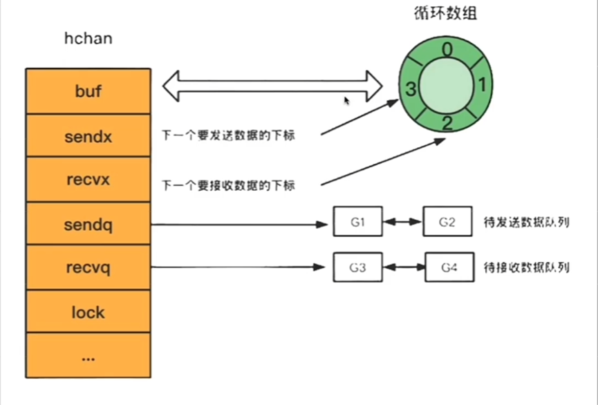
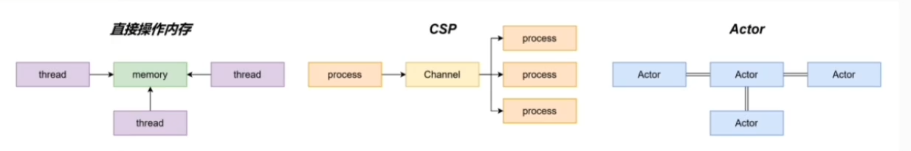

## channel
### channel 的底层实现原理

**概念:**  
Go中的channel是一个队列，遵循先进先出的原则，分则协程之间的通信（Go语言体长不要通过共享内存来通信，而要通过通信来实现内存共享，CSP communicating sequential process 并发模型就是通过goroutine 和 channel 来实现的）

**使用场景:** 
- 停止信号监听
- 定时任务
- 生产方和消费方解耦
- 控制并发数

**底层数据结构:**  
通过var声明或者make函数创建的channel变量是一个存储在 **函数栈** 上的 **指针**，占用8个字节，指向堆上的hchan结构体

源码中 src/runtime/chan.go 定义了 hchan 的数据结构:



```go
type hchan struct {
	/*
	channel 分为无缓冲和有缓冲两种
	对于有缓冲的channel存储数据，使用了 ring buffer 环形缓冲区 来写入数据，本质是循环数组
	为啥是循环数组？普通数组不行吗？ 普通数组容量固定更适合指定的空间，弹出元素的时候普通数组需要廍向前移动。
	当下标超过数组容量后会回到第一个位置所以需要两个字段记录当前读写的下表位置
	*/
	qcount   uint           // total data in the queue 循环数组的元素数量
	dataqsiz uint           // size of the circular queue 循环数组的胀肚
	buf      unsafe.Pointer // 指向底层的循环数组指针  也就是ring buffer
	elemsize uint16         // 元素大小
	
	closed   uint32 // channel 是否关闭的标志
	elemtype *_type // element type 元素类型
	
	// 这里就可以看成循环指针
	sendx    uint   // send index 下一次写下标的位置
	recvx    uint   // receive index 下一次读下标的位置
	
	// 尝试向channel读或者向channel写入数据而被阻塞的goroutine
	recvq    waitq  // list of recv waiters 读等待队列
	sendq    waitq  // list of send waiters 写等待队列

	// lock protects all fields in hchan, as well as several
	// 保护所有hchan的部分  甚至包括 sudog 被组织的几个字段
	// fields in sudogs blocked on this channel.
	//
	// Do not change another G's status while holding this lock
	// (in particular, do not ready a G), as this can deadlock
	// with stack shrinking.
	/*
	在持有这个锁的时候不要随便修改G的状态
	*/
	lock mutex // 互斥锁  保证读写channel的时候不发生并发竞争
}
```

等待队列：

`waitq`包含一个头节点一个尾结点，是个双向链表

每个结点都是一个sudog结构体变量，记录哪个协程在等待，等待的是哪个channel，等待发送、接收的数据在哪

```go
type waitq struct {
	first *sudog
	last  *sudog
}


type sudog struct {
// The following fields are protected by the hchan.lock of the
// channel this sudog is blocking on. shrinkstack depends on
// this for sudogs involved in channel ops.
g *g

next *sudog
prev *sudog
elem unsafe.Pointer // data element (may point to stack)
c        *hchan // channel
...
}
```

操作：
- **创建**

使用`make(chan T, cap)` 来创建channel，make语法在编译的时候会转化为 `makechan64` 和 `makechan`

```go
func makechan64(t *chantype, size int64) *hchan {
	if int64(int(size)) != size {
		panic(plainError("makechan: size out of range"))
	}

	return makechan(t, int(size))
}

func makechan(t *chantype, size int) *hchan { ... }
```

创建channel有两种，一种是带缓冲的channel，一种是不带缓冲的channel

```go
// buffer
ch := make(chan int, 2)
// no buffer
ch := make(chan int)
```

创建的时候会做一些检查: 
1. 元素大小不超过64k
2. 元素对齐大小不能超过 maxAlign 也就是8字节
3. 计算出来的内存是否超过限制

创建时的策略:
1. 如果是无缓冲的 channel，会直接给 hchan 分配内存
2. 如果是有缓冲的 channel，并且元素不包含指针，那么会为 hchan 和底层数组分配一段连续的地址
3. 如果是有缓冲的 channel，并且元素包含指针，那么会为 hchan 和底层数组分别分配地址
```go
// makechan
var c *hchan
switch {
case mem == 0:
    // Queue or element size is zero.
    c = (*hchan)(mallocgc(hchanSize, nil, true))
    // Race detector uses this location for synchronization.
    c.buf = c.raceaddr()
case elem.ptrdata == 0:
    // Elements do not contain pointers.
    // Allocate hchan and buf in one call.
    c = (*hchan)(mallocgc(hchanSize+mem, nil, true))
    c.buf = add(unsafe.Pointer(c), hchanSize)
default:
    // Elements contain pointers.
    c = new(hchan)
    c.buf = mallocgc(mem, elem, true)
}
```
---
- **发送**

发送操作，编译时会转换为 `runtime.chansend` 函数

```go
func chansend(c *hchan, ep unsafe.Pointer, block bool, callerpc uintptr) bool
```

**阻塞式**

调用chansend函数 并且block = true

```go
ch <- 10
```

**非阻塞式**

调用 chansend 函数，并且block=false

```go
select {
    case ch <- 10:
    	...
    default
    	
}
```

向 channel中发送数据时大概分为两大块：检查和数据发送，数据发送流程如下：
- 如果channel的读等待队列存在接收者goroutine
    - 将数据直接发送给第一个等待的 goroutine，唤醒接收的goroutine
- 如果channel的读等待队列不存在接收者goroutine
    - 如果循环数组 buf 未满，那么将会把数据发送到循环数组buf队尾
    - 如果循环数组 buf 已满，这个时候就会走阻塞发送的流程，将当前goroutine加入写等待队列，并挂起等待唤醒
    
---

- **接收**

发送操作，编译时转换为 `runtime.chanrecv` 函数

```go
func chanrecv(c *hchan, ep unsafe.Pointer, block bool) (selected, received bool)
```
**阻塞式**

调用 chanrecv 函数，并且 block = true
```go
<- ch

v := <-ch

v, ok := <-ch

// 当channel 关闭到时候，for循环会自动退出，无需主动监测channel是否关闭，可以防止读取已经关闭的channel，造成督导数据为通道所存储数据类型的零值
for i := range ch {
	fmt.Println(i)
}
```    

**非阻塞式**

调用 chanrecv 函数，并且 block = false
```go
select {
    case <- ch:
    	...
    default
    	
}
```

向 channel 中接收数据时大概分为两大块，检查和数据发送，而数据接收流程如下：
- 如果是channel的写等待队列存在发送者goroutine
    - 如果是无缓冲channel，直接从第一个发送者 goroutine 那里把数据拷贝给接收变量，唤醒发送的 goroutine
    - 如果是有缓冲channel(已满)，将循环数组buf的队首元素拷贝给接收变量，将第一个发送者goroutine的数据拷贝到buf循环数组队尾，唤醒发送的 goroutine
- 如果 channel 的写等待队列不存在发送者 goroutine
    - 如果循环数组buf非空，将循环数组 buf 的队首元素拷贝给接收变量
    - 如果循环数组buf非空，这个时候就会走阻塞接收的流程，将当前 goroutine 加入读等待队列，病挂起等待唤醒
  
---

- **关闭**

关闭操作，调用 close 函数，编译时转换为 `runtime.closechan` 函数
```go
close(ch)

func closechan(c *hchan) 
```

```go
package main

import (
  "fmt"
  "time"
  "unsafe"
)

func main(){
  // ch 是长度为4的带缓冲的 channel
  // 初始 hchan结构体中的buf为空，sendx和recvx均为0
  ch := make(chan string, 4)
  fmt.Println(ch, unsafe.Sizeof(ch))
  go sendTask(ch)
  go receiveTask(ch)
  time.Sleep(1 * time.Second)
}

// G1 是发送者
// 当 G1 向ch里面发送数据的时候，首先会对buf加锁，然后将 task 存储的数据 copy 到 buf 中，然后 sendx++ ， 然后释放对 buf 的锁
func sendTask(ch chan string){
  taskList := []string{"I", "like", "jia jia", "and", "my", "id" , "is", "zhou ", "jia jia"}
  for _, task := range taskList {
    ch <- task
  }
}

// G2 是接收者
// 当 G2 消费 ch 的时候，会首先对 buf 加锁，然后将 buf 中的数据 copy 到 task 变量对应的内存里，然后 recvx++, 并释放锁
func receiveTask(ch chan string){
  for {
    task := <- ch
    fmt.Println("received: ", task)
  }
}
```

---

- **总结**
  - 用来保存goroutine之间传递数据的循环数组: buf
  - 用来记录循环数组当前发送或者接收数据的下标值： sendx 和 recvx
  - 用来保存向该chan发送和从该chan接收数据被阻塞的goroutine队列：sendq和recvq
  - 保证channel写入和读取数据时线程安全的锁: lock
  
### channel 的特点

channel 的类型：无缓冲、有缓冲

channel 有3种模式：写操作模式(单向通道)、读操作模式(单项通道)、读写操作模式(双向通道)

```go
// 写操作模式
make(chan <-int)
// 读操作模式
make(<- chan int)
// 读写操作模式
make(chan int)
```

channel 有三种状态：未初始化、正常、关闭
 

**注意点**
1. 一个channel不能多次关闭，会导致panic
2. 如果多个 goroutine 都监听头一个 channel，那么channel上的数据都可能随机被某一个goroutine取走进行消费
3. 如果多个 goroutine 都监听同一个 channel，如果这个channel被关闭，则所有 goroutine 都能接收到退出信号

### Go channel 有无缓冲的区别

无缓冲：就类似于这个东西我递给你，你不接我就一直举着手，知道你拿走了，我才会收走

有缓冲：只要你桌子上有空余的地方，我就直接放到你空余的地方就好了，除非你的桌子堆满了，我就要等到你空出一个位置之后我放下才会走

|     | 无 缓 冲 | 有 缓 冲 |
|:---:|:---:|:---:|
|创建方式|make(chan T)|make(chan T, size)|
|发送阻塞|数据接收前发送阻塞|缓冲满的时候发送阻塞|
|接收阻塞|数据发送前接收阻塞|缓冲空的时候接收阻塞|

```go
package main

import (
	"fmt"
	"time"
)
// 非缓冲 channel
func loop(ch chan int){
	for {
		select {
		case i := <- ch:
			fmt.Println()
        }
    }
}

func main(){
	ch := make(chan int)
	ch <- 1
	go loop(ch)
	time.Sleep(1 * time.Second)
}
```
这里回报错 `fatal error` 这是因为 ch<-1 发送了，但是没有接收者，所以出现了阻塞

不过这里我们可以把 ch <- 1 放到 go loop 下面，也能够正常执行


如果希望能正常发送和接受，那我们要做一个缓冲 channel

这样程序也能正常运行，这里不做demo了  就把上面的改成缓冲channel 然后多塞几个进去就好了

### channel 为什么是线程安全的

不同协程通过 channel 进行通信，本身的使用场景就是多线程，为了保证数据的一致性，必须实现线程安全

channel的底层实现中，hchan结构体中就采用了 mutex 锁来保证读数据读写安全，在对循环数组buf中数据进行入队和出队操作的时候，必须先获取互斥锁才能操作channel

### channel 如何控制 goroutine 并发执行顺序

多个 goroutine 并发执行的时候，每一个 goroutine 强盗处理器的时间点不一致，goroutine 的执行本身并不能保证顺序，即代码中险些的 goroutine 并不能保证限制性

思路：用channel进行通知，用channel去传递信息，从而控制并发执行顺序

```go
var wg sync.WaitGroup

func main(){
	ch1 := make(chan struct{}, 1)
	ch2 := make(chan struct{}, 1)
	ch3 := make(chan struct{}, 1)
	ch1 <- struct{}{}
	wg.Add(3)
	start := time.Now().Unix()
	go outPut("goroutine1", ch1, ch2)
	go outPut("goroutine2", ch2, ch3)
	go outPut("goroutine3", ch3, ch1)
	wg.Wait()
	end := time.Now().Unix()
	fmt.Printf("duration: %d \n", end - start)
}

func outPut(s string, inch, outch chan struct{}){
	time.Sleep(1 * time.Second)
	select {
	case <- inch:
		fmt.Printf("%s \n", s)
		outch <- struct{}{}
	}
	wg.Done()
}
```

### channel共享内存的优劣

无论是通过共享内存来通信还是通过通信来共或内存，最终我们应用程序都是读取的内存当中的数据，只是前者是直接读取内存的数据，而后者是通过发送消息的方式来
进行同步。而通过发送消息来同步的这种方式常见的就是 Go 采用的 CSP(Ccommunication SequentialProcess)模型以及 Eang 采用的 Actor 模型，这两种方式都是通过
通信来共享内存。



大部分的语言采用的都是第一种方式直接去操作内存，然后通过互斥锁，CAS等操作来保证并发安全。Go引入了Channel和 Goroutine 实现 CSP模型将生产者和消费者进行了解耦，Channel其实和消息队列很相似。而Actor 模型和 CSP模型都是通过发送消息来共享内存，但是它们之间最大的区别就是 Actor 模型当中并没有一个独立的Channel组件，而是 Actor与 Actor 之间直接进行消息的发送与接收，每个 Actor 都有一个本地的"信箱"消息都会先发送到这个"信箱当中"。

- **优点**
  - 使用channel可以帮助我们解耦生产者喝消费者，可以降低并发当中的耦合

- **缺点**
  - 容易出现死锁

### channel 死锁情况
- **死锁**
  - 单个协程永久阻塞
  - 两个或者两个以上的协程的执行过程中，由于竞争资源或由于彼此通信而造成的一种阻塞的现象
  
---

- **channel死锁场景**
  - 非缓存 channel 只写不读
  - 非缓存 channel 读在写后面
  - 缓存 channel 写入超过缓冲区的数量
  - 空读
  - 多个协程互相等待
  
1. 非缓存channel只读不写
```go
func deadlock1(){
	ch := make(chan int)
	ch <- 3 // 这里会一直阻塞
}
```

2. 非缓存channel读在写后
```go
func deadlock2(){
    ch := make(chan int)
    ch <- 3 // 这里会一直阻塞
    num := <-ch
    fmt.Println(num)
}

func deadlock2(){
    ch := make(chan int)
    ch <- 100
    go func(){
  	    num := <-ch
  	    fmt.Println(num)
    }
    time.Sleep(time.Second)
}
```
3. 缓存 channel 写入超过缓冲区数量
```go
func deadlock3(){
	ch := make(chan int, 3)
	ch <- 1
    ch <- 2
    ch <- 3
    ch <- 4 // 这里会一直阻塞
}
```
4. 空读
```go
func deadlock4(){
    ch := make(chan int)
    num := <-ch
    fmt.Println(num)
}
```
5. 多个协程相互等待
```go
func deadlock5(){
    ch1 := make(chan int)
    ch2 := make(chan int)
    go func(){
    	for {
    	    select {
    	    case num := <- ch1:
    	    	fmt.Println(num)
    	    	ch2 <- 100
            }       	
        }   
    }()
    go func(){
        for {
            select {
                case num := <- ch2:
                fmt.Println(num)
                ch1 <- 100
            }       	
        }   
    }()
}
```
### 空 chan 和 关闭的 chan 进行读写会怎么样
1. 空chan
    - 读会读到该chan类型的零值
    - 写会直接写到chan中
2. 关闭的chan
    - 读已经关闭的chan能一直读到东西，但是读到的内容根据通道内关闭前是否有元素而不同，如果有元素就继续读剩下的元素，没有元素就会读零值
    - 写已经关闭的chan会panic
