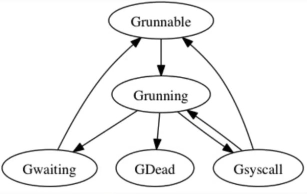
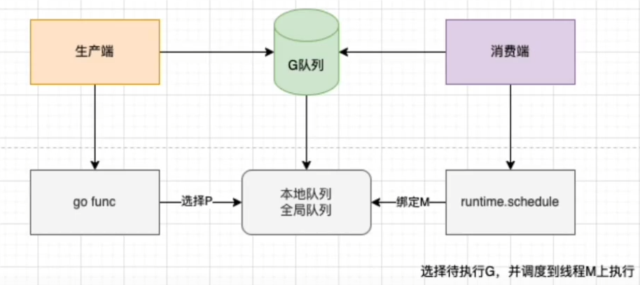

## 协程 Goroutine
### 底层原理

Goroutine 可以理解为一种 Go 语言的协程(轻量级线程)，是 Go 支持高并发的基础，属于用户态的线程，由 Go runtime 管理而不是操作系统

**底层数据结构**
```go
type g struct {
	stack       stack   // offset known to runtime/cgo
	sched     gobuf     // goroutine 切换的时候用于保存 g 的上下文
	goid         int64  // goroutine 唯一id
	gopc           uintptr         // pc of go statement that created this goroutine
	startpc        uintptr         // pc of goroutine function
    ...
}

type gobuf struct {
    sp   uintptr        // 栈指针的位置
    pc   uintptr        // 运行到的程序的位置
    g    guintptr       // 指向 goroutine
    ctxt unsafe.Pointer
    ret  uintptr        // 保存系统调用的返回值
    lr   uintptr
    bp   uintptr // for framepointer-enabled architectures
}

type stack struct {
    lo uintptr  // 栈的下界内存地址
    hi uintptr  // 栈的上界内存地址
}
```
最终有一个 runtime.g 对象放入调度队列

**状态流转**

|**状态**|**含义**|
|:---:|:---:|
|空闲中_Gidle|G刚刚新建，任未初始化|
|待运行_Grunnable|就绪状态，G在运行队列中，等待M取出并运行|
|运行中_Grunning|M正在运行这个G，这个时候M会拥有一个P|
|系统调用中_Gsyscall|M正在运行这个G发起的系统调用，这个时候M并不拥有P|
|等待中_Gwaiting|G在等待某些条件完成，这时候G不在运行也不在运行队列中(可能在channel的等待队列中)|
|已终止_Gdead|G未被使用，可能已执行完毕|
|栈复制中_Gcopystack|G正在获取一个新的栈空间，并把原来的内容复制过去(用于防止GC扫描)|



#### 创建
通过 `go` 关键字调用底层函数 `runtime.newproc()` 创建一个 `goroutine`

当调用该函数之后， goroutine 会被设置成 runnable 状态

创建好的这个goroutine 会申请一个自己的栈空间，同时在 G 的 sched 中维护栈地址与程序计数器这些信息。

！！！每个 G 在被创建之后，都会被优先放到本地队列，如果本地队列已经满了，就会被放到全局队列中！！！‘

#### 运行
goroutine 本身只是一个数据结构，真正让 goroutine 运行起来的是调度器，Go实现了一个用户态的调度器模型(GMP)
这个调度器充分利用现代计算机的多核心特性，同时让多个 goroutine 运行，同时 goroutine 设计的很轻量级，调度和上下文切换的代价都比较小



#### 调度时机
- 新启一个协程和协程执行完毕
- 会阻塞的系统调用，比如文件IO、网络 IO
- channel、mutex 等阻塞操作
- time.sleep
- gc
- 主动调用 runtime.Gosched()
- 运行过久或者系统调用过久等

1. 每个 M 开始执行 P 的本地队列中的 G 时，goroutine 会被设置成 `running` 状态
2. 如果某个 M 把本地队列中的 G 都执行完成之后，然后就会去全局队列中拿 G，这里需要注意，每次去全局队列拿 G 的时候都需要上锁，避免同样的任务被多次拿
3. 如果全局队列都被拿完了，而且当前 M 也没有更多的G可以执行的时候，它就回去其他P的本地队列中拿任务，这个机制被称之为 work stealing 机制，每次会拿走一半的任务，向下取整，比如另一个p中有3个任务，那么拿走一半就是拿走一个
4. 当全局队列为空，M也没办法从其他的 P 中拿任务的时候，就会让自身进入自选状态，等待有新的 G 进来。最多只有 GOMAXPROCS 个 M 在自旋状态，过多的 M 自旋会浪费 CPU 资源

#### 阻塞
channel 的读写操作、等待锁、等待网络数据、系统调用等都有可能发生阻塞，会调用底层函数 `runtime.gopark()` 会让出 cpu 时间片，让调度器安排其他等待的任务进行，并在下次某个时候从该位置恢复执行

当调用该函数之后，goroutine 会被设置成 waiting 状态

#### 唤醒
处于 waiting 状态的 goroutine， 在调用 `runtime.goready()` 函数后会被唤醒，唤醒的goroutine 会被放到 M 对应的上下文P对应的 runqueue 中等待被调度

当调用该函数后 goroutine 会处于 runnable 的状态

#### 退出
当 goroutine 执行完成后，会调用底层函数 `runtime.Goexit()`

当调用该函数之后，goroutine会被设置为 dead 状态

### goroutine 和线程的区别

| |goroutine|线程|
|:---:|:---:|:---:|
|内存占用|创建一个goroutine的栈内存消耗为2KB，实际运行过程中如果栈空间不足会自动进行扩容|创建一个线程的栈内存消耗为 1MB|
|创建和销毁|goroutine因为是由Go runtime 负责管理的，创建和销毁的消耗非常小，是用户级|线程创建和销毁都有巨大的内存消耗，因为要和操作系统打交道，是内核级的，通常解决办法就是线程池|
|切换|goroutine切换秩序保存三个寄存器: PC、SP、BP(程序计数器、堆栈指针寄存器，内容为栈顶的偏移地址、基地址寄存器，常用于访问内存时存放内存单元的偏移地址)goroutine切换约 200ns，相当于2400-3600条指令|当线程切换到时候需要保存各种寄存器，方便恢复现场。线程切换会消耗 1000-1500ns 相当于 12000-18000 条指令|

### goroutine 泄露场景
**泄露原因**
- Goroutine 内进行 channel/mutex 等读写操作一直被阻塞
- Goroutine 内的业务逻辑进入死循环，资源一直无法释放
- Goroutine 内的业务逻辑进入长时间等待，有不断新增的 goroutine 入场

**泄露场景**

如果输出的 goroutines 数量是不断在增加的，就说明存在泄露

- **nil channel**

channel 如果忘记初始化，无论你是读还是写都会阻塞

```go
package main

import (
	"fmt"
	"runtime"
	"time"
)

func main(){
	fmt.Println("before goroutine: ", runtime.NumGoroutine())
	block1()
	time.Sleep(time.Second * 1)
	fmt.Println("after goroutine: ", runtime.NumGoroutine())
}

func block1(){
	var ch chan int
	for i := 0; i < 10; i++ {
		go func() {
			<- ch
		}()
	}
}
```
- **发送不接收**

channel发送数量超过channel接收数量，也会造成阻塞
  
```go
func block2(){
	ch := make(chan int)
	for i := 0; i < 10; i++ {
        go func() {
            ch <- 1
        }()
    }
}
```
- **接收不发送**
  
channel接收数量超过channel发送数量，也会造成阻塞

```go
func block2(){
	ch := make(chan int)
	for i := 0; i < 10; i++ {
        go func() {
            <-ch
        }()
    }
}
```
- http request body 未关闭

`resp.Body.Close()` 未被调用的时候，goroutine 不会退出

```go
func requestWithNoClose(){
	_, err := http.Get("www.baidu.com")
	if err != nil {
		fmt.Println("err: ", err.Error())
	}
}

func requestWithClose(){
	resp, err := http.Get("www.baidu.com")
	if err != nil {
		fmt.Println("err: ", err.Error())
		return
	}
	defer resp.Body.Close()
}

var wg sync.WaitGroup

func block4(){
	for i := 0; i < 10; i++ {
		wg.Add(1)
		go func() {
			defer wg.Done()
			requestWithClose()
		}()
	}
}

func main(){
	block4()
	wg.Wait()
}
```
一般发起request 请求 需要关闭 body

- **互斥锁忘记解锁**

第一个协程获取 `sync.Mutex` 加锁了，但是他可能在处理业务逻辑，又或是忘记了 Unlock 了。

因此导致后面的协程想加锁，却因锁未释放被阻塞了
```go
func block5(){
	var mutex sync.Mutex
	for i := 0; i < 10; i++ {
	    go func(){
	    	mutex.Lock()
        }()   	
    }   
}
```

- **sync.waitGroup 使用不当**

由于 `wg.Add` 的数量与 `wg.Done` 的数量不匹配，因此在调用 wg.Wait 方法后一直阻塞等待

```go
func block6(){
	var wg sync.WaitGroup
	for i := 0; i < 10; i++ {
		go func(){
		    wg.Add(2)
		    wg.Done()
		    wg.Wait()
		}()
    }
}
```

#### 如何排查
单个函数：调用 runtime.NumGoroutine 方法来打印执行代码前后 Goroutine 的运行数量，进行前后比较，就能知道有没有泄露了

生产测试环境：使用 pprof 实时检测Goroutine 的数量

### Go 如何查看正在执行的 goroutine 的数量

在程序中引入 pprof package

```go
package main

import "net/http"

func main(){
	for i := 0; i < 100; i++ {
		go func() {
			select {}
		}()
	}
	go func() {
		http.ListenAndServe("localhost:6060", nil)
	}()

	select {}
}
```
**分析goroutine文件**

执行命令
```shell
go tool pprof -http=:1248 http://127.0.0.1:6060/debug/pprof/goroutine
```

会自动打开一个网页

可惜我看不到图  so sad

Could not execute dot; may need to install graphviz.


### 如何控制并发 goroutine 的数量

#### 为什么要控制goroutine并发的数量
在开发过程中，如果对goroutine不加以控制而进行滥用的话，可能会导致服务整体崩溃。比如耗尽系统资源导致程序崩溃，或者CPU使用率过高导致系统忙不过来

#### 用什么方法控制 goroutine 并发的数量
- 有缓冲 channel

利用缓冲满时发生阻塞的特性
```go
package main

import (
	"fmt"
	"runtime"
	"sync"
)

var wg = sync.WaitGroup{}

func main(){
	// 模拟用户请求
	requestCount := 10
	fmt.Println("goroutine_num", runtime.NumGoroutine())
	// 管道长度即最大并发数
	ch := make(chan bool, 3)
	for i := 0; i < requestCount; i++ {
		wg.Add(1)
		ch <- true
		go Read(ch,i)
	}
	wg.Wait()
}

func Read(ch chan bool, i int){
	fmt.Printf("goroutine_num: %d, go func: %d", runtime.NumGoroutine(), i)
	<- ch
	wg.Done()
}
```
输出结果 默认不超过3(4-1)个 goroutine 并发执行

- 无缓冲channel

任务发送和执行分离，指定消费者并发协程数
```go
package main

import (
	"fmt"
	"runtime"
	"sync"
)

var wg = sync.WaitGroup{}

func main(){
	// 模拟用户请求
	requestCount := 10
	fmt.Println("goroutine_num", runtime.NumGoroutine())
	// 管道长度即最大并发数
	ch := make(chan bool)
	for i := 0; i < 3; i++ {
		go Read(ch,i)
	}
	for i := 0; i < requestCount; i++ {
		wg.Add(1)
		ch <- true
	}
	wg.Wait()
}

func Read(ch chan bool, i int){
	for _ = range ch {
		fmt.Printf("goroutine_num: %d, go func: %d", runtime.NumGoroutine(), i)
		wg.Done()
	}
}
```

