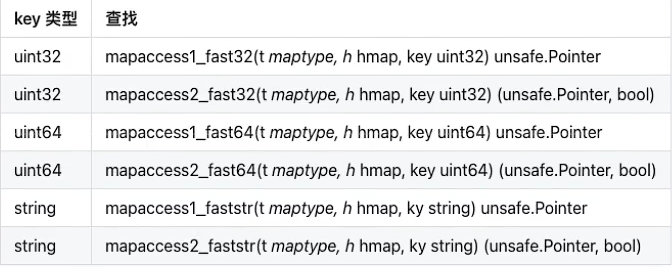
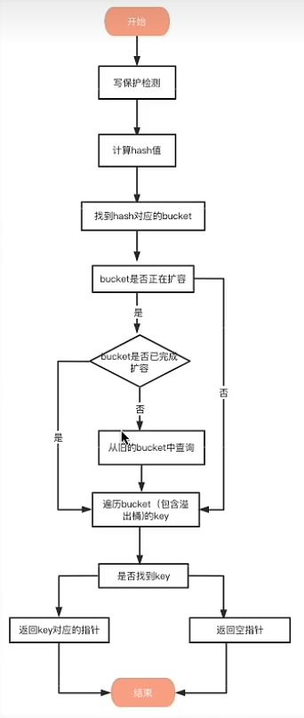

[toc]
## Go map
### Go map 的实现原理
Go中的map是一个指针，占用8个字节，指向hmap结构体

源码在 src/runtime/map.go 中定义了hmap的数据结构

hmap半酣若干给结构为bmap的数组，每个bmap底层都采用链表结构，bmap通常称其为bucket，也就是go数据结构中桶的那个说法

具体用到的一些数据结构
```go
// Go map 的底层结构体表示
type hmap struct {
    count     int    // map中键值对的个数，使用len()可以获取 
	flags     uint8  // 这事一个状态标记位，标记是否处于正在写入
	B         uint8  // 哈希桶的数量的log2，比如有8个桶，那么B=3
	noverflow uint16 // 溢出桶的数量
	hash0     uint32 // 哈希种子

	buckets    unsafe.Pointer // 指向哈希桶数组的指针，数量为 2^B 
	oldbuckets unsafe.Pointer // 扩容时指向旧桶的指针，当扩容时不为nil 
	nevacuate  uintptr        // 扩容进度，小鱼此处地址的buckets表示已经迁移完成了

	extra *mapextra  // 可选字段  存储溢出桶，这个字段是为了优化GC扫描而设计的
}

const (
	bucketCntBits = 3
	bucketCnt     = 1 << bucketCntBits     // 桶数量 1 << 3 = 8
)

// Go map 的一个哈希桶，一个桶最多存放8个键值对
type bmap struct {
    // tophash存放了哈希值的最高字节
	tophash [bucketCnt]uint8
	// 用于实现快速定位key的位置，在实现过程中会使用key的哈希值的高八位作为tophash存放在tophash字段中
	// tophash字段不仅存储key哈希值的高八位，还会存储一些状态来表明当前桶的状态
    // 特殊标记相关在下面tophash有明确说明
    // 在这里有几个其它的字段没有显示出来，因为k-v的数量类型是不确定的，编译的时候才会确定
    // keys: 是一个数组，大小为bucketCnt=8，存放Key
    // elems: 是一个数组，大小为bucketCnt=8，存放Value
    // 你可能会想到为什么不用空接口，空接口可以保存任意类型。但是空接口底层也是个结构体，中间隔了一层。因此在这里没有使用空接口。
    // 注意：之所以将所有key存放在一个数组，将value存放在一个数组，而不是键值对的形式，是为了消除例如map[int64]所需的填充整数8（内存对齐）
    keys    [bucketCnt]keyType
	values  [bucketCnt]valueType
    // overflow: 是一个指针，指向溢出桶，当该桶不够用时，就会使用溢出桶
    overflow uintptr
}
```
**图像如下**

这里还没有画出溢出桶，找个图

这里绿色部分就是溢出桶

```go
//可能的tophash值。我们保留了一些特殊标记的可能性。
//每个存储桶（包括其溢出存储桶，如果有的话）将有其全部或全部
//vacuum*状态中的条目（在evacuate（）方法期间除外，该方法只发生
//在映射写入期间并且因此在该时间期间没有其他人能够观察到映射）。
emptyOne       = 1 // this cell is empty
evacuatedX     = 2 // key/elem is valid.  Entry has been evacuated to first half of larger table.
evacuatedY     = 3 // same as above, but evacuated to second half of larger table.
evacuatedEmpty = 4 // cell is empty, bucket is evacuated.
minTopHash     = 5 // minimum tophash for a normal filled cell.

// tophash calculates the tophash value for hash.
func tophash(hash uintptr) uint8 {
    top := uint8(hash >> (goarch.PtrSize*8 - 8))
    if top < minTopHash {
        top += minTopHash
    }
    return top
}

这里我们可以看到，为了防止高八位和这些状态值相等，都自动加上了minTopHash这些值
```

**mapextra结构体**
```go
// mapextra holds fields that are not present on all maps.
type mapextra struct {
    //如果key和elem都不包含指针并且是内联的，那么我们标记bucket
    //类型为不包含指针。这样可以避免扫描此类地图。
    //但是，bmap.overflow是一个指针。为了保持水桶溢出
    //活着时，我们将指向所有溢出存储桶的指针存储在hmap.extra.overflow和hmap.extra.oldoverflow中。
    //只有当key和elem不包含指针时，才会使用overflow和oldoverflow。
    //overflow包含用于hmapbucket的溢出bucket。
    //oldoverflow包含hmap.oldbuckets的溢出bucket。
    //间接寻址允许在hiter中存储指向切片的指针。	overflow    *[]*bmap
	overflow    *[]*bmap
	oldoverflow *[]*bmap

	// nextOverflow保存一个指向空闲溢出存储桶的指针。
	nextOverflow *bmap
}
```
当map的key和value都不是指针类型对象的时候，bmap将完全不包含指针，那么gc的时候就不用扫描bmap，bmap指向一处同的字段overflow是uintptr类型，为了防止这些overflow
桶被gc掉，所以需要mapextra.overflow将它保存起来。如果bmap的overflow是*bmap类型，那么gc扫描的是一个个拉链表，效率明显不如直接扫描一段内存

**总结**

注意这里上面提到的key和value都是各自存放在一起的，并不是key-value/key-value 这种存储形式，当key和value类型不同的时候二者占用的字节大小不一样，这样可能会因为
考虑内存对齐而造成内存空间浪费，所以go采用key和value分开存储的设计，这样更节省内存空间


这一段是map里面必须要弄懂的，后面扩容相关规则参考这篇博客 说得还挺清楚的
https://blog.csdn.net/Peerless__/article/details/125458742

### Go map的遍历为什么是无序的
使用range多次遍历map的时候输出的key和value顺序有可能不同，这事Go语言的设计者们有意为之，旨在告诉开发者们，Go底层实现并不保证map遍历顺序稳定，请打架
不要依赖range遍历结果顺序

主要原因有两点：
- map在遍历的时候并不是从固定的0号bucket开始遍历的，每次遍历都会从一个随机值序号的bucket，在从其中随机的cell开始遍历
- map遍历时，是按序遍历bucket，同时按需遍历bucket中和其他overflow bucket中的cell。但是map在扩容后会发生key的搬迁，这造成原来落在一个bucket中的key，搬迁后，有可能落到其他bucket中了，从这个角度看遍历map的结果就不可能是按照原来的顺序了

map本身是无序的，且遍历的时候顺序还会被随机化，如果想顺序遍历map，需要对map key 先排序，再按照key的顺序遍历map。

### 为什么map不是线程安全的
map默认是并发不安全的，同时对map进行并发读写，程序会出现panic

Go官方在经过长时间讨论后认为map更适配典型使用场景，不需要从多个goroutine中进行安全访问，而不是为了小部分情况(并发访问)，导致大部分程序付出枷锁的代价(性能)，决定了不支持

如果两个协程同时读写，会出现致命错误：fatal error: concurrent map writes

**注意！** 这个fatal是不能被recover进行异常捕获的

如果想要实现map的线程安全
- 方法1：使用读写锁 --- map + sync.RWMutex

```go
package main

import (
	"fmt"
	"sync"
	"time"
)

func main() {
	var lock sync.RWMutex
	s := make(map[int]int)
	for i := 0; i < 100; i++ {
		go func(i int) {
			lock.Lock()
			s[i] = i
			lock.Unlock()
		}(i)
	}

	for i := 0; i < 100; i++ {
		go func(i int) {
			lock.RLock()
			fmt.Printf("map 元素 %v    %v \n", i, s[i])
			lock.RUnlock()
		}(i)
	}
	time.Sleep(1 * time.Second)
}
```

- 方法2 使用 Go提供的 sync.map
```go
package main

import (
	"fmt"
	"sync"
	"time"
)

func main() {
	var m sync.Map
	for i := 0; i < 100; i++ {
		go func(i int) {
			m.Store(i, i)
		}(i)
	}

	for i := 0; i < 100; i++ {
		go func(i int) {
			v, ok := m.Load(i)
			fmt.Printf("load: %v, %v", v, ok)
		}(i)
	}
	time.Sleep(1 * time.Second)
}
```

### Go map 如何查找
Go语言中读取map有两种语法：带comma和不带comma，当要查询的key不在map里面，带comma的用法会返回一个bool型的变量提示key是否在map中，而不殆comma的语句则会返回一个value类型的零值。
如果value是int就会返回0，如果value是string类型就会返回空字符串。

```go
// 不带 comma
value := a["name"]
fmt.Printf("value %s", value)

// 带 comma
value, ok := a["name"]
```

map的查找可以通过生成会变吗可以知道，根据key的不同类型/返回参数，编译器会将查找函数用具体的函数替换，优化效率


**查找流程**


1. 写保护检测

函数首先会检查map的标志位flags，如果flags的写标志位此时被置为1了，说明有其他的协程正在进行写操作，进而导致程序panic，这也说明了map不是线程安全的


2. 计算hash值
```go
hash := t.hasher(key, uintptr(h.hash0))
```
key 经过哈希函数计算之后，得到的哈希值如下（主流64位机下共六十四个bit位） 不同类型的key会有不同搞得hash函数：

10010111|000011110110110010001111001010100010010110010101010|01010

3. 找到hash值对应的bucket

bucket定位：哈希值的低B个bit位，用来定位key锁存放的bucket

如果当前正在扩容中，并且定位到的旧的bucket数据还未完成迁移，就会使用就的bucket(扩容前的bucket)

```go
// 计算hash值
hash := t.hasher(key, uintptr(h.hash0))
// 桶的个数n-1，即 1 << B-1, B=5时，则有0-31号桶
m := bucketMask(h.B)
// 计算hash值对应的bucket
// t.bucketsize 为一个bmap的大小，通过对哈希值和桶个数取模得到桶的编号，通过对桶编号和buckets其实地址进行运算，获取哈希值对应的bucket
b := (*bmap)(add(h.buckets, (hash&m)*uintptr(t.bucketsize)))
// 是否在扩容
if c := h.oldbuckets; c != nil {
	// 桶的个数已经发生增长，则就bucket的桶个数为当前桶个数的一半
    if !h.sameSizeGrow() {
        // There used to be half as many buckets; mask down one more power of two.
        m >>= 1
    }
    // 计算哈希值对应的旧的bucket
    oldb := (*bmap)(add(c, (hash&m)*uintptr(t.bucketsize)))
    // 如果就的bucket数据还没有完成迁移，则使用旧的bucket查找
    if !evacuated(oldb) {
        b = oldb
    }
}
top := tophash(hash)
```

4. 遍历bucket查找

tophash值定位：哈希值的高八个bit位，用来快速判断key是否已经存在当前bucket中，如果不在的画则需要取bucket的overflow中查找

用步骤2中的hash值得到高八个bit位，也就是10010111，转化为10进制也就是151
```go
top := tophash(hash)

// tophash calculates the tophash value for hash.
func tophash(hash uintptr) uint8 {
    top := uint8(hash >> (goarch.PtrSize*8 - 8))
    if top < minTopHash {
        top += minTopHash
    }
    return top
}
```
上面函数中的hash是六十四位的，但是sys.PtrSize 的值是8，所以 `top := uint8(hash >> (goarch.PtrSize*8 - 8))` 等同于 `top = uint8(hash >> 56)`
最后top取出来的值就是hash的高八位值

在bucket以及bucket的overflow中寻找tophash值（HOB hash）为151*的曹魏，即key所在的位置，如果找到空槽或者2号槽位，这样整个查找过程就结束了，其中空槽为代表没找到
```go
bucketloop:
	for ; b != nil; b = b.overflow(t) {
		for i := uintptr(0); i < bucketCnt; i++ {
			if b.tophash[i] != top {
				// 未使用的槽位，插入
				if b.tophash[i] == emptyRest {
					break bucketloop
				}
				continue
			}
			// 找到tophash值对应的key
			k := add(unsafe.Pointer(b), dataOffset+i*uintptr(t.keysize))
			if t.indirectkey() {
				k = *((*unsafe.Pointer)(k))
			}
			if t.key.equal(key, k) {
				e := add(unsafe.Pointer(b), dataOffset+bucketCnt*uintptr(t.keysize)+i*uintptr(t.elemsize))
				if t.indirectelem() {
					e = *((*unsafe.Pointer)(e))
				}
				return e
			}
		}
	}
```
（这里顶格写的是标签，然后break + 标签 是跳出整个标签，相关的关键字用法还有goto 是跳转到标签段执行，这里可以取搜索下相关的资料）

5. 返回keyh对应的指针

如果上面的步骤找到了key对应的槽位下标i，我们再来看如何获取到key和value的

```go
dataOffset = unsafe.Offsetof(struct {
    b bmap
    v int64
}{}.v)

bucketCntBits = 3
bucketCnt     = 1 << bucketCntBits

// key 定位公式
k := add(unsafe.Pointer(b), dataOffset+i*uintptr(t.keysize))

// value elem 定位公式
e := add(unsafe.Pointer(b), dataOffset+bucketCnt*uintptr(t.keysize)+i*uintptr(t.elemsize))
```
bucket里面keys的起始地址就是unsafe.Pointer(b)+dataOffset

第i个下标key的地址就要在此基础上跨过i个key的大小；

而我们还知道 value 的地址是在所有的key之后，因此第i个下标的value地址还要加上所有key的偏移

### Go map 解决冲突的方式
比较常见的解决hash冲突的方法有链地址发和开放寻址法

**链地址法：** 当哈希冲突发生的时候，创建新的单元，并将新单元添加到冲突单元所在链表的尾部

**开放寻址法：** 当哈希冲突发生的时候，从发生冲突的那个单元起，按照一定的次序，从哈希表中寻找一个空闲的单元，然后把发生冲突的元素存入到该单元。开放寻址发需要的表长度要大于等于所需要存放的元素数量

开放寻址法有多种方式：线性探测法，平方探测法，随机探测法和双重哈希法。这里以线性探测法来说明

**线性探测法**

设 Hash(key) 表示关键字 key 的哈希值，表示哈希表的槽位数（哈希表大小）

线性探测法可以表示为：

如果 `Hash(x) % M` 已经有数据，则尝试 `(Hash(x) + 1) % M`;

如果 `Hash(x + 1) % M` 已经有数据，则尝试 `(Hash(x) + 2) % M`;

以此类推

**两种方法比较**

对于链地址法，基于数组+链表进行存储，链表结点可以在需要的时候再创建，不必像开放地址法那样先申请号足够的内存，因此链地址法对于内存的利用率会比开放地址法的利用率高。
链地址法对装载因子的容忍度会更高，并且适合存储大对象、大数据量的哈希表。而且相较于开放寻址法则，它更加灵活，支持更多的优化策略，比如可以采用红黑树来代替链表。但是链地址法需要额外的空间来存储指针

对于开放地址法，它只有数组一种数据结构完成存储，继承了数组的优点，比如对cpu缓存友好，易于序列号操作，但是它对于内存的利用率不如链地址法，并且发生冲突的时候代价更高。当数据量明确，装载因子小的时候更适合用开放寻址法

**总结**

在发生哈希冲突的时候，python中的dict采用的开放寻址发，java的hashmap采用的是链地址法，具体就是插入key到map中，当key定位的桶充满八个元素后(这里的单元就是桶，不是元素)，将会创建出一个溢出桶，并且将溢出桶插入当前桶所在链表尾部

```go
	if inserti == nil {
		// The current bucket and all the overflow buckets connected to it are full, allocate a new one.
		newb := h.newoverflow(t, b)
		// 创建要给新的溢出桶
		inserti = &newb.tophash[0]
		insertk = add(unsafe.Pointer(newb), dataOffset)
		elem = add(insertk, bucketCnt*uintptr(t.keysize))
	}
```

### Go 的负载因子为什么是6.5
在Go的数据结构那一章里面提到了Go map的负载因子

负载因子就是用于衡量当前哈希表中空间占用率的核心指标，也就是每个bucket桶存储的平均元素个数。

负载因子 = 哈希表存储的元素个数/桶个数

另外负载因子与扩容、迁移等重新散列(rehash)行为有直接关系：
- 在程序运行到时候会不断地进行插入、删除等，会导致bucket不均，内存利用率低，需要迁移
- 在程序运行的时候会出现负载因子过大，需要做扩容，解决bucket过大的问题。

负载因子是哈希表中的一个重要指标，在各种版本的哈希表视线中都有类似的东西，主要目的是为了平衡buckets的存储空间大小和查找元素时的性能高低。

在接触各种哈希表的时候都可以关注一下，做不同的对比，看看各家的考量。

```go
func overLoadFactor(count int, B uint8) bool {
    return count > bucketCnt && uintptr(count) > loadFactorNum*(bucketShift(B)/loadFactorDen)
}
const loadFactorNum = 13
// 扩容规则的意思是：如果map中键值对的数量 count> 8，也就是说，至少要能装满一个bmap；
// 且 count > 13*桶的数量/2，也就是说 count/bucketCount >6.5；两个条件都满足才会允许扩容；
```

**为什么是6.5？**

为什么Go语言中的哈希表的负载因子是6.5，为什么不是8也不是1，这里面有可靠的数据支撑吗？

**测试报告**

实际上这是Go官方经过认真测试得出的数字，在官方报告中一共包含4个关键指标

loadFactor、%overflow、bytes/entry、hitprobe、missprobe

- loadFactor: 负载因子，也有叫装载因子
- %overflow: 溢出率，有溢出bucket的百分比
- bytes/entry: 平均每对key value的开销字节数 
- hitprobe: 查找一个存在的key时，需要查找的平均个数
- missprobe: 查找一个不存在的key的时候，需要查找的平均个数

**选择数值**

Go官方发现：装在因子越大，填入的元素越多，空间利用率就越高，但是发生哈希冲突的可能性就变大。反之，转载因子越小，填入的元素越少，冲突发生的几率就越小，但是空间浪费就会变得更多，而且会提高扩容操作的次数

根据测试结果，Go官方选取了一个相对适中的值，把Go中的map的负载因子编码为6.5，这就是6.5的理由

这意味着在Go语言中，当map存储的元素个数大于或者等于 6.5 * 桶个数的时候，就会触发扩容行为

### map 如何扩容
**扩容规则**

1. 条件1：超过负载。 map元素个数 > 6.5 * 桶个数
```go
func overLoadFactor(count int, B uint8) bool {
    return count > bucketCnt && uintptr(count) > loadFactorNum*(bucketShift(B)/loadFactorDen)
}
const loadFactorNum = 13
// 扩容规则的意思是：如果map中键值对的数量 count> 8，也就是说，至少要能装满一个bmap；
// 且 count > 13*桶的数量/2，也就是说 count/bucketCount >6.5；两个条件都满足才会允许扩容；
```
2. 条件2： 溢出桶太多。 

当桶总数 < 2^15 时， 如果溢出桶总数 >= 桶总数，则会认为溢出桶过多。

当桶总数 >= 2^15 时， 直接与 2^15 比较，当溢出桶总数 >= 2^15，则会认为溢出桶太多
```go
// tooManyOverflowBuckets reports whether noverflow buckets is too many for a map with 1<<B buckets.
// Note that most of these overflow buckets must be in sparse use;
// if use was dense, then we'd have already triggered regular map growth.
func tooManyOverflowBuckets(noverflow uint16, B uint8) bool {
	// If the threshold is too low, we do extraneous work.
	// If the threshold is too high, maps that grow and shrink can hold on to lots of unused memory.
	// "too many" means (approximately) as many overflow buckets as regular buckets.
	// See incrnoverflow for more details.
	if B > 15 {
		B = 15
	}
	// The compiler doesn't see here that B < 16; mask B to generate shorter shift code.
	return noverflow >= uint16(1)<<(B&15)
}
```
对于条件2，其实算是对条件1的补充。因为在负载因子较小的情况下，有可能map的查找效率也低，而第一点识别不出来这种情况。

表面现象就是负载因子比较小，即map里元素总数少，但是桶的数量多(真是分配的桶数量多，包括大量的溢出桶)。比如不断的增删，这样会造成overflow的bucket数量增多
，但是负载因子又不高，达不到第一点的临界值，就不能触发扩容机制来环节这种情况，这样会造成桶的使用率不高，值存储的比较系数，查找插入效率会变得比较低，因此有了第二扩容条件

**扩容机制:**

- 双倍扩容：针对条件1，新建一个buckets数组，新的buckets大小是原来的两倍，然后旧的buckets数据搬迁到新的buckets。这种方法称为双倍扩容
- 等量扩容：针对条件2，并不扩大容量，buckets数量维持不变，重新做一遍类似双倍扩容的搬迁动作，把松散的键值对重新排列一次，是的同一个bucket中的key排列得更加紧密，更节约空间，提高bucket的利用率。

**扩容函数:**

在golang数据结构中提到的hashGrow并没有实现真正的”搬迁“，它只是分配好了新的buckets，并将老的buckets挂到了oldbuckets字段上。真正搬迁buckets动作在growWork()函数中，
而调用 growWork() 函数的动作是在 mapassign 和 mapdelete 函数中，也就是插入或者修改、删除key的时候都会尝试进行搬迁buckets的工作，先检查oldbuckets是否搬迁完，具体来说就是检查oldbuckets是否为nil

```go
func hashGrow(t *maptype, h *hmap) {
    // bigger为需要扩充的数量
    bigger := uint8(1)
    // 判断是否满足扩容条件
    if !overLoadFactor(h.count+1, h.B) {
        // 不满足bigger为0
        bigger = 0
        h.flags |= sameSizeGrow
    }
    // oldbuckets和 按照修改后的数组创建 newbuckets
    // 记录老的 buckets
    oldbuckets := h.buckets
    // 申请新的buckets
    newbuckets, nextOverflow := makeBucketArray(t, h.B+bigger, nil)
    // 注意 &^ 运算符，这块代码的逻辑是转移标志位
    flags := h.flags &^ (iterator | oldIterator)
    if h.flags&iterator != 0 {
        flags |= oldIterator
    }
    // 修改h的buckets数量，也就是翻倍，例如原来B=2，数量为 1<<2 == 4，1<<(2+1) == 8；
    // 修改flag，把oldbuckets、newbuckets修改，将rehash进度置为0，将溢出桶的数量置为0
    h.B += bigger
    h.flags = flags
    h.oldbuckets = oldbuckets
    h.buckets = newbuckets
    // 搬迁进度
    h.nevacuate = 0
    h.noverflow = 0
    // 修改 extra字段中的 oldoverflow 和 overflow 
    if h.extra != nil && h.extra.overflow != nil {
        // Promote current overflow buckets to the old generation.
        if h.extra.oldoverflow != nil {
            throw("oldoverflow is not nil")
        }
        h.extra.oldoverflow = h.extra.overflow
        h.extra.overflow = nil
    }
    if nextOverflow != nil {
        if h.extra == nil {
            h.extra = new(mapextra)
        }
        h.extra.nextOverflow = nextOverflow
    }
}
```

由于map扩容需要将原有的key/value 重新搬迁到新的内存地址，如果map存储了数以亿记的key-value，一次性搬迁将会造成比较大的时延，因此 Go map的扩容采取了
一种被称为 **渐进式** 的方式，原有的key并不会一次性搬迁完毕，每次搬迁只会搬迁两个bucket

```go
func growWork(t *maptype, h *hmap, bucket uintptr) {
	// make sure we evacuate the oldbucket corresponding
	// to the bucket we're about to use
	evacuate(t, h, bucket&h.oldbucketmask())

	// evacuate one more oldbucket to make progress on growing
	if h.growing() {
		evacuate(t, h, h.nevacuate)
	}
}
```

### map 和 sync.Map 性能比较

**sync.Map**
```go
type Map struct {
	mu Mutex
	read atomic.Value // readOnly
	dirty map[any]*entry
	misses int
}
```
对比原始map：和原始map+RWLock的实现并发的方式相比，减少了加锁对性能的影响，它做了一些优化：可以无锁访问read map，而且会优先操作 read map，倘若只操作read map 就可以满足要求，
那就不用去操作 write map(dirty)，所以在某些特定场景它发生锁竞争的频率会远远小于 map + RWLock 的实现方式

优点：适合多读写少的场景

缺点：写多的场景，会导致read map 缓存失效，需要加锁，冲突变多，性能急剧下降