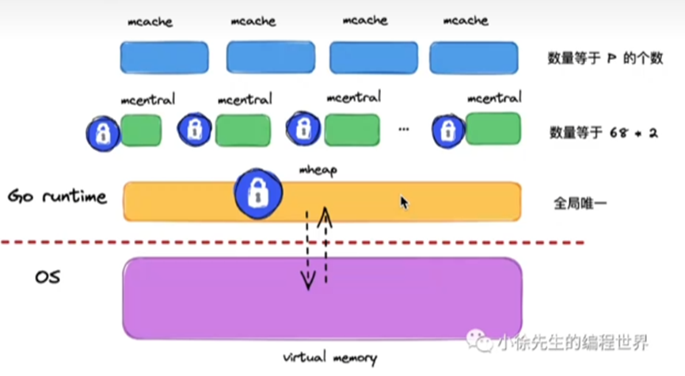

## GO 内存
### Go 内存分配机制
Go语言内置运行时 (runtime) 抛弃了传统的内存分配方式，改为自主管理。这样可以自主地实现更好的内存使用模式，比如内存池，预分配等等。这样，不会每次内存分配的时候都需要进行系统钓友。

**设计思想**

- 内存分配算法采用 Google 的 TCMalloc 算法，每个线程都会自行维护一个独立的内存池，进行内存分配时优先从该内存池中分配，当内存池不足时才会向加锁向全局内存池申请，减少系统调用并且避免不同线程对全局内存池的锁竞争
- 把内存切分的非常细小，分为多级管理，以降低锁的粒度
- 回收对象内存时，并没有将其真正释放掉，只是放回预先分配的大块内存中，以便复用。只有内存闲置过多的时候，才会尝试归还部分内存给操作系统，降低整体开销

**分配组件**

Go的内存管理组件主要有: mspan、mcache、mcentral 和 mheap



内存管理单元 mspan

`mspan` 是内存管理的基本单元，该结构体中包含 next 和 prev 两个字段，他们分别指向了前一个后一个 mspan，每个 mspan都管理 npages 个大小为 8kb的页，
一个span是由多个page组成的，这里的页不是操作系统中的内存页，它们是操作系统内存页的整数倍。

page是内存存储的基本单元，“对象”放到page中
```go
type mspan struct {
	next        *mspan // 后指针
	prev        *mspan // 前指针
	startAddr   uintptr // 管理页的起始地址 指向page
	npages      unitptr // 页面数量
	spanclass   spanClass // 规格
}

type spanClass uint8
```

Go 有 68 种不同大小的 spanClass, 用于小对象的分配

```go
const _NumSizeClasses = 68
var class_to_size = [_NumSizeClasses]uint16{0, 8, 16, 32, 64, 80, 96, 112, 128 ...}
```
如果按照序号为1的spanClass(对象规格为8B)分配，每个span占用的字节数: 8k, mspan 可以保存 1024 个对象

如果按照序号为2的spanClass(对象规格为16B)分配，每个span占用的字节数: 8k, mspan 可以保存 512 个对象

...

如果按照序号为67的spanClass(对象规格为32k)分配，每个span占用的字节数: 32k, mspan 可以保存 1 个对象

当大于32k的对象出现的时候，回直接从heap分配一个特殊的 span，这个特殊的span类型是0，只包含了一个大对象

**线程缓存:mcache**

mcache 管理线程在本地缓存的 mspan，每个goroutine绑定的P都有一个mcache字段
```go
type mcache struct {
	alloc [numSpanClasses]*mspan
}
_NumSizeClasses = 68
numSpanClasses = _NumSizeClasses << 1
```
mcache 用 span classes 作为索引管理多个用于分配的 mspan，它包含所有规格的mspan。它是 _NumSizeClasses 的两倍，其中 *2 是将spanClass 分成了又指针和没有指针两种，
方便垃圾回收。对于每种规格，又两个mspan，一个mspan不包含指针，另一个mspan则包含指针。对于无指针对象的mspan在进行垃圾回收的时候无需进一步扫描它是否引用了其他活跃的对象。

mcache 在初始化的时候是没有任何 mspan 资源的，在使用过程中回动态地从 mcentral 申请，只会回缓存下来，当对象小鱼等于32kb大小的时候，使用 mcache 的相应规格的 mspan 进行分配

**中心缓存: mcentral**

mcentral

```go
type mcentral struct {
	spanclass   spanClass// 当前规格大小
	partial [2]spanSet  // 有空闲的
	full    [2]spanSet  // 没有空闲object的mspan列表
}
```
每个mcentral管理一种spanClass的mspan，并将有空闲空间和没有空闲空间的貌似盘分开管理。

partial和full的数据类型为 spanSet，表示 mspans 集，可以通过 pop、push 来获得 mspans

```go
type spanSet struct {
	spineLock   mutex
	spine       unsafe.Pointer  // 指向 []span 指针
	spineLen    uintptr     // spin array length， accessed atomically
	spineCap    uintptr
	index       headTailIndex   // 前三十二位是头指针，后三十二位是尾指针
}
```
简单说下 mcache 从 mcentral 获取和归还 mspan 的流程:
- 获取; 加锁，从 partial 链表找到一个可用的 mspan；并将其从 partial 链表删除；将取出的 mspan 加入到 full 链表;将 mspan 返回给工作线程，解锁。
- 归还; 加锁，将 mspan 从 full 链表删除; 将 mspan 加入到 partial 链表，解锁

**页堆 mheap**

mheap管理Go的所有动态分配内存，可以认为是Go程序持有的整个堆空间，全局唯一
```go
type mheap struct {
	lock  mutex     // 全局锁
	pages pageAlloc // 页面分配的数据结构
	allspans []*mspan // 所有通过 mheap_ 申请的 mspans 也就是 堆
	arenas [1 << arenaL1Bits]*[1 << arenaL2Bits]*heapArena
	// 所有中心缓存 mcentral
	central [numSpanClasses]struct {
		mcentral mcentral
		pad      [cpu.CacheLinePadSize - unsafe.Sizeof(mcentral{})%cpu.CacheLinePadSize]byte
	}
	...
}
```
所有 mcentral 的集合则是存放于 mheap 中的。 mheap 里的 arens 区域是堆内存的抽象，运行时会将 8kb 看作一页，这些内存页中存储了所有在堆上初始化的对象。
运行时使用二维的 runtime.heapArena 数组管理所有的内存，每个 runtime.heapArena 都会管理64MB的内存。

当申请内存时，依次 经过 mcache 和 mcentral 都没有合适规格的大小就会向mheap 申请一个块内存，然后按照指定规格划分为列表，并添加到相同规格大小的 mcentral 的非空闲列表后面

**分配对象**

- 微对象(0,16B): 先使用线程缓存上的微型分配器，再一次尝试线程缓存、中心缓存、堆 分配内存
- 小对象(16B,32KB): 依次尝试线程缓存、中心缓存、堆分配内存;
- 大对象(32kb,+∞): 直接尝试堆分配内存

**分配流程**

- 首先计算使用的大小规格
- 然后使用 mcache 中对应大小规格的块分配
- 如果 mcentral 中没有可用的块，向 mheap 申请，并根据算法找到最合适的 mspan。
- 如果申请到的 mspan 超出申请大小，将会根据需求进行切分，以返回用户所需数据页数。剩余的页构成一个新的 mspan 放回 mheap 的空闲列表。
- 如果 mheap 中没有可用 span，则向操作系统申请一系列新的页面(1MB)

### Go 内存逃逸机制

**概念**

在一段程序中，每一个函数都会有自己的内存区域存放自己的局部变量、返回地址等，这些内存会由编译器在栈中进行分配，每一个函数都会分配一个栈桢，在函数运行结束后进行销毁，
但是有些变量我们向在函数运行结束后仍然使用它，那么就需要把这个变量在堆上分配，这种从"栈"上逃逸到"堆"的现象就称为内存逃逸。

在栈上分配的地址，一般由系统申请和释放，不会由额外的性能开销，比如函数的入参、局部变量、返回值等。在堆上分配的内存，如果要回收掉，需要进行GC，那么GC一定会带来额外的性能开销。
编程语言不断优化GC算法，主要目的都是为了减少GC带来的额外性能开销，变量一旦逃逸导致性能开销变大。

**逃逸机制**

编译器会根据变量是否被外部引用来决定是否逃逸：
1. 如果函数外部没有引用，则优先放到栈中;
2. 如果函数外部存在引用，则必定放到堆中;
3. 如果栈上放不下，就必定会放到堆中;

逃逸分析也就是由编译器决定哪些变量放在栈，哪些放在堆中，通过编译参数 -gcflag=-m 可以查看编译过程中的逃逸分析，发生逃逸的几种场景如下：

```go
// 指针挑选
package main

func escape1() *int{
	var a int = 1
	return &a
}

func main() {
	escape1()
}
```
通过`go build -gcflags=-m main.go`查看逃逸情况

函数返回值为局部变量的指针，函数虽然退出了，但因为指针的存在，只想的内存不能随着函数结束而回收，因此只能分配在堆上
```go
// 栈空间不足
func escape2(){
    s := make([]int, 0, 10000)
    for index, _ := range s {
        s[index] = index
    }
}

func main() {
    escape2()
}
```

当栈空间足够的时候，不会发生逃逸，但是当变量过大时，已经完全超过栈空间的大小时，将会发生逃逸到堆上分配内存。局部变量s占用内存过大，编译器会将其分配到堆上
```go
// 变量大小不确定
func escape3() {
    number := 10
    s := make([]int, number) // 编译期间无法确定 slice 的长度
    for i := 0; i < len(s); i++ {
        s[i] = i
    }
}

func main() {
    escape3()
}
```

编译期间无法确定 slice 的长度，这种情况为了保证内存的安全，编译器也会触发逃逸，在堆上进行分配内存。直接 `s := make([]int, 10)` 不会发生逃逸

**动态类型**

动态类型就是编译期间不确定参数的类型、参数的长度也不确定的情况下发生逃逸

空接口 interface{} 可以表示任意的类型，如果函数参数为 interface{}, 编译期间很难确定其参数的具体类型，也会发生逃逸。

```go
func escape4() {
    fmt.Println(1111)
}

func main() {
    escape4()
}
```
fmt.Println(a ...interface{}) 函数参数为 interface，编译器不确定参数的类型，会将变量分配到堆上

```go
func escape5()func() int {
	var i int = 1
	return func() int {
		i++
		return i
	}
}

func main() {
	escape5()
}
```
闭包函数中局部变量i在后续函数是继续使用的，编译器将其分配到堆上

**总结**

1. 栈上分配内存比在堆中分配内存效率高
2. 栈上分配的内存不需要GC处理，而堆需要
3. 逃逸分析目的是决定内分配地址是栈还算堆
4. 逃逸分析在编译阶段完成

因为无论变量大小，只要是指针变量都会在堆上分配，所以对于小变量我们还是使用传值效率(而不说传指针)更高一点。

### Go 内存对齐机制

**什么是内存对齐**

为了让CPU可以更快的存取到各个字段，Go编译器会帮你把struct结构体做数据的对齐。所谓的数据对齐，是指内存地址是所存储数据大小(按字节为单位)的整数倍，以便CPU可以一次将该一次将该数据从内存中读取出来。
编译器通过在结构体的各个字段之间填充一些空白已达到对齐的目的。

**对齐系数**

不同硬件平台占用的大小和对齐值都可能是不一样的，每个特定平台上的编译器都有自己的默认"对齐"系数，32位系统对齐系数是4，64位系数对齐系数是8

不同类型的对齐系数也可能不一样，使用Go语言中的 unsafe.Alignof 函数可以返回相应类型的对齐系数，对齐系数都符合 2^n 这个规律，最大也不会超过8

优点：

1. 提高可移植性，有些CPU可以访问任意地址上的任意数据，而有些CPU只能在特定地址访问数据，因此不同硬件平台具有差异性，这样的代码就不具有移植性，如果在编译的时候将分配的内存进行对齐，就具有平台的可以执行了
2. 提高内存的访问效率，32位CPU下一次可以从内存中读取32位(4个字节)的数据，64位CPU下一次可以从内存中读取 64位 (8个字节)的数据，这个长度也成为CPU的字长。CPU一次可以读取1个字长的数据到内存中，如果所需要读取的数据正好跨了一个字长，那就得花两个CPU周期的时间去读取了。因此在内存中存放数据的时候要进行内存对齐，可以提高内存访问效率

缺点：
1.　存在内存空间的浪费，实际上是空间换时间

#### 结构体对齐

对齐原则：

1. 结构体变量中成员的偏移量必须是成员大小的整数倍
2. 整个结构体的地址必须是最大字节的整数倍(结构体的内存占用是 1/4/8/16 byte)

```go
package main

import (
	"fmt"
	"unsafe"
)

type T1 struct {
	i16  int16 // 2 byte
	bool bool  // 1 byte
}

type T2 struct {
	i8  int8  // 1 byte
	i64 int64 // 8 byte
	i32 int32 // 4 byte
}

type T3 struct {
	i8  int8  // 1 byte
	i32 int32 // 4 byte
	i64 int64 // 8 byte
}

func main() {
	t1 := T1{}
	fmt.Println(unsafe.Sizeof(t1))  // 4 byte
	t2 := T2{}
	fmt.Println(unsafe.Sizeof(t2))  // 24 byte
	t3 := T3{}
	fmt.Println(unsafe.Sizeof(t3))  // 16 byte
}
```

### Go GC 原理

垃圾回收是一种内存管理机制

现代的一些语言内存管理方式分两种, 自动和手动，像C和C++使用的就是手动管理内存的方式，在编码的时候需要主动申请或者释放内存，而Go python 这些就是使用的自动的内存管理系统，有
内存分配器和垃圾收集器来代为分配和回收内存，其中垃圾收集器就是我们常说的GC

在应用程序中会使用到两种内存，分别位 堆heap 和 栈stack，GC负责回收堆内存，而不会收栈中的内存

栈是线程的专用内存，专门为了函数执行而准备的，存储着函数中的局部变量以及调用栈，函数执行完毕后，编译器就可以将栈上分配的内存可以直接释放，而不需要通过GC来回收

堆是程序共享的内存，需要GC进行回收在堆上分配的内存

垃圾回收的执行过程被划分为两个半独立的组件:
- 赋值器 Mutator：这一名本质上是指代用户态的代码。因为对垃圾回收器而言，用户态的代码仅仅只是在修改对象之间的引用关系，也就是在对象图(对象之间引用关系的一个有向图)上进行操作。
- 回收器 Collector：负责执行垃圾回收的代码。

**主流GC算法**

比较常见的垃圾回收算法有三种：
1. 引用计数法：为复合对象维护一个引用计数，当引用该对象的对象销毁的时候，引用计数-1，当引用计数为0的时候就回收该对象
    - php python
    - 优点：对象回收快，不会出现内存耗尽或达到某个阈值的时候才回收
    - 缺点：不能很好的处理循环引用，而实时维护引用计数也是有损耗的
2. 分代收集：按照对象生命周期长短划分不同的代空间，生命周期长的放入老年代，短的放入新生代，不同代有不同的回收算法和回收频率
    - java
    - 优点：回收性能好
    - 缺点: 算法复杂
3. 标记-清除：从根变量开始遍历所有引用的对象，标记引用的对象，没有标记的进行回收
    - Golang 三色标记法
    - 优点：解决了引用计数的缺点
    - 缺点：需要STW,暂停掉程序进行

---
Golang垃圾回收采用分代回收策略：(同java) (并发三色标记)

在此基础上三色标记法混合写屏障技术，GC过程和其他用户Goroutine可以并发运行，但需要一定时间的stw

三色标记法实际上是没有三色之分的，这里的三色对应的是垃圾回收过程中对象的三种状态

1.	初始化垃圾回收，标记所有根对象为灰色，开启写屏障（STW： stop the word），（this activity is usually very quick， with in 10 to 30 microseconds on average）
2.	并发标记，三色标记（这个阶段占用时间最长）
    
    - 遍历所有灰色对象，弹出一个对象A
    - 将A标记为黑色，将他们引用的指针对象标记为灰色
    - 直到灰色对象队列为空

3.	标记结束阶段，关闭写屏障，时间较短
4.	清理数据，延时清理

- 灰色：对象还在标记队列中等待
- 黑色：对象已被标记，gcmarkBits 对应位为1 不会被回收
- 白色：对象没被标记，gcmarkbits 对应位为0 会在本次gc回收

1. 创建黑白灰三个集合
2. 所有对象放入白色集合中
3. 遍历所有root对象，把遍历的对象从白色集合放入毁色集合，这里放入灰色集合的都是根节点的对象
4. 遍历灰色集合，将灰色对象引用的对象从白色集合放入灰色集合，自身标记为黑色
5. 重复步骤4，直到灰色中无任何对象，其中用到两个机制

    - 写屏障 : 上面说到的 stw的目的是防止GC扫描的时候内存变化引起混乱，而写屏障就是让 goroutine 与 GC 同时运行的手段，虽然不能完全消除 STW，但是可以大大减少STW的时间。写屏障在GC特定的时间开启，开启后指针传递时会把指针标记，即本轮不进行回收，下次GC再确定
    - 辅助GC : 为了防止内存分配过快，GC过程中 mutator 线程会并发运行，而 mutator assist 机制会协助GC做一部分工作

6. 收集所有白色对象(垃圾)

---

**root 对象**

根对象在垃圾回收的术语中又叫根集合，它是垃圾回收器在标记过程时最先检查的对象，包括：

全局变量：程序在编译期就能确定的那些存在于程序整个生命周期的变量。

执行栈：每个goroutine都包含自己的执行栈，这些执行栈上指向堆内存的指针

寄存器：寄存器的值可能表示一个指针，参与计算的这些指针可能指向某些赋值器分配的堆内存区块

**插入写屏障**

对象被引用时触发的机制(只在堆内存中生效)：复制器这一行为通知并发执行的回收器，被引用的对象标记为灰色

缺点：结束的时候需要STW来重新扫描栈，标记栈上的白色对象的存活

**删除写屏障**

对象被删除时触发的机制(只在堆内存中生效)：赋值器将这一行为通知给并发执行的回收器，被删除的对象，如果自身为灰色或者白色，那么就标记为灰色

缺点: 一个对象的引用被删除后，即使没有其他存活的对象引用它，它仍然会活到下一轮，会产生很大冗余扫描成本，且降低了回收精度

**混合写屏障**

GC没有混合写屏障前，一直是插入写屏障；混合写屏障是插入写屏障+删除写屏障，写屏障只应用在堆上，栈上不启用（栈上启用成本很高）

- GC开始将栈上的对象全部标记为黑色
- GC期间，在任何栈上创建的新对象均为黑色。
- 被删除的对象标记为灰色
- 被添加的对象标记为灰色

**GC流程**

1. 标记准备 mark setup： 打开写屏障，需 STW
2. 标记开始 marking：使用三色标记法并发标记，与用户程序并发执行
3. 标记终止 mark termination： 对触发写屏障的对象进行重新扫描标记，关闭写屏障，需 stw
4. 清理 sweeping：讲需要回收的内存归还到堆中，将过多的内存归还给操作系统，与用户程序并发执行


#### GC触发时机

主动触发： 调用 runtime.GC() 触发GC

被动触发： 
- 定时触发，该触发条件由 runtime.forcegcperiod 控制变量，默认为2分钟。当唱过两分钟没有产生任何GC的时候，触发GC
- 根据内存分配阈值触发，该触发条件由环境变量 GOGC控制，默认值为 100%，当前堆内存占用是上次GC结束后占用内存的两倍时，触发GC

### GC 如何调优
- 控制内存分配速度，限制Goroutine的数量，提高赋值器 mutator 的cpu利用率 (降低GC的利用率)
- 少使用 + 连接 string
- slice 提前分配足够的内存来降低扩容带来的拷贝
- 避免 map key 对象过多，导致扫描时间增加
- 避免复用，减少对象分配，例如使用 sync.Pool 来复用需要频繁创建的临时对象、使用全局变量等
- 增大 GOGC 的阈值，降低GC运行频率

### 如何查看GC信息

1. GODEBUG='gctrace=1'

```go
package main
func main(){
	for n := 1; n < 100000; n++ {
		_ = make([]byte, 1<<20)
    }
}
```

```shell
GODEBUG='gctrace=1' go run main.go
```


字段含义：

|字段|含义|
|:---:|:---:|
|gc 2|第2个gc周期|
|0.006|程序开始后的 0.006秒|
|2%|该gc周期中cpu的使用率|
|0.006|标记开始时们所花费的时间 wall clock|
|4.5|标记过程中，并发标记所花费的时间 wall clock|
|0.058|标记终止时，stw所花费的时间 wall clock|
|0.048|标记开始时mstw所花费的时间 cpu time|
|0.070|标记过程中，标记辅助所花费的时间 cpu time|
|0.027|标记过程中，并发标记所花费的时间 cpu time|
|3.6|标记过程中，GC空闲的时间 cpu time|
|0.47|标记终止时，stw所花费的时间 cpu time|
|4|标记开始时，堆的大小的实际值|
|5|标记结束时，堆的大小的实际值|
|1|标记结束时，标记为存活的对象大小|
|5|标记结束时，堆的大小预测值|
|8|P的数量|

2. go tool trace

3. debug.ReadGCStats

4. runtime.ReadMemStats