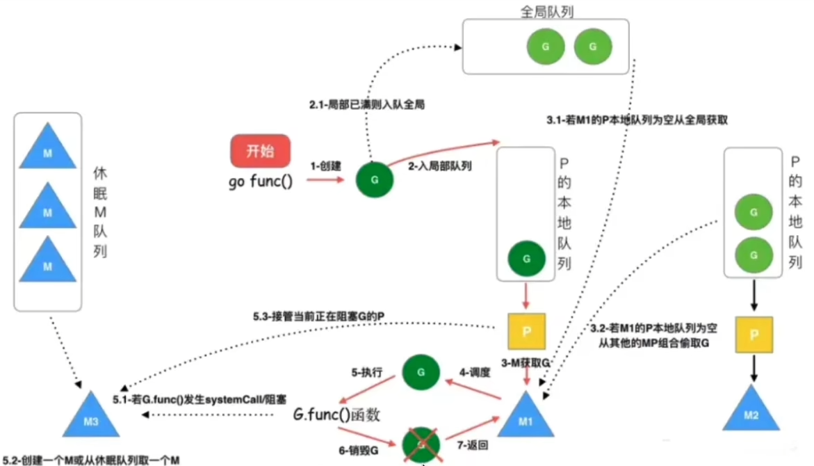
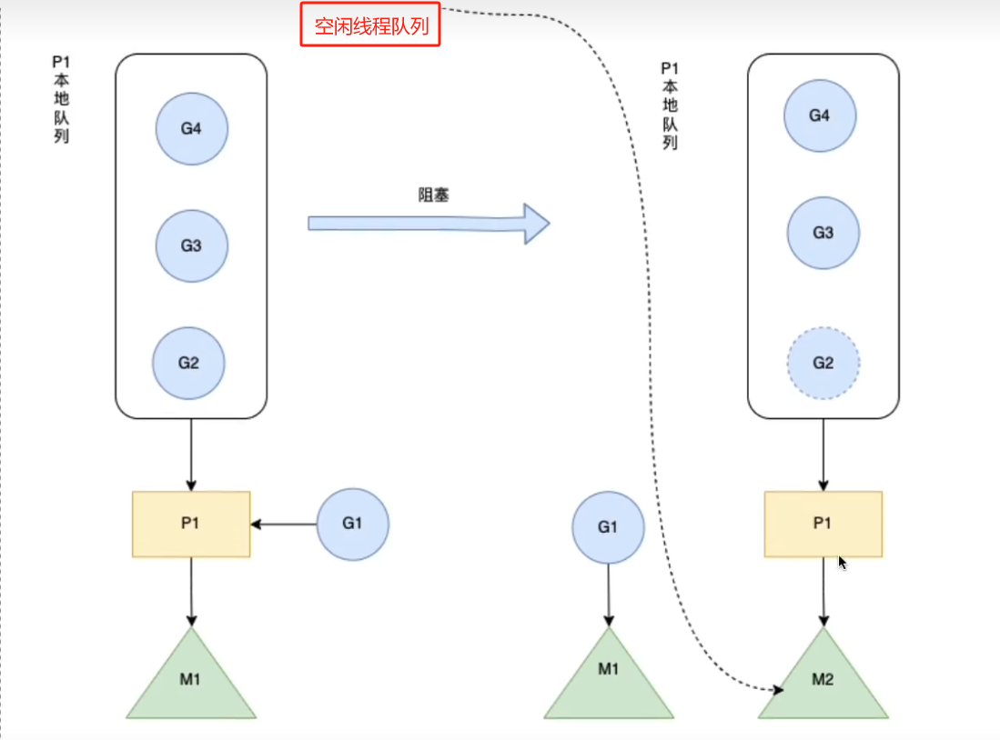
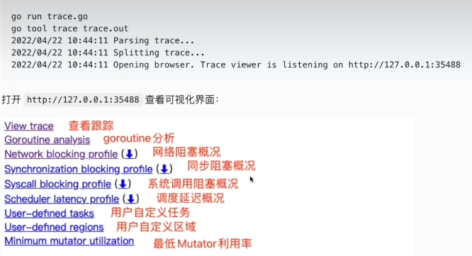

## 调度模型
### Go 线程实现模型
Go实现的是两级线程模型(M:N)，准确的说是GMP模型，是对两级线程模型的改进实现，使它能够更加灵活地进行线程之间的调度。

**背景**

| | 含义|缺点|
|:---:|:---:|:---:|
|单进程时代|每个程序就是一个进程，直到一个程序运行完才能运行下一个进程|无法并发，只能串行\\进程阻塞所带来的CPU时间浪费|
|多进程/线程时代|一个线程阻塞，CPU可以立即切换到其他线程中执行|进程/线程占用内存高\\进程/线程上下文切换成本高|
|协程时代|协程(用户态线程)绑定线程(内核态线程)CPU调度线程执行|实现起来比较复杂，协程和线程的绑定依赖调度器实现(调度器算法)|

线程->CPU由操作系统调度， 协程->线程 由Go调度器来调度，协程与线程的映射关系有三种线程模型

#### 三种线程模型
主要分为：
1. 内核级线程模型
2. 用户级线程模型
3. 两级线程模型

它们的区别在于用户线程与内核线程之间的对应关系

---

- 内核级线程模型  1:1

1个用户线程对应1个内核线程，这种最容易实现，协程的调度都由CPU完成了

优点：
1. 实现起来最简单
2. 能够利用多核
3. 如果进程中要给线程被阻塞不会影响其他线程，是能够切换同一个进程内其他线程继续执行

缺点
1. 上下文切换成本高

---

- 用户级线程模型(n:1)

1个进程中所有线程对应1个内核线程

优点
1. 上下文切换成本低，再用户态即可完成协程切换

缺点
1. 无法利用多核
2. 一旦协程阻塞造成线程阻塞，本线程的其他协程无法执行

---

- 两级线程模型 (M:N)

M个协程对应N个内核线程

优点
1. 利用多核
2. 上下文切换成本低
3. 如果一个线程被阻塞不会阻塞其他线程，是能够切换同一进程内的其他线程继续执行

缺点
1. 实现起来最复杂

### GMP 和 GM

调度器的好坏评价标准: 是否能在适当的实际将合适的协程分配到合适的位置，保证公平和效率

Go采用了 GMP 模型(对两级线程模型的改进实现)，使它能够更加灵活地进行线程之间的调度。

#### GMP
GMP 是 Go 运行时调度层面的实现，包含4个重要结构，分别是G、M、P、Sched


1. G：取Goroutine的首字母，即用户态的线程，也叫协程；
2. M：取Machine的首字母，和内核线程一一对应，为简单理解，我们可以认为其就是内核线程； 
   - **M(Machine)**:Go对操作系统线程(0Sthread)的封装，可以看作操作系统内核线程，想要在 CPU上执行代码必须有线程，通过系统调用 clone 创建。M在绑定有效的P后，进入一个调度循环，而调度循环的机制大致是从P的本地运行队列以及全局队列中获取G，切换到G的执行栈上并执行G的函数，调用goexit 做清理工作并回到M，如此反复。M并不保留G状态，这是G可以跨M调度的基础。M的数量有限制，默认数量限制是10000，可以通过 debug.SetMaxThreads()方法进行设置，如果有M空闲，那么就会回收或者睡眠。
3. P：取Processor的首字母，表示处理器（可以理解成用户态的协程调度器），是G和M之间的中间层，负责协程调度。
   - **P(Processor)**:虚拟处理器，M执行G所需要的资源和上下文，只有将P和M绑定，才能让P的runq中的G真正运行起来。P的数量决定了系统内最大可并行的G的数量，**P的数量受本机的CPU核数影响，可通过环境变量$GOMAXPROCS或在runtime.GOMAXPROCS()来设置，默认为CPU核心数。
4.	Sched 调度器结构，它维护有存储M和G的全局队列以及调度器的一些状态信息

| |G|M|P|
|:---:|:---:|:---:|:---:|
|数量限制|无限制、受机器内存影响|有限制，默认最多 10000| 有限制，最多 GOMAXPROCS 个|
|创建时机|go func| 当没有足够的M来关联P并运行其中的可运行的G的时候就会请求创建新的M|再确定了P的最大数量n后，运行时系统会根据这个数据创建P|

**核心数据结构**
```go
type g struct {
	stack       stack   // offset known to runtime/cgo
	sched     gobuf     // goroutine 切换的时候用于保存 g 的上下文
	goid         int64  // goroutine 唯一id
	gopc           uintptr         // pc of go statement that created this goroutine
	startpc        uintptr         // pc of goroutine function
    ...
}

type p struct {
	lock        mutex
    id          int32
    status      uint32 // one of pidle/prunning/...
    // Queue of runnable goroutines. Accessed without lock.
    runqhead uint32     // 本地队列队头
    runqtail uint32     // 本地队列队尾
    runq     [256]guintptr  // 本地队列 大小为256的数组，数组往往都会被读到缓存中，对缓存友好，效率较高
    runnext guintptr    // 下一个优先执行的 goroutine （一定是最后生产出来的），为了实现局部性原理，runnext的G永远是会被最先调度的
    ...
}

type m struct {
    g0      *g // goroutine with scheduling stack
    // 每个M都有一个自己的G0，不知想任何函数 在系统调用或者调度的时候，M会切换到 G0，使用 G0的栈空间来调度
    curg    *g // 当前正在执行的G
    ...
}

type schedt struct {
    ...
    // Global runnable queue.
    runq     gQueue // 全局队列 链表 无长度限制
    runqsize int32  // 全局队列长度
    ...
}
```
GMP模型的实现算是Go调度器的一大进步，但调度器任然有一个令人头疼的问题，那就是不支持抢占式调度，这导致一旦某个G中出现死循环的代码逻辑，那么G将
永久占用分配给它的 P 和 M，而位于同一个P中的其他G将得不到调度，出现饿死的情况。

当只有要给 P (GOMAXZPROCS=1) 的时候，整个Go程序中其他的G都将被饿死，因此在 Go1.2 版本中实现了基于写作的 “抢占式” 调度，在 Go 1.14 版本中实现了基于信号的 “抢占式” 调度。

#### GM 模型


缺点：
1. 主要就是性能不行，全局队列的锁竞争
2. M和G切换的额外开销：当 M1 在执行 G1 的时候，M1 创建了 G2，为了继续执行 G1，需要把G2保存到全局队列中，无法保证 G2是被M1处理。因为M1 原本就保存了 G2 的信息，所以 G2 最好是在 M1 上执行，这样的话也不需要转移 G 到全局队列和线程上下文切换
3. 线程使用效率不能最大化，没有 work-stealing 和 hand-off 机制(这是啥  我也不知道)

### Go 调度的原理
goroutine 调度的本质就是将 **Goroutine(G)** 按照一定算法放到CPU上去运行。

CPU感知不到Goroutine，只知道内核线程，所以需要Go调度器将协程调度到内核线程上面去，然后操作系统调度器将内核级线程放到CPU上去执行

M是对内核级线程的封装，所以Go调度器的工作就是将G分配到M

Go调度器的实现不是一蹴而就的，它的调度模型与算法也是几经演化，从最初的GM模型、到GMP模型，从不支持抢占到支持协作式抢占，再到支持基于信号的异步抢占，经理了不断地优化与打磨

**设计思想**
- 线程复用(work stealing 和 hand off)
- 利用并行(利用多核CPU)
- 抢占调度(解决公平性问题)

**调度对象**

Go调度器

    Go 调度器是属于 Go runtime 的一部分，Go runtime 负责实现 Go 的并发调度、垃圾回收、内存堆栈管理等关键功能

**被调度对象**

G的来源
- P的runnext(只有1个G，局部性原理，永远会被最先调度执行)
- P的本地队列(数组，最多256个G)
- 全局G队列(链表，无限制)
- 网络轮询器 network poller (存放网络调用被阻塞的G)

P的来源
- 全局P队列(数组，GOMAXPROCS个P)

M的来源
- 休眠线程队列(未绑定P，长时间休眠会等待 GC 回收销毁)
- 运行线程(绑定P，指向P中的G)
- 自旋线程(绑定P，指向M的G0)

其中运行线程数+自旋线程数 <= P的数量(GOMAXPROCS), M个数 >= P个数

**调度流程**

协程的调度采用了生产者消费者模型，实现了用户任务与调度器的解耦


1. go creates a new goroutine
2. newly created goroutine being put into local or global queue
3. A M is being waken or created to execute goroutine
4. Schedule loop
5. Try its best to get a goroutine to execute
6. Clear, reenter schedule loop



生产端我们开启的每个协程都是一个计算任务，这些任务会被提交给go的runtime。如果计算任务非常多，有成千上万个，那么这些任务是不可能同时被立刻执行的
所以这个计算任务一定会被先暂存起来，一般的做法是放到内存的队列中等待被执行

G的生命周期：G从创建、保存、被获取、调度和执行、阻塞、销毁，步骤如下：
1. 步骤1：创建G，关键字 go func() 创建G
2. 步骤2：保存G，创建的G优先保存到本地队列P，如果P满了，则会平衡部分P到全局队列中
3. 步骤3：唤醒或者新建M执行任务，进入循环调度(4,5,6)
4. 步骤4：M获取G，M首先从P的本地队列获取G，如果P为空，则从全局队列中获取G，如果全局队列也为空，则从另一个本地队列中偷取一半的G，这种从其他P偷的方式称之为 work stealing
5. 步骤5：M调度和执行G，M调用 G.func() 函数执行G
    - 如果M在执行G的过程中发生系统调用阻塞(同步)，会阻塞G和M(操作系统限制)，此时P会和当前M解绑寻找新的M，如果没有空闲的M就会创建一个新的M，接管正在阻塞G所属的P，接着继续执行P中其余的G，这种阻塞后释放P的方式称之为hand off。当系统调用结束后，这个G会尝试获取一个空闲的P执行，优先获取之前绑定的P，并放入到这个P的本地队列，如果获取不到P那么这个线程M变成休眠状态，加入到空闲县城后，然后这个G会被放入到全局队列中
    - 如果M在执行G的过程中发生网络IO等操作阻塞时(异步)，阻塞G，不会阻塞M。M会寻找P中其他可执行的G继续执行，G会被网络轮询器 network poller 接手，当阻塞的G恢复后，G1从network poller 被移回到P的LRQ中，重新进入可执行状态。异步情况下，通过调度，Go scheduler 成功地将 I/O 的任务转变成为了 CPU任务，或者说将内核级线程切换转变成了用户级别的 goroutine 切换，大大提高了效率
6. 步骤6：M执行完G后清理现场，重新进入调度循环(将M上运行的goroutine切换为G0，G0负责调度时协程的切换)

其中步骤2中保存G的详细流程如下：
- 执行 go func 的时候，主线程M0回调用 newproc()
- 每个协程 G 都会被尝试先放到 P 中的 runnext，若 runnext 为空则放到 runnext 中，生产结束
- 若 runnext 已满，则将原来 runnext 中的 G 踢到本地队列中，将当前G放到 runnext 中，生产结束
- 若本地队列也满了，则将本地队列中的 G 拿出一半，放到全局队列中，生产结束

**调度时机**

什么时候进行调度(执行/切换)？

在一下情形下，回切换正在执行的goroutine

- 抢占式调度
    - sysmon检测到协程运行过久 （比如说sleep，死循环）
        - 切换到 g0， 进入循环调度
    
- 主动调度
    - 新起一个协程和协程执行完毕
        - 触发调度循环
    - 主动调用 runtime.Gosched()
        - 切换到g0，进入调度循环
    - 垃圾回收之后
        - stw之后，会重新选择g开始执行
    
- 被动调度
    - 系统调用(比如文件IO)阻塞(同步)
        - 阻塞G和M，P和M分离，将P交给其他M绑定，其他M执行P的剩余G
    - 网络IO调用阻塞(异步)
        - 阻塞G，G移动到NewPoller，M执行P的剩余G
    - atomic/mutex/channel 等阻塞(异步)
        - 阻塞G，G移动到 channel 的等待队列中，M执行P的剩余G
    
**调度策略**

使用什么调度策略来挑选下一个goroutine执行？

由于P中的G分布在 runnext、本地队列、全局队列、网络轮询器中，则需要挨个判断是否有可执行的G，大体逻辑如下：
- 每执行61次调度循环，从全局队列获取G，若有则直接返回
- 从P上的runnext看一下是否有G，若有则直接返回
- 从P上的本地队列看一下是否有G，若有则直接返回
- 上面都没查找到时，则去全局队列、网络轮询器查找或者从其他P中窃取，一直阻塞到获取一个可用的G为止

源码如下：
```go
func schedinit() {
	// 取出g0
	_g_ := getg()
	if raceenabled {
		_g_.racectx, raceprocctx0 = raceinit()
	}	

	// 设置最大线程数
	sched.maxmcount = 10000
	
	...	

	// 初始化m0, 前边已经将m0和g0的关系绑定好了
	// 只是检查一下各种变量，然后将m0挂到allm链表中
	mcommoninit(_g_.m)

	...

	sched.lastpoll = uint64(nanotime())
	// ncpu在osinit时已经获取
	procs := ncpu
	// 如果GOMAXPROCS设置并且合法就将procs的设置为GOMAXPROCS
	if n, ok := atoi32(gogetenv("GOMAXPROCS")); ok && n > 0 {
		procs = n
	}

	if procresize(procs) != nil {
		throw("unknown runnable goroutine during bootstrap")
	}

	...	
}
```

### Go 的 work stealing 机制
当线程M无可运行的G的时候，尝试从其他M绑定的P偷取G，减少空转，提高了线程利用率(避免闲着不干活)。

当从本线程绑定P本地队列、全局G队列、netpoller都找不到可执行的g，会从别的P里窃取G并放到当前P上面。

从 netpoller 中拿到的G 是 Gwating 状态(存放的是因为网络IO被阻塞的G)，从其他地方拿到的G是 Grunnable状态

从全局队列取G数量: N = min(len(GRQ)/GOMAXPROCS+1, len(GRQ/2)) (根据GOMAXPROCS负载均衡)

从其他P本地队列窃取的G数量： N = len(LRQ)/2 （平分）

**窃取流程**

源码见 runtime/proc.go stealWork函数 流程如下：如果金国多次努力一直找不到需要运行的goroutine则调用stopm进入睡眠状态，等待被其他工作线程唤醒
1. 选择要窃取的P
2. 从P中偷走一半G

**选择要窃取的P**

窃取的实质就说遍历allp中的所有P，查看其运行队列是否有goroutine，如果有，则窃取一半到当前工作线程的运行队列

为了保证公平性，遍历allP的时候不是固定从 allp[0] 开始，而是从随机位置上的P开始，而且遍历的顺序也随机化了，不是i到i+1，而是使用了一种伪随机的方式遍历每个p，防止每次遍历时使用同样的顺序访问allP中的元素

**从p偷走一半g**

源码见 runtime/proc.go runqsteal函数

挑选出盗取的对象p后，则调用runqsetal盗取p的运行队列中的goroutine，runqsteal函数再调用runqgrap从p的本地队列队尾拿走一半的G

### hand off 机制
也成为P分离机制，当本线程M因为G进行的系统调用阻塞时，线程释放绑定的P，把P转移给其他空闲的M执行，也提高了线程利用率(避免占着茅坑不拉屎)

**分离流程**

当前线程M阻塞，释放P，给其他空闲的M处理


### Go 抢占式调度
**基于协作的抢占式调度**

- 协作式：打架都按事先定义好的规则来，比如：一个 goroutine 执行完后，退出，让出P，然后下一个goroutine被调度到P上运行。这样做的缺点在于是否让出p的决定权在
goroutine自身。一旦某个g不主动让出p或执行时间较长，那么后面的goroutine只能等着，没有方法让前者让出p，导致延迟甚至饿死
  
- 非协作式：就是由 runtime 来决定一个 goroutine 运行多长时间，如果你不主动让出，对不起，我有手段可以抢占你，把你踢出去，让后面的goroutine来运行

基于协作的抢占式调度流程：
1. 编译器会在函数调用前插入 runtime.morestack，让运行时有机会在这段代码中检查是否需要执行抢占式调度
2. Go语言运行时会在垃圾回收暂停程序、系统监控发现 Goroutine 运行超过 10ms，那么会在这个协程设置一个抢占标记
3. 当发生函数调用时，可能会执行编译器插入的 runtime.morestack，它调用的 runtime.newstack 会检查抢占标记，如果由抢占标记就会触发抢占让出cpu，切到调度主协程里

这种方案只能说局部解决了“饿死问题”，只在由函数调用的地方才能插入“抢占”代码(埋点)，对于没有函数调用而是纯算法循环计算的G，go调度器依然无法抢占

比如，死循环等并没有给编译器插入抢占代码的机会，以下程序在 go 1.14 之前的版本中会一直卡住，而不会打印 i got scheduled
```go
package main

import (
	"fmt"
	"runtime"
	"time"
)

func main(){
	runtime.GOMAXPROCS(1)
	go func() {
		for  {
            
		}
    }()
    time.Sleep(time.Second)
	fmt.Println("i got scheduled")
}
```

为了解决这些问题，Go再1.14中添加了对非协作的抢占调度的支持，这种方式是基于系统信号的，也就是向线程向线程发送信号的方式来抢占运行的 goroutine

**基于信号的抢占式调度**

真正的抢占式调度是基于信号完成的，也成为"异步抢占"。不管协程有没有意愿主动让出 cpu 运行权，只要某个协程执行时间过长，就会发送信号强行夺取 cpu 运行权

- M注册一个 SIGURG 信号的处理函数：sighandler
- sysmon启动后会间隔性的进行监控，最长 10ms，最短 20us。如果发现协程独占超过 10ms 会给M发送抢占信号
- M收到信号后内核执行 sighandler 函数把当前协程状态从 Grunning 改为 Grunnable，把抢占的协程放到全局队列里，M继续寻找其他的goroutine来执行
- 被抢占的G再次调度过来执行，会继续原来的执行流

抢占式分为 _Prunning 和 _Psyscall, syscall 通常是由于阻塞性系统调用引起的，比如磁盘IO、cgo；Prunning一般是由四玄幻的计算逻辑引起的

### Go如何查看运行时的调度信息
由两种方式可以查看一个程序的调度GMP信息，分别是 go tool trace 和 GODEBUG

```go
// trace.go
package main

import (
	"fmt"
	"os"
	"runtime/trace"
	"time"
)

func main(){
	// 创建 trace 文件
	f, err := os.Create("trace.out")
	if err != nil {
		panic(err)
	}

	defer f.Close()
	// 启动trace goroutine
	err = trace.Start(f)
	if err != nil {
		panic(err)
	}
	defer trace.Stop()

	// main
	for i := 0; i < 5; i++ {
		time.Sleep(time.Second)
		fmt.Println("Hello")
	}
}
```


点击 `view trace` 能够看见可视化的调度流程

**GoDebug**

GODEBUG变量可以控制运行时内的调试变量。查看调度器信息，将会使用如下两个参数：
- schedtrace：设置 schedtrace=X 参数可以使运行时在每X毫秒发出一行调度器的摘要信息到标准err输出中。
- scheddtail：设置 schedtrace=X 和 scheddtail=1 可以使运行时在每个X毫秒发出一次详细的多行信息，信息内容主要包括调度程序、处理器、OS线程和Goroutine 状态

```shell
go build trace.go GODEBUG=schedtrace=1000 ./trace
```

