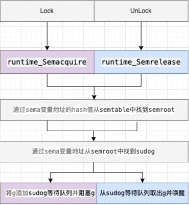

## Mutex
### Mutex 的实现原理
Go sync包提供了两种锁类型：互斥锁 sync.Mutex 和读写互斥锁 sync.RWMutex，都属于悲观锁。

**概念:**

Mutex是互斥锁，当一个goroutine获得了锁后，其他 goroutine 不能获取锁 (只能存在一个写者或者读者，不能同时读写)

**使用场景:**

多个线程同时访问临界区，为保证数据的安全，所著一些共享资源，以防止并发访问这些共享数据时可能导致的数据不一致的问题。

获取锁的线程可以正常访问临界区，未获取到锁的线程等待锁释放后可以尝试获取锁


**底层实现结构:**

互斥锁对应的是底层结构是 sync.Mutex 结构体，位于 src/sync/mutex.go 中

```go
type Mutex struct {
	state int32
	sema  uint32
}
```
state 表示锁的状态，有锁定、被唤醒、饥饿模式等。并且是用state的二进制位来标识的，不同模式下会有不同的处理方式


Sema表示信号量，mutex阻塞队列的定位就是通过这个变量来实现的，从而实现goroutine的阻塞和唤醒



(引入sudog结构体)
```go
type sudog struct {
    // The following fields are protected by the hchan.lock of the
    // channel this sudog is blocking on. shrinkstack depends on
    // this for sudogs involved in channel ops.
    g *g
    
    next *sudog
    prev *sudog
    elem unsafe.Pointer // data element (may point to stack) 指向sema变量
    waitlink *sudog // g.waiting list or semaRoot
    waittail *sudog // semaRoot
    ...
}
```

**操作**

锁的实现一般会依赖于原子操作、信号量，通过atomic包中一些原子操作来实现锁的锁定，通过信号量来实现线程阻塞与唤醒

**加锁**

通过原子操作 cas 加锁，如果加锁不成功就会根据不同场景选择自旋重试加锁或者阻塞等待被唤醒后加锁


```go
func (m *Mutex) Lock() {
    // Fast path: grab unlocked mutex.
    if atomic.CompareAndSwapInt32(&m.state, 0, mutexLocked) {
        if race.Enabled {
            race.Acquire(unsafe.Pointer(m))
        }
        return
    }
    // Slow path (outlined so that the fast path can be inlined)
    m.lockSlow() // 尝试自选或者阻塞获取锁
}
```

**解锁**

通过原子操作add解锁，如果任有 goroutine 在等待，唤醒等待的goroutine


```go
func (m *Mutex) Unlock() {
	if race.Enabled {
		_ = m.state
		race.Release(unsafe.Pointer(m))
	}

	// Fast path: drop lock bit.
	new := atomic.AddInt32(&m.state, -mutexLocked)
	if new != 0 {
		// Outlined slow path to allow inlining the fast path.
		// To hide unlockSlow during tracing we skip one extra frame when tracing GoUnblock.
		m.unlockSlow(new) // 唤醒等待的goroutine
	}
}
```

**注意点:**
- 在 Lock() 之前使用 Unlock() 会导致 panic 异常
- 使用 Lock() 加锁后，再次 Lock() 会导致死锁（不支持重入），需要 Unlock() 解锁后才能再加锁
- 锁定状态与 goroutine 没有关联，一个goroutine 可以 Lock，另一个 goroutine 可以 Unlock

### Go互斥锁正常模式和饥饿模式的区别
Go有两种抢锁的模式，一种是正常模式，另一种是饥饿模式

**正常模式(非公平锁)**

在刚开始的时候，是处于正常模式(Barging)，也就是，当一个G1持有一个锁的时候，G2会自旋的去尝试获取这个锁

当自旋四次还没有能获取到锁的时候，这个G2就会被浇入到获取锁的等待队列里，并阻塞等待唤醒

    正常模式下，所有等待锁的goroutine按照 FIFO 顺序等待，唤醒的 goroutine 不会直接拥有锁，而是回合请求锁的 goroutine 竞争，新请求锁的 gotoutine 具有优势: 它正在CPU上执行，而且可能有好几个，所以刚刚唤醒的 goroutine 有很大可能在竞争中失败，长时间获取不到锁会进入饥饿模式

**饥饿模式(公平锁)**

当一个 goroutine 等待锁时间超过 1 毫秒的时候，它可能会遇到接问题。 在版本 1.9 中，这个场景下 Go Mutex 切换到饥饿模式 handoff 解决接问题

```go
starving = runtime_nanotime()-waitStartTime > 1e6
```

    饥饿模式下，直接把锁交给等待队列中排在第一位的 goroutine(队头)，同时饥饿模式下，新进来的goroutine不会参与抢锁，也不会进入自旋状态，会直接进入等待队列的队尾，这样很好地解决了老的 goroutine 一直抢不到锁的问题

那么也不可能说永远保持一个饥饿状态，总归有要有吃饱的时候，也就是说有那么一个 Mutex 要回到正常模式，那么回归正常模式必须具备的条件有以下几种：

    1. G的执行时间小于 1ms
    2. 等待队列已经全部清空了

当满足上述两个条件的任意一个的时候，Mutex会切换回正常模式，而Go的抢锁过程，就是在这个正常模式和饥饿模式中来回切换进行的。
```go
delta := int32(mutexLocked - 1<<mutexWaiterShift)
if !starving || old>>mutexWaiterShift == 1 {
    // Exit starvation mode.
    // Critical to do it here and consider wait time.
    // Starvation mode is so inefficient, that two goroutines
    // can go lock-step infinitely once they switch mutex
    // to starvation mode.
    delta -= mutexStarving
}
atomic.AddInt32(&m.state, delta)
```

总结:

对于两种模式，正常模式下的性能都是最好的，goroutine 可以连续多次获取锁，饥饿模式就是为了解决锁公平的问题，但是性能会下降

### 互斥锁允许自旋的条件

线程没有获取到锁的时候常见有两种处理方式：
- 一种是没有获取到锁的线程就一直循环等待判断该资源是否已经释放锁，这种锁也叫自旋锁，它不用将线程阻塞起来，适用于并发低且程序执行时间短的场景，缺点是cpu占用高
- 另一种处理方式就是把自己阻塞起来，会释放CPU给其他线程，内核会将线程置为 _睡眠_ 状态, 等到锁被释放后，内核会在合适的实际唤醒该线程，适用于高并发场景，缺点是有线程上下文切换的开销

Go语言中的Mutex实现了自旋与阻塞两种场景，当满足不了自旋条件的时候就会进入阻塞

允许自旋的条件: 
1. 锁已经被占用，且锁不处于饥饿状态
2. 积累的自旋次数小鱼最大自旋次数 (active_spin=4)
3. CPU核数大于1
4. 有空闲的P
5. 当前 goroutine 所挂在的P下，本地待运行队列为空

```go
if old&(mutexLocked|mutexStarving) == mutexLocked && runtime_canSpin(iter) {
// Active spinning makes sense.
// Try to set mutexWoken flag to inform Unlock
// to not wake other blocked goroutines.
    if !awoke && old&mutexWoken == 0 && old>>mutexWaiterShift != 0 &&
        atomic.CompareAndSwapInt32(&m.state, old, old|mutexWoken) {
        awoke = true
    }
    runtime_doSpin()
    iter++
    old = m.state
    continue
}

func sync_runtime_canSpin(i int) bool {
	if i >= active_spin || ncpu <= 1 || gomaxprocs <= int32(sched.npidle+sched.nmspinning) + 1 {
		return false
    }   
    if p := getg().m.p.ptr(); !runqempty(p){
        return false	
    }
    return false
}
```

**自旋:**
```go
func sync_runtime_doSpin(){
	procyield(active_spin_cnt)
}
```
如果可以进入自旋状态后就调用上面这个方法来进入自旋，doSpin 方法会调用 procyield(30) 执行 30 次 PAUSE 指令，什么都不做，但是会消耗CPU时间

### Go 读写锁的实现原理
读写互斥锁 RWMutex, 是对 Mutex 的一个扩展，当一个 goroutine 获得了读锁之后，其他 goroutine 可以获取读锁，但是不能获取写锁；当一个goroutine获得了写锁后，其他goroutine既不能获取读锁也不能获取写锁（只能存在一个写者或者多个读者，可以同时读）

**使用场景:**

读多余写的情况(既保证线程安全，又保证性能不太差)

**底层实现结构:**

互斥锁对应的底层结构在 src/sync/rwmutex.go 中

```go
type RWMutex struct {
	w           Mutex  // held if there are pending writers
	writerSem   uint32 // semaphore for writers to wait for completing readers
	readerSem   uint32 // semaphore for readers to wait for completing writers
	readerCount int32  // number of pending readers
	readerWait  int32  // number of departing readers
}
```

**操作**

####读锁的加锁与释放

```go
func (rw *RWMutex) RLock()

func (rw *RWMutex) RUnlock()
```
**加读锁**
```go
func (rw *RWMutex) RLock() {
	if race.Enabled {
		_ = rw.w.state
		race.Disable()
	}
	// 为什么readerCount会小于0 因为 writer的lock会对readerCount做减法(原子操作)
	if atomic.AddInt32(&rw.readerCount, 1) < 0 {
		// A writer is pending, wait for it.
		runtime_SemacquireMutex(&rw.readerSem, false, 0)
	}
	if race.Enabled {
		race.Enable()
		race.Acquire(unsafe.Pointer(&rw.readerSem))
	}
}
```
`atomic.AddInt32(&rw.readerCount, 1)` 调用这个原子方法,对当前在读的数量加1，如果返回负数那就说明当前有其他写缩，就调用 `runtime_SemacquireMutex`
休眠当前goroutine等待被唤醒

**释放读锁**

解锁的时候对正在读的操作减1，如果返回值小鱼0那么说明当前有在写的操作，这个时候调用 rUnlockSlow 进入慢速通道

```go
func (rw *RWMutex) RUnlock(){
	if r:= atomic.AddInt32(&rw.readerCount, -1); r < 0 {
		rw.rUnlockSlow(r)
    }   
}
```
被阻塞的准备读的goroutine的数量减一，readerWait 为0，就表示当前没有正在准备读的 goroutine 这时候调用 runtime_Semrelease 唤醒写操作

```go
func (rw *RWMutex) rUnlockSlow(r int32) {
	if r+1 == 0 || r+1 == -rwmutexMaxReaders {
		race.Enable()
		throw("sync: RUnlock of unlocked RWMutex")
	}
	// A writer is pending.
	if atomic.AddInt32(&rw.readerWait, -1) == 0 {
		// The last reader unblocks the writer.
		runtime_Semrelease(&rw.writerSem, false, 1)
	}
}
```

#### 写锁的加锁与释放
```go
func (rw *RWMutex) Lock()

func (rw *RWMutex) Unlock()
```

**加写锁**
```go
func (rw *RWMutex) Lock() {
    if race.Enabled {
        _ = rw.w.state
        race.Disable()
    }
    // First, resolve competition with other writers.
    rw.w.Lock()
    // Announce to readers there is a pending writer.
    r := atomic.AddInt32(&rw.readerCount, -rwmutexMaxReaders) + rwmutexMaxReaders
    // Wait for active readers.
    if r != 0 && atomic.AddInt32(&rw.readerWait, r) != 0 {
        runtime_SemacquireMutex(&rw.writerSem, false, 0)
    }
    if race.Enabled {
        race.Enable()
        race.Acquire(unsafe.Pointer(&rw.readerSem))
        race.Acquire(unsafe.Pointer(&rw.writerSem))
    }
}
```

首先调用互斥锁的lock，获取到互斥锁之后，如果计算之后当前仍然又其他的goroutine持有读锁，那么就调用`runtime_SemacquireMutex` 休眠当前的goroutine
等待所有读锁操作完成

这里的read count 原子性加上一个很大的负数是防止后面的协程能拿到读锁，阻塞读

**释放写锁**

```go
func (rw *RWMutex) Unlock() {
	if race.Enabled {
		_ = rw.w.state
		race.Release(unsafe.Pointer(&rw.readerSem))
		race.Disable()
	}

	// Announce to readers there is no active writer.
	r := atomic.AddInt32(&rw.readerCount, rwmutexMaxReaders)
	if r >= rwmutexMaxReaders {
		race.Enable()
		throw("sync: Unlock of unlocked RWMutex")
	}
	// Unblock blocked readers, if any.
	for i := 0; i < int(r); i++ {
		runtime_Semrelease(&rw.readerSem, false, 0)
	}
	// Allow other writers to proceed.
	rw.w.Unlock()
	if race.Enabled {
		race.Enable()
	}
}
```

解锁的操作会西安调用 `atomic.AddInt32(&rw.readerCount, rwmutexMaxReaders)` 将回复之前写入的负数，然后根据当前有多少个读操作在等待，循环唤醒

**注意点**

- 读锁或写锁Lock()之前使用 Unlock() 会导致 panic
- 使用 Lock() 加锁后再次 Lock() 会导致死锁（不支持重入），需要 Unlock() 之后才能再加锁
- 锁定状态与 goroutine 没有关联，一个 goroutine 可以 Rlock(Lock), 另一个 goroutine 可以 RUnlock(Unlock)

**互斥锁和读写锁的区别：**

- 读写锁区分读者和写者，而且互斥锁不区分
- 互斥锁同一时间只允许一个线程访问该对象，无论读写；读写锁同一时间只允许一个写者，但是允许多个读者同时读对象

### Go 可重入锁如何实现

可重入锁又称为递归锁，是指在同一个线程在外层方法获取锁的时候，在进入该线程的内层方法时会自动获取锁，不会因为之前已经获取过还没释放再次加锁导致死锁

#### 为什么Go语言种没有可重入锁？
Mutex不是可重入的锁，mutex实现种没有记录哪个 goroutine 拥有这把锁，理论上任何 goroutine 都可以随意地 unlock 这把锁，所以没办法计算重入条件，并且 Mutex 重复Lock 会导致死锁

如何实现可重入锁？

两个重点

- 记住持有锁的线程
- 统计重入的次数

```go
package main

import (
	"fmt"
	"runtime"
	"strconv"
	"strings"
	"sync"
	"sync/atomic"
)

type ReentrantLock struct {
	sync.Mutex
	recursion	int32 // goroutine 可重入的次数
	owner 		int64 // 当前持有锁的 goroutine id
}

func GetGoroutineID() int64 {

	var buf [64]byte
	// 获取栈信息
	n := runtime.Stack(buf[:], false)
	// 抽取id
	idField := strings.Fields(strings.TrimPrefix(string(buf[:n]), "goroutine"))[0]
	// 转为64位整数
	gid, _ := strconv.Atoi(idField)
	return int64(gid)
}

func NewReentrantLock() sync.Locker {
	res := &ReentrantLock{
		Mutex: sync.Mutex{},
		recursion: 0,
		owner: 0,
	}
	return res
}

// ReentrantMutex 包装一个 Mutex 实现可重入
type ReentrantMutex struct {
	sync.Mutex
	recursion	int32 // goroutine 可重入的次数
	owner 		int64 // 当前持有锁的 goroutine id
}
func (m *ReentrantMutex) Lock(){
	gid := GetGoroutineID()
	if atomic.LoadInt64(&m.owner) == gid {
		m.recursion++
		return
	}
	m.Mutex.Lock()
	// 获得锁的 goroutine 第一次调用 记录下它的goroutine id 调用次数加1
	atomic.StoreInt64(&m.owner, gid)
	m.recursion = 1
}

func (m *ReentrantMutex) ULock(){
	gid := GetGoroutineID()
	// 非持有锁的goroutine尝试释放锁，错误使用
	if atomic.LoadInt64(&m.owner) != gid {
		panic(fmt.Sprintf("worng the owner(%d): %d", m.owner, gid))
	}
	// 调用次数减1
	m.recursion--
	if m.recursion != 0 {
		return
	}
	// 最后一次调用，需要释放锁
	atomic.StoreInt64(&m.owner, -1)
	m.Mutex.Unlock()
}
```

### Go 的原子操作有哪些

Go atomic 包是最轻量级的锁(也称无锁结构)，可以在不形成临界区和创建互斥量的情况下完成并发安全值的替换操作，不过这个包值支持 int32/int64/uint32/uint64/uintptr
这集中数据类型的一些基础操作(增减、交换、载入、存储)

概念：原子操作仅会由一个独立的CPU指令和代表完成，原子操作是无锁的，常常直接通过CPU指令直接实现。事实上，其他同步技术的实现依赖于原子操作

使用场景：

当我们想要对某个变量并发安全的修改，除了使用官方提供的 mutex，还可以使用 sync/atomic 包的原子操作，它能够保证对变量的读取或修改期间不被其他的协程所影响。

atomic包提供的原子操作能够确保任一时刻只有一个goroutine对变量进行操作，善用atomic能够避免程序中出现大量锁操作。

**常见操作：**
- 增减 Add
- 载入 Load
- 比较并交换 CompareAndSwap
- 交换 Swap
- 存储 Store

atomic 操作的对象是一个地址，你需要把可寻址的变量的地址作为参数传递给方法，而不是把变量的值传递给方法

下面分别介绍这些操作

**增减**
```go
func AddInt32(addr *int32, delta int32)(new int32)
func AddInt64(addr *int64, delta int64)(new int64)
func AddUInt32(addr *uint32, delta uint32)(new uint32)
func AddUInt32(addr *uint64, delta uint64)(new uint64)
func AddUintptr(addr *uintptr, delta uintptr) (new uintptr)
```

需要注意的是，第一个参数必须是指针类型的值，通过指针变量可以获取被操作数在内存中的地址，从而施加特殊的CPU指令，确保同一时间只有一个goroutine能够操作

```go
fund add(addr *int64, delta int64){
	atomic.AddInt64(addr, delta)
	fmt.Println("add opts: ", *addr)
}
```

**载入**
```go
func LoadInt32(addr *int32) (val int32)
func LoadInt64(addr *int64) (val int64)
func LoadUint32(addr *uint32) (val uint32)
func LoadUint64(addr *uint64) (val uint64)
func LoadUintptr(addr *uintptr) (val uintptr)
func LoadPointer(addr *unsafe.Pointer) (val unsafe.Pointer)
```
载入操作能保证原子的读变量的值，当读取的时候，任何其他CPU操作都无法对该变量进行读写，其实是吓死你机制受到底层硬件的支持

**比较并交换**

此类操作的前缀为 CompareAndSwap 简称为 CAS，可以实现乐观锁
```go
func CompareAndSwapInt32(addr *int32, old, new int32) (swapped bool)
func CompareAndSwapInt64(addr *int64, old, new int64) (swapped bool)
func CompareAndSwapUint32(addr *uint32, old, new uint32) (swapped bool)
func CompareAndSwapUint64(addr *uint64, old, new uint64) (swapped bool)
func CompareAndSwapUintptr(addr *uintptr, old, new uintptr) (swapped bool)
func CompareAndSwapPointer(addr *unsafe.Pointer, old, new unsafe.Pointer) (swapped bool)
```
该操作在进行交换前首先确保变量的值未被更改，即依然保持参数old所记录的值，满足此前提条件下才进行交换。CAS的做法类似操作数据库时常见的乐观锁机制

需要注意的是，当由大量的 goroutine 对变量进行读写操作的时候，可能导致 CAS 操作无法成功，这时可以利用 for 循环多次尝试

**交换**
```go
func SwapInt32(addr *int32, new int32) (old int32)
func SwapInt64(addr *int64, new int64) (old int64)
func SwapUint32(addr *uint32, new uint32) (old uint32)
func SwapUint64(addr *uint64, new uint64) (old uint64)
func SwapUintptr(addr *uintptr, new uintptr) (old uintptr)
func SwapPointer(addr *unsafe.Pointer, new unsafe.Pointer) (old unsafe.Pointer)
```
相对于CAS，明显此类操作更直接暴力，不管变量的旧值是否被改变，直接赋予新值然后返回替换的值

**存储**
```go
func StoreInt32(addr *int32, val int32)
func StoreInt64(addr *int64, val int64)
func StoreUint32(addr *uint32, val uint32)
func StoreUint64(addr *uint64, val uint64)
func StoreUintptr(addr *uintptr, val uintptr)
func StorePointer(addr *unsafe.Pointer, val unsafe.Pointer)

func (v *Value)Store(x interface{}){}
```
此类操作确保了写变量的原子性，避免其他操作督导了修改变量过程中的脏数据

### Go的原子操作和锁

1. 原子操作由底层硬件支持，而锁是基于原子操作+信号量完成。若实现相同功能，前者通常会更有效率
2. 原子操作是单个指令的互斥操作；互斥锁/读写锁是一种数据结构，可以完成临界区(多个指令)的互斥操作，扩大原子操作的反胃
3. 原子操作是无锁操作，属于乐观锁；说起锁的时候一般都是悲观锁
4. 原子操作存在于各个指令/语言层级，比如"机器指令层级的原子操作"，“汇编指令层级的原子操作”，“Go语言层级的原子操作”
5. 锁也存在于各个指令/语言层级，比如 "机器指令层级的锁"，“汇编指令层级的锁”，“Go语言层级的锁”等
