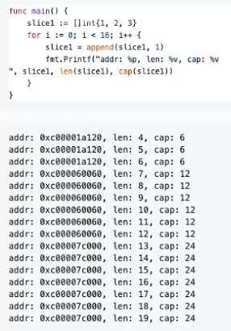

## slice head
slice的具体原理已经在golang数据结构那个仓库有总结了，这里再梳理一边

源码在 src/runtime/slice.go 里面定义了slice的数据结构

```go
type slice struct{
	array   unsafe.Pointer
	len     int
	cap     int
}
```
slice 占用24个字节

- array： 指向底层数组的指针 占用8字节
- len： 切片的长度 占用8字节
- cap： 切片的容量，cap总是大于等于len的，占用8个字节

slice 有四种初始化方式
```go
// var 直接声明
var slice1 []int

// 字面量初始化
slice2 := []int{1, 2, 3, 4}

// make
slice3 := make([]int, 3, 5)

// 从切片或者数组截取
slice4 := arr[1:3]
```

通过一个简单的程序看看slice初始化调用的底层函数
```go
package main

import "fmt"

func main(){
	slice := make([]int, 0)
	slice = append(slice, 1)
	fmt.Println(slice, len(slice), cap(slice))
}

```
通过 `go tool compile -S test.go | grep CALL` 得到汇编代码


初始化slice调用的是runtime.makeslice, makeslice 函数的主要工作就是计算slice所需的内存大小，然后调用mallocgc进行内存分配

所需内存大小 = 切片中元素大小*切片的容量
```go
func makeslice(et *_type, len, cap int) unsafe.Pointer {
	mem, overflow := math.MulUintptr(et.size, uintptr(cap))
	if overflow || mem > maxAlloc || len < 0 || len > cap {
		// NOTE: Produce a 'len out of range' error instead of a
		// 'cap out of range' error when someone does make([]T, bignumber).
		// 'cap out of range' is true too, but since the cap is only being
		// supplied implicitly, saying len is clearer.
		// See golang.org/issue/4085.
		mem, overflow := math.MulUintptr(et.size, uintptr(len))
		if overflow || mem > maxAlloc || len < 0 {
			panicmakeslicelen()
		}
		panicmakeslicecap()
	}

	return mallocgc(mem, et, true)
}
```

### array 和 slice的区别
数据结构那个仓库有  再梳理一边

1. 数组长度不同
    - 数组初始化必须指定长度 并且长度就是固定的
    - 切片的唱剫不固定的，可以追加元素，再追加的时候可能使切片的容量增大
2. 函数传参不同
    - 数组是值类型，将一个数组赋值给另一个数组的时候，传递的是一份深拷贝，函数传参操作都会复制整个数组数据，会占用额外的内存，函数内对数组元素值的修改不会修改原数组的内容
    - 切片是引用类型，将一个切片赋值给另一个切片的时候，传递是一份浅拷贝，函数传参操作不会直接拷贝整个切片，只会复制len和cap，底层共用同一个数组，不会占用额外的内存。函数内对数组元素值的修改会修改原数组内容。
3. 计算数组长度方式不同
    - 数组需要变例计算数组长度，时间复杂度为 O(n)
    - 切片底层包含len字段，可以通过len()计算切片长度，时间复杂度为 O(1)

### slice 的深浅拷贝
深拷贝: 拷贝的是数据本身，创造一个新对象，新创建的对象与原对象不共享内存，新创建的对象再内存中开辟一个新的内存地址，新对象值修改的时候不会影响原对象的值

实现深拷贝的方式：
- copy(slice2, slice1)
- 遍历append赋值
```go
package main

import "fmt"

func main(){
	slice1 := []int{1, 2, 3, 4}
	slice2 := make([]int, 5, 5)
	fmt.Printf("slice1: %v, %p \n", slice1, slice1)
	copy(slice2, slice1)
	fmt.Printf("slice2: %v, %p \n", slice2, slice2)
    slice3 := make([]int, 0, 5)
    for _, v := range slice1{
    	slice3 = append(slice3, v)
    }
    fmt.Printf("slice2: %v, %p \n", slice3, slice3)
}
```
浅拷贝：拷贝的是数据地址，只复制指向对象的指针，此时新对象和老对象指向的内存地址是一样的，新对象修改值时老对象也会发生变化

实现浅拷贝的方式:
1. slice2 := slice1

引用类型的变量，默认复制操作就是浅拷贝

```go
package main

import "fmt"

func main(){
   slice1 := []int{1, 2, 3, 4}
   fmt.Printf("slice1: %v, %p \n", slice1, slice1)
   slice2 := slice1
   fmt.Printf("slice2: %v, %p \n", slice2, slice2)
}
```
### slice 的扩容机制
扩容会发生在slice append的时候，当slice的cap不足以容纳新元素的时候就会触发扩容，扩容规则如下:
- 如果新申请的容量比两倍原有的容量大，那么扩容后容量大小为新申请容量
- 如果原有slice长度小于1024，那么每次扩容为原来的两倍
- 如果原有slice长度大于等于1.24，那么每次扩容就为原来的1.25倍


```go
var inta = [5]int{1, 2, 3, 4, 5}
ints := inta[0:]
fmt.Println(cap(ints))
// 这个时候 使用 cap(ints)查看  会发现 cap==5, 此时如果要append一个元素会怎么样
ints = append(ints, 6)
fmt.Println(cap(ints))
// 这里我们会发现cap变成了10
// 先不去考虑cap的问题, 我们知道array在内存中是一个连续的一段,并且不能扩大;
// 那么当slice需要表示的len超过了array就会重新给slice创建一个新的array, 再将元数据拷贝过去
// 至此就能理解为什么会出现cap变成10的原因了;
// 因为slice是可以扩大的, 如果没append一次就要重新创建数组再copy回来, 那么对于性能的损耗就会比较大
// 所以 Go 对slice的扩容做了优化
```

### slice为什么不是线程安全的
线程安全的定义:
- 多个线程访问一个对象的时候，可以调用这个对象的行为，并且都能获得正确的结果，那么这个对象就是线程安全的
- 若有多个线程同时执行写操作，一般都要考虑线程同步，否则的话就可能影响线程安全。

Go实现线程安全的常用方式
1. 互斥锁
2. 读写锁
3. 原子操作
4. sync.once
5. sync.atomic
6. channel

slice底层结构并没有用加锁等方式，不支持并发读写，所以并不是线程安全的，使用多个goroutine对slice变量进行操作的时候，每次输出的值大概率都不会一样，与预期的不一致；slice在并发执行的过程中不会报错，但是数据会丢失

```go
/*
切片非并发安全
多次执行看到的结果不同
可以考虑用channel不呢神的特性(阻塞)来实现安全的并发读写
 */

package sliceTest

import (
	"sync"
	"testing"
)

func TestSliceConcurrencySafy(t *testing.T){
	a := make([]int, 0)
	var wg sync.WaitGroup
	for i :=0; i < 10000; i++ {
		wg.Add(1)
		go func(i int) {
			a = append(a, i)
			wg.Done()
        }(i)
    }
    wg.Wait()
	t.Log(len(a))
}
```