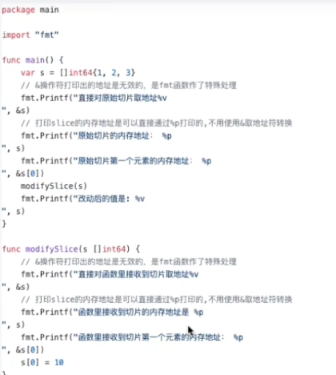
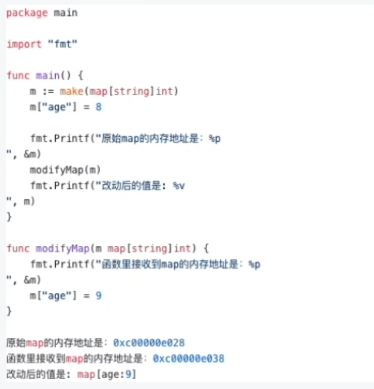
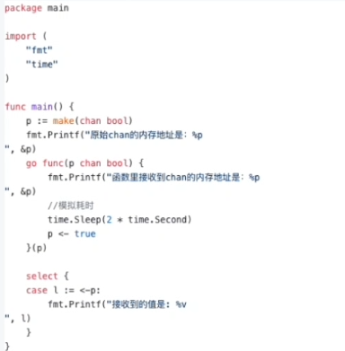

https://github.com/ameamezhou/go-data-structure

这里做了部分常用数据类型详细的记录

这个仓库要重点看，比如slice和map的扩容，函数内的调用都设计它们的底层结构，说得越清楚越好

简单来说
1. bool
2. 数字类型 uint int float32 float64 byte rune
3. 字符串类型
4. 复合类型
    - 数组
    - 切片
    - map
    - 管道
    - 结构体 struct
5. 指针 pointer
6. 接口 interface
7. 函数
8. 方法类型 method (注意和函数进行区分)

其实和关键字一样 属于基础提问，但是可以针对你回答的问题进行深入探究

### 方法和函数的区别
在go语言里面，函数和方法不太一样，有明确的概念区分。在其他语言中，比如java，一般来说函数就是方法，但是在go语言中，函数是指不属于任何结构体、类型的方法，也就是说
函数是没有接收者的，但是方法有接收者

```go

func (t *T) add (a, b int) int {
	return a + b
}

// 其中T是自定义类或者说结构体，不能是基础数据类型 int 等

func add (a, b int) int {
    return a + b
}

```

### 方法接收者和指针接收者的区别
这两者都属于能把函数内的修改带回到本身的一个使用方法，所以要区分好他们之间有什么区别

如果方法的接收者是指针类型，无论调用者是对象还是对象指针，修改的都是对象本身，会影响调用者

如果方法接收者是值类型，无论调用者是对象还是对象指针，修改的都是对象的副本，不影响调用者

我们通常使用指针类型作为方法的接收者的理由：
- 使用指针类型能够修改调用者的值
- 使用指针类型可以避免在每次调用方法的时候复制该值，在值的类型为大型结构体时，这个做法会更高效

### Go函数返回局部变量的指针是否是安全的
一般来说，局部变量会在函数返回后被销毁，因此被返回的引用就成了“无所指”的引用，陈旭会进入未知状态。

但这在Go中是安全的，Go编译器将会对每个局部变量进行逃逸分析.如果发现局部变量的作用域超出该函数，则不会将内存分配在栈上，而是分配在堆上，因为他们不在栈区，所以即使释放函数，其内容也不会受影响

(这里关于堆栈的内容，详细的要看golang的垃圾回收机制和操作系统的堆栈分配区的区别)

```go
package main

import (
   "fmt"
   "net/http"
)

func add(x, y int) *int {
   res := x + y
   return &res
}

func main(){
	fmt.Println(add(1, 2))
}
```
这个例子中，add函数的局部变量 res 发生了逃逸，res作为返回值，在main函数中继续使用，因此res指向的内存不能够分配在栈上，随着函数结束而会回收，因此只能分配在堆上

编译的时候可以用 -gcflags=-m 查看变量逃逸的情况

我们看到 res escapes to heap 代表res从栈区分配到了堆区，发生了逃逸

### go函数中参数传递到底是值传递还是引用传递
Go语言中所有的传参都是值传递，都是一个副本一个拷贝

参数如果是非引用类型 int string struct 这些，这样就在函数中无法修改原内容数据；如果是引用类型 (指针、map、slice、chan等这些)，这样就可以修改原内容数据

是否可以修改原内容数据，和传值、传引用没有必然的关系，在c++中，传引用肯定是可以修改原内容数据的，但是在Go中虽然只有传值，但是我们也可以修改原内容数据，因为参数是引用类型。

引用类型和引用传递是两个概念
- 值传递: 将实际参数的值传递给形参，形式参数是实际参数的一份拷贝，实际参数和形式参数的内存地址不同。函数内堆形式参数值的内容进行修改，至于是否影响实际参数的值的内容，取决于参数是否是引用类型
- 引用传递: 将实际参数的地址传递给形式参数，函数内堆形式参数内容的修改，将会影响实际参数的值的内容。GO语言中是没有引用传递的，在c++中函数参数的传递方式又引用传递。

**int 类型**
```go
package main

import "fmt"

func main(){
	var i = 1
	fmt.Printf("原内存地址 %p \n", &i)
	modifyInt(i)
	fmt.Printf("改动后值 %v \n", i)
}

func modifyInt(i int){
	fmt.Printf("函数内内存地址 %p \n", &i)
	i = 10
}
```
**指针类型**
```go
package main

import "fmt"

func main(){
   var args = 1
   p := &args
   fmt.Printf("原指针内存地址 %p \n", &p)
   fmt.Printf("原指针变量内存地址 %p \n", p)
   modifyPointer(p)
   fmt.Printf("改动后值 %v \n", *p)
}

func modifyPointer(i *int){
   fmt.Printf("函数内内存地址 %p \n", &i)
   *i = 10
}
```
**Slice 类型**

形式参数和实际参数内存地址一样，不代表是引用类型；下面进行详细说明slice还是值传递，传递的是指针


slice 这里的结构体参考golang数据结构那个仓库   后面的map同

**map**

map 形式参数和实际参数内存地址不同，所以其实还是值传递

因为这里我们通过make创建的map变量的本质是一个hmap类型的指针，所以函数内堆形参的修改还是会返回原来的内容数据

**channel**



因为通过make创建的chan本质也是一个hchan类型的指针，所以堆形参的修改会修改原内容数据

**struct**
形参和实际参数内存地址不一样  是值传递，只要内部的元素不是指针类型的  函数内对形参的修改就不会修改原来的内容数据


